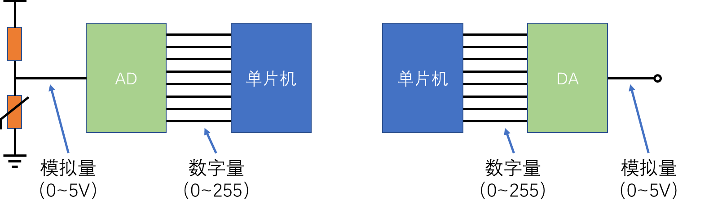

# AD+DA介绍+3476512d-9968-4366-ade6-41adca570f0c

# AD+DA介绍+3476512d-9968-4366-ade6-41adca570f0c 6ddb80138e524d128648e2603d7ea433

## 目录

-   [AD+DA介绍+3476512d-9968-4366-ade6-41adca570f0c](#ADDA介绍3476512d-9968-4366-ade6-41adca570f0c "AD+DA介绍+3476512d-9968-4366-ade6-41adca570f0c")
-   [AD+DA介绍+3476512d-9968-4366-ade6-41adca570f0c](#ADDA介绍3476512d-9968-4366-ade6-41adca570f0c "AD+DA介绍+3476512d-9968-4366-ade6-41adca570f0c")
-   [硬件电路模型](#硬件电路模型 "硬件电路模型")
-   [硬件电路](#硬件电路 "硬件电路")
-   [运算放大器](#运算放大器 "运算放大器")
    -   [运放电路](#运放电路 "运放电路")
    -   [DA原理](#DA原理 "DA原理")
    -   [AD原理](#AD原理 "AD原理")
    -   [AD/DA性能指标](#ADDA性能指标 "AD/DA性能指标")
-   AD（Analog?to?Digital）：模拟-数字转换，将模拟信号转换为计算 机可操作的数字信号 • DA（Digital?to?Analog）：数字-模拟转换，将计算机输出的数字信 号转换为模拟信号 • AD/DA转换打开了计算机与模拟信号的大门，极大的提高了计算机 系统的应用范围，也为模拟信号数字化处理提供了可能

# 硬件电路模型

-   AD转换通常有多个输入通道，用多路选择开关连接至AD转换器， 以实现AD多路复用的目的，提高硬件利用率 • AD/DA与单片机数据传送可使用并口（速度快、原理简单），也可 使用串口（接线少、使用方便） • 可将AD/DA模块直接集成在单片机内，这样直接写入/读出寄存器 就可进行AD/DA转换，单片机的IO口可直接复用为AD/DA的通道

# 硬件电路

ET2046也是一个触摸屏芯片

# 运算放大器

-   运算放大器（简称“运放”）是具有很高放大倍数的放大电路单元。 内部集成了差分放大器、电压放大器、功率放大器三级放大电路， 是一个性能完备、功能强大的通用放大电路单元，由于其应用十分 广泛，现已作为基本的电路元件出现在电路图中 • 运算放大器可构成的电路有：电压比较器、反相放大器、同相放大 器、电压跟随器、加法器、积分器、微分器等 • 运算放大器电路的分析方法：虚短、虚断（负反馈条件下）

## 运放电路

## DA原理

<https://www.bilibili.com/video/BV15t4y1y7tY/?spm_id_from=333.337.search-card.all.click>

> 这个会消耗单片机的资源（要io口输出PWN），但是精度高

低通滤波器会把**交流分量**给去除掉

## AD原理

逐次逼近型AD转换器：

## AD/DA性能指标

-   分辨率：指AD/DA数字量的精细程度，通常用位数表示。例如，对于5V电源系统来说，8位的AD可将5V等分为256份，即数字量变化最小一个单位时，模拟量变化5V/256=0.01953125V，所以，8位AD的电压分辨率为0.01953125V，AD/DA的位数越高，分辨率就越高 • 转换速度：表示AD/DA的最大采样/建立频率，通常用转换频率或者转换时间来表示，对于采样/输出高速信号，应注意AD/DA的转换速度
