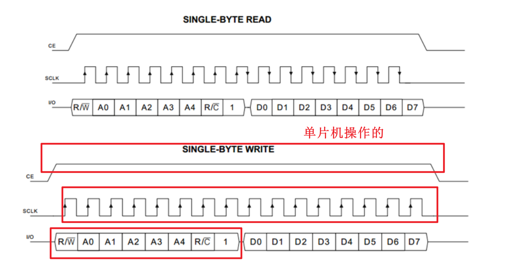

# DS1302介绍+ae228658-4152-4975-8ff8-8d5ea669b07a 10e7

## 目录

-   [DS1302介绍+ae228658-4152-4975-8ff8-8d5ea669b07a](#DS1302介绍ae228658-4152-4975-8ff8-8d5ea669b07a "DS1302介绍+ae228658-4152-4975-8ff8-8d5ea669b07a")
-   [DS1302介绍+ae228658-4152-4975-8ff8-8d5ea669b07a](#DS1302介绍ae228658-4152-4975-8ff8-8d5ea669b07a "DS1302介绍+ae228658-4152-4975-8ff8-8d5ea669b07a")
-   [DS1302为什么要使用32.768K的晶振](#DS1302为什么要使用32768K的晶振 "DS1302为什么要使用32.768K的晶振")
    -   [引脚定义和应用电路](#引脚定义和应用电路 "引脚定义和应用电路")
    -   [内部结构框图](#内部结构框图 "内部结构框图")
    -   [寄存器定义](#寄存器定义 "寄存器定义")
    -   [时序定义](#时序定义 "时序定义")
-   [代码](#代码 "代码")

# DS1302介绍+ae228658-4152-4975-8ff8-8d5ea669b07a

# DS1302介绍+ae228658-4152-4975-8ff8-8d5ea669b07a

-   DS1302是由美国DALLAS公司推出的具有涓细电流充电能力的低功耗实时时钟芯片。它可以对年、月、日、周、时、分、秒进行计时，且具有闰年补偿等多种功能 • RTC(Real?Time?Clock)：实时时钟，是一种集成电路，通常称为时钟芯片


# DS1302为什么要使用32.768K的晶振

DS1302使用32.768K的晶振是因为这个晶振可以较准确地产生32768Hz的频率，而且它的精度（产生1hz的精度）也比较高。 晶振的精度和引脚负载电容都会影响时钟的精度。

## 引脚定义和应用电路


## 内部结构框图


## 寄存器定义


## 时序定义

跟SPI很像，SPI的时钟的上升的时候写数据，下降的时候读数据


是否读或者写数据，是看I/O的R/W的位，1为读，0为写



**写**的脉冲只有15个，读的脉冲只有16个


# 代码

```纯文本
#include <REGX52.H>
#include "LCD1602.h"
#include "DS1302.h"

//引脚定义
sbit DS1302_SCLK=P3^6;
sbit DS1302_IO=P3^4;
sbit DS1302_CE=P3^5;

//寄存器写入地址/指令定义
#define DS1302_SECOND       0x80
#define DS1302_MINUTE       0x82
#define DS1302_HOUR         0x84
#define DS1302_DATE         0x86
#define DS1302_MONTH        0x88
#define DS1302_DAY          0x8A
#define DS1302_YEAR         0x8C
#define DS1302_WP           0x8E

//时间数组，索引0~6分别为年、月、日、时、分、秒、星期
unsigned char DS1302_Time[]={19,11,16,12,59,55,6};
void Delay(unsigned int xms)
{
    unsigned char i, j;
    while(xms--)
    {
        i = 2;
        j = 239;
        do
        {
            while (--j);
        } while (--i);
    }
}

/**
  * @brief  DS1302初始化
  * @param  无
  * @retval 无
  */
void DS1302_Init(void)
{
    DS1302_CE=0;
    DS1302_SCLK=0;
}

/**
  * @brief  DS1302写一个字节
  * @param  Command 命令字/地址
  * @param  Data 要写入的数据
  * @retval 无
  */
void DS1302_WriteByte(unsigned char Command,Data)
{
    unsigned char i;
    DS1302_CE=1;
    for(i=0;i<8;i++)
    {
        DS1302_IO=Command&(0x01<<i);
        DS1302_SCLK=1;
        DS1302_SCLK=0;
    }
    for(i=0;i<8;i++)
    {
        DS1302_IO=Data&(0x01<<i);
        DS1302_SCLK=1;
        DS1302_SCLK=0;
    }
    DS1302_CE=0;
}

/**
  * @brief  DS1302读一个字节
  * @param  Command 命令字/地址
  * @retval 读出的数据
  */
unsigned char DS1302_ReadByte(unsigned char Command)
{
    unsigned char i,Data=0x00;
    Command|=0x01;  //将指令转换为读指令
    DS1302_CE=1;
    for(i=0;i<8;i++)
    {
        DS1302_IO=Command&(0x01<<i);
        DS1302_SCLK=0;
        DS1302_SCLK=1;
    }
    for(i=0;i<8;i++)
    {
        DS1302_SCLK=1;
        DS1302_SCLK=0;
        if(DS1302_IO){Data|=(0x01<<i);}
    }
    DS1302_CE=0;
    DS1302_IO=0;    //读取后将IO设置为0，否则读出的数据会出错
    return Data;
}

/**
  * @brief  DS1302设置时间，调用之后，DS1302_Time数组的数字会被设置到DS1302中
  * @param  无
  * @retval 无
  */
void DS1302_SetTime(void)
{
    DS1302_WriteByte(DS1302_WP,0x00);
    DS1302_WriteByte(DS1302_YEAR,DS1302_Time[0]/10*16+DS1302_Time[0]%10);//十进制转BCD码后写入
    DS1302_WriteByte(DS1302_MONTH,DS1302_Time[1]/10*16+DS1302_Time[1]%10);
    DS1302_WriteByte(DS1302_DATE,DS1302_Time[2]/10*16+DS1302_Time[2]%10);
    DS1302_WriteByte(DS1302_HOUR,DS1302_Time[3]/10*16+DS1302_Time[3]%10);
    DS1302_WriteByte(DS1302_MINUTE,DS1302_Time[4]/10*16+DS1302_Time[4]%10);
    DS1302_WriteByte(DS1302_SECOND,DS1302_Time[5]/10*16+DS1302_Time[5]%10);
    DS1302_WriteByte(DS1302_DAY,DS1302_Time[6]/10*16+DS1302_Time[6]%10);
    DS1302_WriteByte(DS1302_WP,0x80);
}

/**
  * @brief  DS1302读取时间，调用之后，DS1302中的数据会被读取到DS1302_Time数组中
  * @param  无
  * @retval 无
  */
void DS1302_ReadTime(void)
{
    unsigned char Temp;
    Temp=DS1302_ReadByte(DS1302_YEAR);
    DS1302_Time[0]=Temp/16*10+Temp%16;//BCD码转十进制后读取
    Temp=DS1302_ReadByte(DS1302_MONTH);
    DS1302_Time[1]=Temp/16*10+Temp%16;
    Temp=DS1302_ReadByte(DS1302_DATE);
    DS1302_Time[2]=Temp/16*10+Temp%16;
    Temp=DS1302_ReadByte(DS1302_HOUR);
    DS1302_Time[3]=Temp/16*10+Temp%16;
    Temp=DS1302_ReadByte(DS1302_MINUTE);
    DS1302_Time[4]=Temp/16*10+Temp%16;
    Temp=DS1302_ReadByte(DS1302_SECOND);
    DS1302_Time[5]=Temp/16*10+Temp%16;
    Temp=DS1302_ReadByte(DS1302_DAY);
    DS1302_Time[6]=Temp/16*10+Temp%16;
}

void main()
{
    LCD_Init();
    DS1302_Init();
    LCD_ShowString(1,1,"  -  -  ");//静态字符初始化显示
    LCD_ShowString(2,1,"  :  :  ");

    DS1302_SetTime();//设置时间

    while(1)
    {
        DS1302_ReadTime();//读取时间
        LCD_ShowNum(1,1,DS1302_Time[0],2);//显示年
        LCD_ShowNum(1,4,DS1302_Time[1],2);//显示月
        LCD_ShowNum(1,7,DS1302_Time[2],2);//显示日
        LCD_ShowNum(2,1,DS1302_Time[3],2);//显示时
        LCD_ShowNum(2,4,DS1302_Time[4],2);//显示分
        LCD_ShowNum(2,7,DS1302_Time[5],2);//显示秒
    }
}

```

全局变量定义好默认是0，局部变量不一定是0
