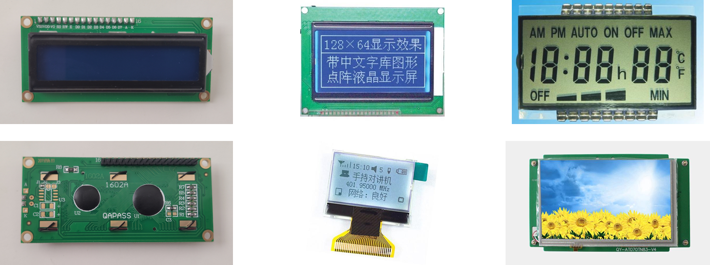
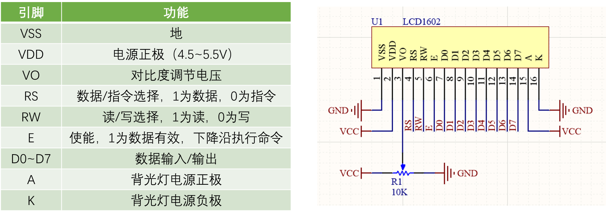
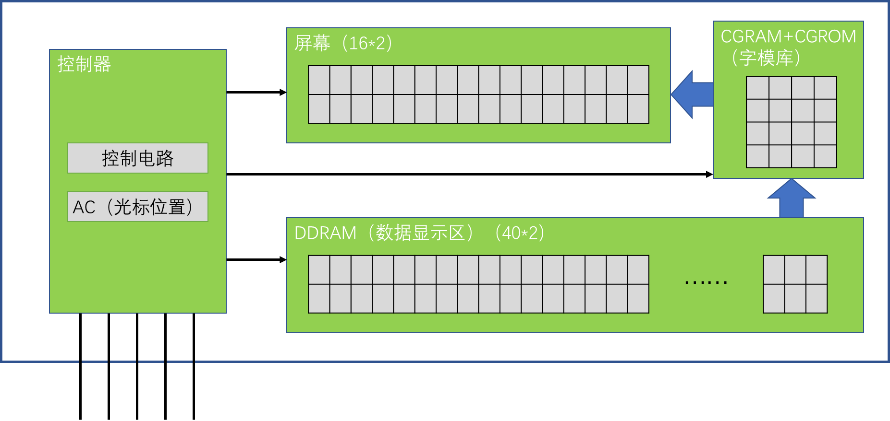
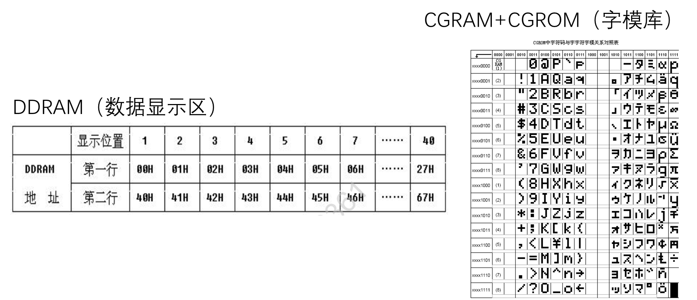
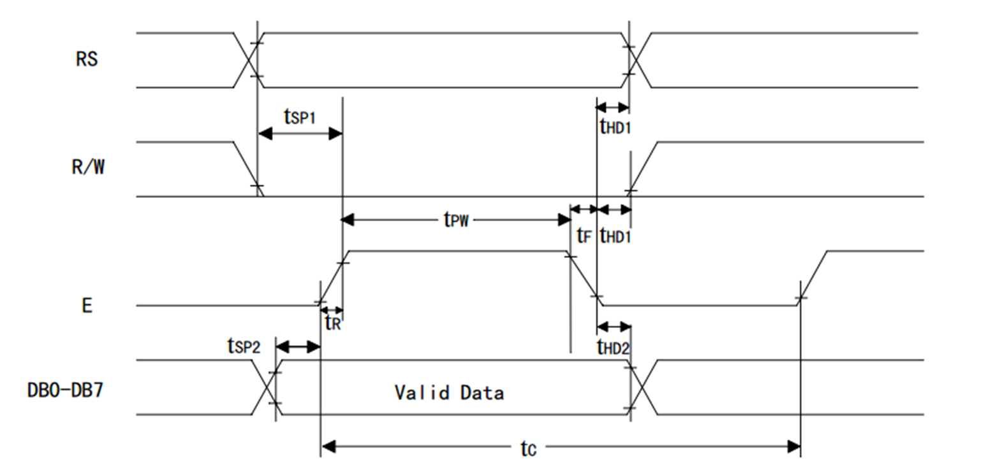
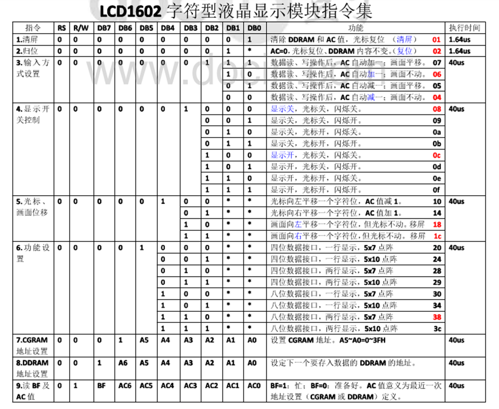

# LCD1602+232ae12c-76cf-4f1b-8814-b3c388d1b694

# LCD1602+232ae12c-76cf-4f1b-8814-b3c388d1b694 e8080fa80e524d9195aa13a17b1a68b1

## 目录

-   [LCD1602+232ae12c-76cf-4f1b-8814-b3c388d1b694](#LCD1602232ae12c-76cf-4f1b-8814-b3c388d1b694 "LCD1602+232ae12c-76cf-4f1b-8814-b3c388d1b694")
-   [LCD1602+232ae12c-76cf-4f1b-8814-b3c388d1b694](#LCD1602232ae12c-76cf-4f1b-8814-b3c388d1b694 "LCD1602+232ae12c-76cf-4f1b-8814-b3c388d1b694")
-   [LCD1602介绍](#LCD1602介绍 "LCD1602介绍")
-   [引脚及应用电路](#引脚及应用电路 "引脚及应用电路")
-   [内部结构框图](#内部结构框图 "内部结构框图")
-   [存储器结构](#存储器结构 "存储器结构")
-   [时序结构](#时序结构 "时序结构")
-   [LCD1602指令集](#LCD1602指令集 "LCD1602指令集")
-   [LCD1602操作流程](#LCD1602操作流程 "LCD1602操作流程")
-   [LCD1602调试工具](#LCD1602调试工具 "LCD1602调试工具")
-   [软件代码](#软件代码 "软件代码")
    -   [LCD1602.h](#LCD1602h "LCD1602.h")
    -   [LCD1602.c](#LCD1602c "LCD1602.c")
    -   [主函数调用](#主函数调用 "主函数调用")

# LCD1602介绍

-   LCD1602（Liquid?Crystal?Display）液晶显示屏是一种字符型液晶显 示模块，可以显示ASCII码的标准字符和其它的一些内置特殊字符， 还可以有8个自定义字符 • 显示容量：16×2个字符，每个字符为5\*7点阵



# 引脚及应用电路



# 内部结构框图



# 存储器结构



# 时序结构

-   写数据/指令



# LCD1602指令集



# LCD1602操作流程

```纯文本
•
初始化：
发送指令0x38
//八位数据接口，两行显示，5*7点阵
发送指令0x0C
//显示开，光标关，闪烁关
发送指令0x06
//数据读写操作后，光标自动加一，画面不动
发送指令0x01
//清屏
•
显示字符：
发送指令0x80|AC //设置光标位置
发送数据
//发送要显示的字符数据
发送数据
//发送要显示的字符数据
……
```

# LCD1602调试工具

-   使用LCD1602液晶屏作为调试窗口，提供类似printf函数的功能，可 实时观察单片机内部数据的变换情况，便于调试和演示。 • 本视频提供的LCD1602代码属于模块化的代码，使用者只需要知道 所提供函数的作用和使用方法就可以很容易的使用LCD1602

| 函数                              | 作用         |
| ------------------------------- | ---------- |
| LCD\_Init();                    | 初始化        |
| LCD\_ShowChar(1,1,‘A’);         | 显示一个字符     |
| LCD\_ShowString(1,3,“Hello”);   | 显示字符串      |
| LCD\_ShowNum(1,9,123,3);        | 显示十进制数字    |
| LCD\_ShowSignedNum(1,13,-66,2); | 显示有符号十进制数字 |
| LCD\_ShowHexNum(2,1,0xA8,2);    | 显示十六进制数字   |
| LCD\_ShowBinNum(2,4,0xAA,8);    | 显示二进制数字    |

# 软件代码

## LCD1602.h

## LCD1602.c

## 主函数调用
