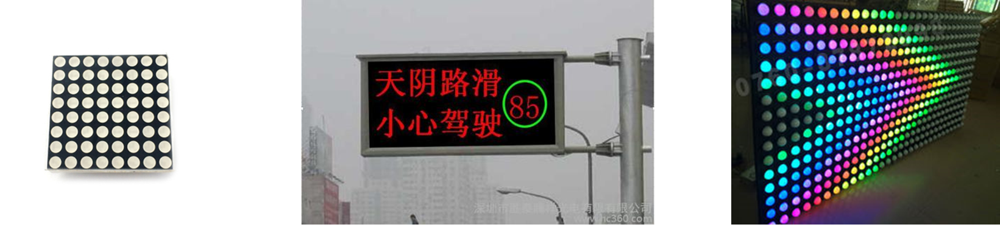
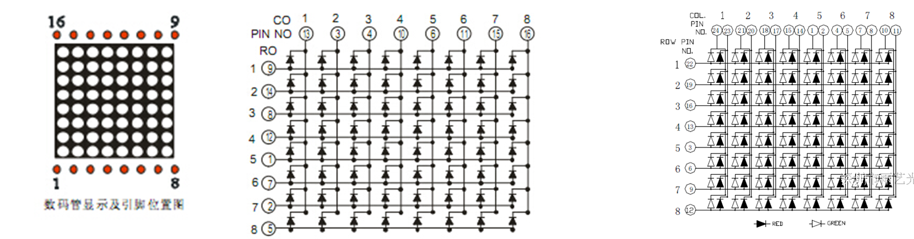
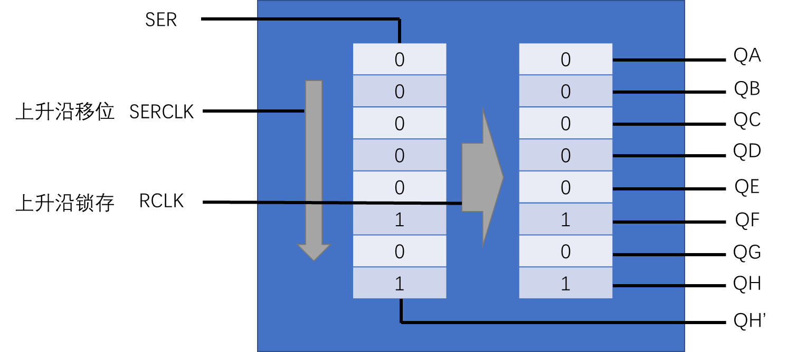
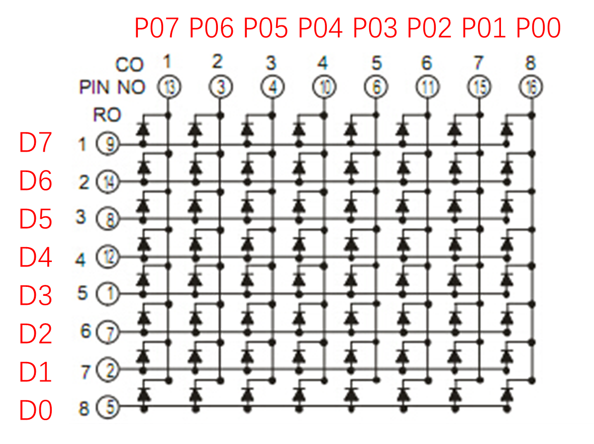
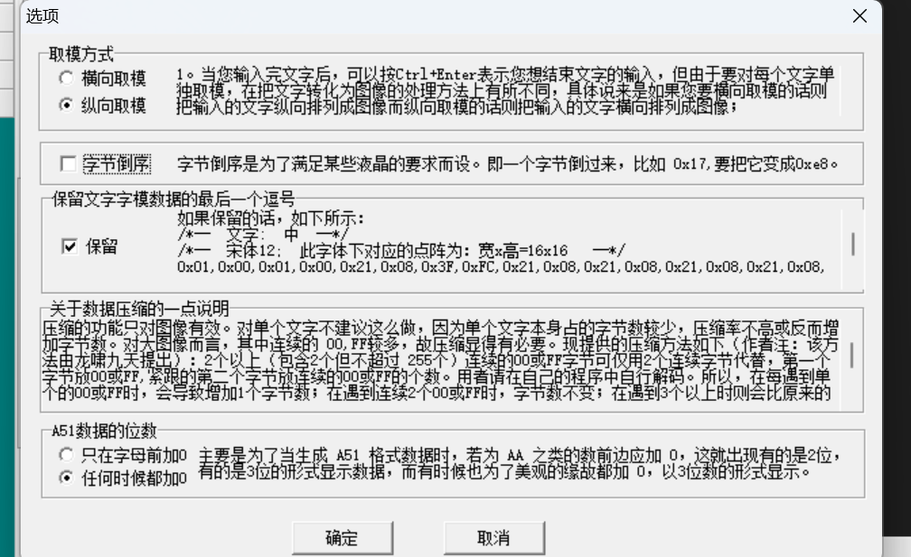
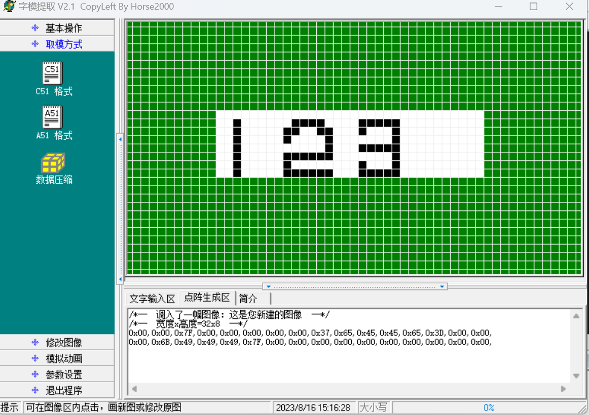
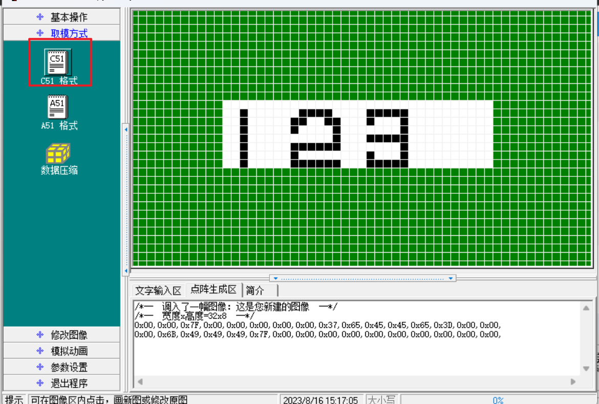

# LED点阵屏+95b9fa46-04c7-4142-8e21-6531f1093f79 ebc70b

## 目录

-   [LED点阵屏+95b9fa46-04c7-4142-8e21-6531f1093f79](#LED点阵屏95b9fa46-04c7-4142-8e21-6531f1093f79 "LED点阵屏+95b9fa46-04c7-4142-8e21-6531f1093f79")
-   [LED点阵屏+95b9fa46-04c7-4142-8e21-6531f1093f79](#LED点阵屏95b9fa46-04c7-4142-8e21-6531f1093f79 "LED点阵屏+95b9fa46-04c7-4142-8e21-6531f1093f79")
    -   [LED点阵屏介绍](#LED点阵屏介绍 "LED点阵屏介绍")
    -   [显示原理](#显示原理 "显示原理")
    -   [74HC595](#74HC595 "74HC595")
    -   [开发板引脚对应关系](#开发板引脚对应关系 "开发板引脚对应关系")
-   [代码](#代码 "代码")
    -   [9-1 LED点阵屏显示图形](#9-1-LED点阵屏显示图形 "9-1 LED点阵屏显示图形")
    -   [9-2 LED点阵屏显示动画（显示23）](#9-2-LED点阵屏显示动画显示23 "9-2 LED点阵屏显示动画（显示23）")
    -   [9-2 LED点阵屏显示动画（显示笑脸）](#9-2-LED点阵屏显示动画显示笑脸 "9-2 LED点阵屏显示动画（显示笑脸）")

# LED点阵屏+95b9fa46-04c7-4142-8e21-6531f1093f79

# LED点阵屏+95b9fa46-04c7-4142-8e21-6531f1093f79

<https://www.bilibili.com/video/BV1Mb411e7re/?p=21&spm_id_from=333.880.my_history.page.click&vd_source=5e12cc40b4cf9bc1265b996e2d71fa81>

## LED点阵屏介绍



-   LED点阵屏由若干个独立的LED组成，LED以矩阵的形式排列，以灯珠亮灭来显示文字、图片、视频等。LED点阵屏广泛应用于各种公共场合，如汽车报站器、广告屏以及公告牌等 • LED点阵屏分类 按颜色：单色、双色、全彩按像素：8X8 *、16X*16等（大规模的LED点阵通常由很多个小点阵 拼接而成）

## 显示原理



-   LED点阵屏的结构类似于数码管，只不过是数码管把每一列的像素以“8”字型排列而已 • LED点阵屏与数码管一样，有共阴和共阳两种接法，不同的接法对应的电路结构不同 • LED点阵屏需要进行逐行或逐列扫描，才能使所有LED同时显示

## 74HC595

-   74HC595是串行输入并行输出的移位寄存器，可用3根线输入串行数据，8根线输出并行数据，多片级联后，可输出16位、24位、32位等，常用于IO口扩展。



## 开发板引脚对应关系



# 代码

## 9-1 LED点阵屏显示图形

````纯文本
//这段代码是用于控制一个8x8的LED点阵屏显示数据的。主要功能是通过74HC595芯片驱动LED点阵屏，通过P3口的RCK和SCK引脚来控制数据和时钟信号的传输。

//```c
#include <REGX52.H> //包含头文件，定义了51单片机的寄存器
#include "Delay.h" //包含延时函数的头文件

sbit RCK=P3^5; //定义RCK引脚，连接到P3.5
sbit SCK=P3^6; //定义SCK引脚，连接到P3.6
sbit SER=P3^4; //定义SER引脚，连接到P3.4  发送数据

#define MATRIX_LED_PORT P0 //定义LED点阵屏的端口，连接到P0口

// 74HC595写入一个字节
// @param Byte 要写入的字节
// @retval 无
void _74HC595_WriteByte(unsigned char Byte)
{
    unsigned char i;
    for(i=0;i<8;i++)
    {
//       SER=  Byte&0x80
//       SCK=1; //拉高时钟信号
//       SCK=0; //拉低时钟信号
//       SER=  Byte&0x40
//       SCK=1; //拉高时钟信号
//       SCK=0; //拉低时钟信号
        //Byte&0x80  取出高位
        SER=Byte&(0x80>>i); //将字节的最高位写入SER引脚     取出高位，下次循环传到下一位
        SCK=1; //拉高时钟信号
        SCK=0; //拉低时钟信号
    }
    RCK=1; //拉高RCK引脚，使数据有效  数据推过去
    //这里可以加延时程序，如果你的单片机速度快可能要加，51慢一点没那么快，不加延时也没关系
    RCK=0; //拉低RCK引脚，使数据无效
}

// LED点阵屏显示一列数据
// @param Column 要选择的列，范围：0~7，0在最左边
// @param Data 选择列显示的数据，高位在上，1为亮，0为灭
// @retval 无
void MatrixLED_ShowColumn(unsigned char Column,Data)
{
    _74HC595_WriteByte(Data); //将数据写入74HC595芯片
    MATRIX_LED_PORT=~(0x80>>Column); //将对应列的LED点亮或熄灭
    Delay(1); //延时1ms，保证显示效果
    MATRIX_LED_PORT=0xFF; //将所有LED熄灭
}

void main()
{
    SCK=0; //初始化时钟信号为低电平
    RCK=0; //初始化RCK引脚为低电平
    while(1) //无限循环
    {
        MatrixLED_ShowColumn(0,0x3C); //显示第一列的数据0x3C
        MatrixLED_ShowColumn(1,0x42); //显示第二列的数据0x42
        MatrixLED_ShowColumn(2,0xA9); //显示第三列的数据0xA9
        MatrixLED_ShowColumn(3,0x85); //显示第四列的数据0x85
        MatrixLED_ShowColumn(4,0x85); //显示第五列的数据0x85
        MatrixLED_ShowColumn(5,0xA9); //显示第六列的数据0xA9
        MatrixLED_ShowColumn(6,0x42); //显示第七列的数据0x42
        MatrixLED_ShowColumn(7,0x3C); //显示第八列的数据0x3C
    }
}
//```
````

## 9-2 LED点阵屏显示动画（显示23）

```纯文本
#include <REGX52.H>
#include "Delay.h"
#include "MatrixLED.h"

//动画数据
unsigned char code Animation[]={   // 23    写上code的关键字是把数据写到flash里面去
/*--  调入了一幅图像：这是您新建的图像  --*/
/*--  宽度x高度=32x8  --*/
0xFF,0xFF,0xFF,0xFF,0xFF,0xFF,0x00,0x00,0x37,0x65,0x45,0x45,0x65,0x3D,0x00,0x00,
0x00,0x63,0x49,0x49,0x49,0x7F,0x00,0x00,0x00,0x00,0x00,0x00,0x00,0x00,0x00,0x00,

};

sbit RCK=P3^5;      //RCLK
sbit SCK=P3^6;      //SRCLK
sbit SER=P3^4;      //SER

#define MATRIX_LED_PORT     P0

/**
  * @brief  74HC595写入一个字节
  * @param  Byte 要写入的字节
  * @retval 无
  */
void _74HC595_WriteByte(unsigned char Byte)
{
    unsigned char i;
    for(i=0;i<8;i++)
    {
        SER=Byte&(0x80>>i);
        SCK=1;
        SCK=0;
    }
    RCK=1;
    RCK=0;
}

/**
  * @brief  点阵屏初始化
  * @param  无
  * @retval 无
  */
void MatrixLED_Init()
{
    SCK=0;
    RCK=0;
}

/**
  * @brief  LED点阵屏显示一列数据
  * @param  Column 要选择的列，范围：0~7，0在最左边
  * @param  Data 选择列显示的数据，高位在上，1为亮，0为灭
  * @retval 无
  */
void MatrixLED_ShowColumn(unsigned char Column,Data)
{
    _74HC595_WriteByte(Data);
    MATRIX_LED_PORT=~(0x80>>Column);
    Delay(1);
    MATRIX_LED_PORT=0xFF;
}

void Delay(unsigned int xms)
{
    unsigned char i, j;
    while(xms--)
    {
        i = 2;
        j = 239;
        do
        {
            while (--j);
        } while (--i);
    }
}

void main()
{
    unsigned char i,Offset=0,Count=0;
    MatrixLED_Init();
    while(1)
    {
        for(i=0;i<8;i++)    //循环8次，显示8列数据
        {
            MatrixLED_ShowColumn(i,Animation[i+Offset]);
        }
        Count++;            //计次延时
        if(Count>10)
        {
            Count=0;
            Offset++;
            if(Offset>24)
            {
                Offset=0;
            }
        }
    }
}

```







## 9-2 LED点阵屏显示动画（显示笑脸）

```纯文本
#include <REGX52.H>
#include "Delay.h"
#include "MatrixLED.h"

//动画数据
unsigned char code Animation[]={
    0x3C,0x42,0xA9,0x85,0x85,0xA9,0x42,0x3C,
    0x3C,0x42,0xA1,0x85,0x85,0xA1,0x42,0x3C,
    0x3C,0x42,0xA5,0x89,0x89,0xA5,0x42,0x3C,
};

sbit RCK=P3^5;      //RCLK
sbit SCK=P3^6;      //SRCLK
sbit SER=P3^4;      //SER

#define MATRIX_LED_PORT     P0

/**
  * @brief  74HC595写入一个字节
  * @param  Byte 要写入的字节
  * @retval 无
  */
void _74HC595_WriteByte(unsigned char Byte)
{
    unsigned char i;
    for(i=0;i<8;i++)
    {
        SER=Byte&(0x80>>i);
        SCK=1;
        SCK=0;
    }
    RCK=1;
    RCK=0;
}

/**
  * @brief  点阵屏初始化
  * @param  无
  * @retval 无
  */
void MatrixLED_Init()
{
    SCK=0;
    RCK=0;
}

/**
  * @brief  LED点阵屏显示一列数据
  * @param  Column 要选择的列，范围：0~7，0在最左边
  * @param  Data 选择列显示的数据，高位在上，1为亮，0为灭
  * @retval 无
  */
void MatrixLED_ShowColumn(unsigned char Column,Data)
{
    _74HC595_WriteByte(Data);
    MATRIX_LED_PORT=~(0x80>>Column);
    Delay(1);
    MATRIX_LED_PORT=0xFF;
}

void Delay(unsigned int xms)
{
    unsigned char i, j;
    while(xms--)
    {
        i = 2;
        j = 239;
        do
        {
            while (--j);
        } while (--i);
    }
}

void main()
{
    unsigned char i,Offset=0,Count=0;
    MatrixLED_Init();
    while(1)
    {
        for(i=0;i<8;i++)    //循环8次，显示8列数据
        {
            MatrixLED_ShowColumn(i,Animation[i+Offset]);
        }
        Count++;            //计次延时
        if(Count>15)
        {
            Count=0;
            Offset+=8;      //偏移+8，切换下一帧画面
            if(Offset>16)
            {
                Offset=0;
            }
        }
    }
}

```
