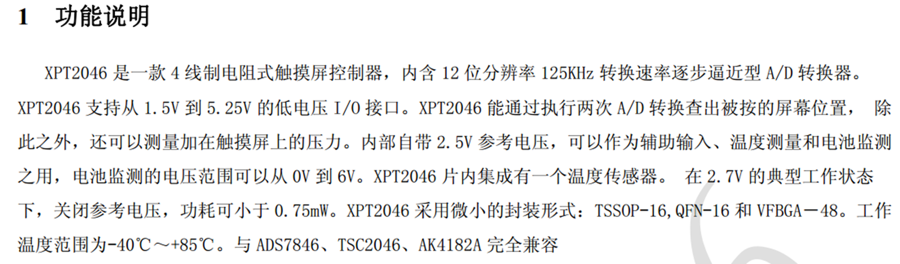

# XPT2046+59c84c4b-2ab5-4e57-9221-fb6cd8632ef8

# XPT2046+59c84c4b-2ab5-4e57-9221-fb6cd8632ef8 2627950327d9473e9f85981d2d2bd416

## 目录

-   [XPT2046+59c84c4b-2ab5-4e57-9221-fb6cd8632ef8](#XPT204659c84c4b-2ab5-4e57-9221-fb6cd8632ef8 "XPT2046+59c84c4b-2ab5-4e57-9221-fb6cd8632ef8")

XPT2046时序

提示：DCLK时钟线在进入读取的For循环之前必须为低电平，否则会丢失一位数据，比如8位最大只能调节到128
