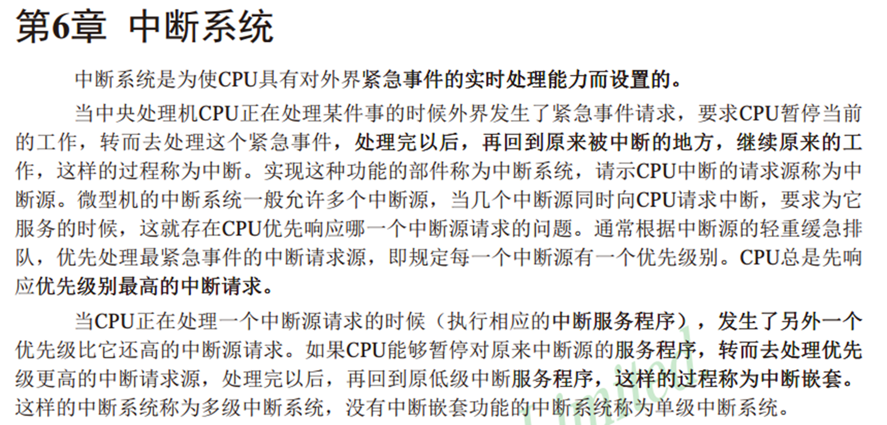
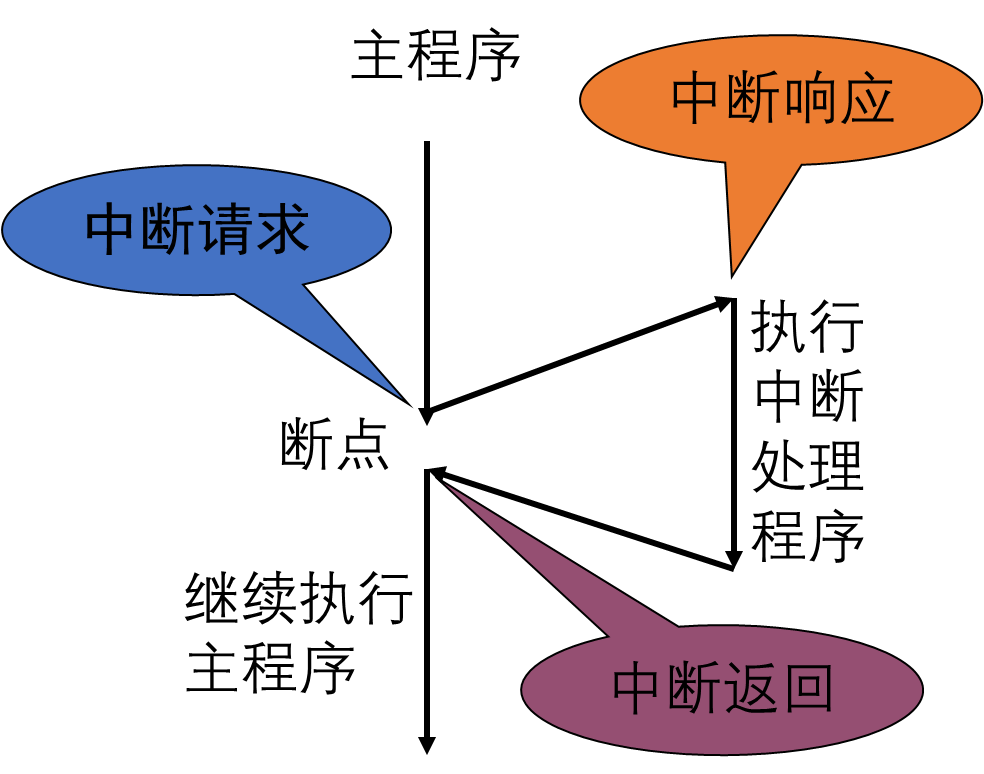
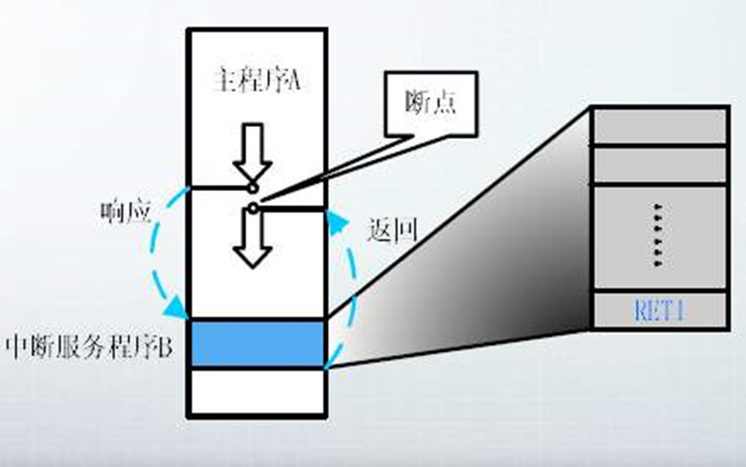
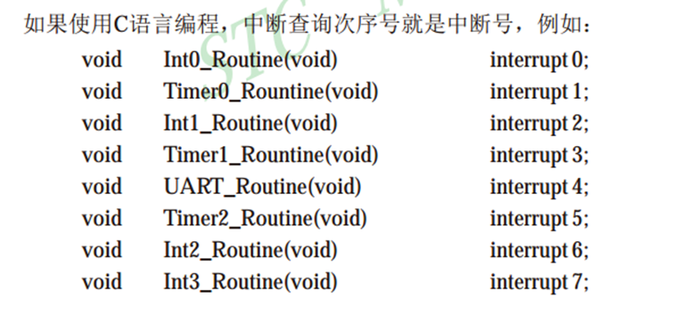
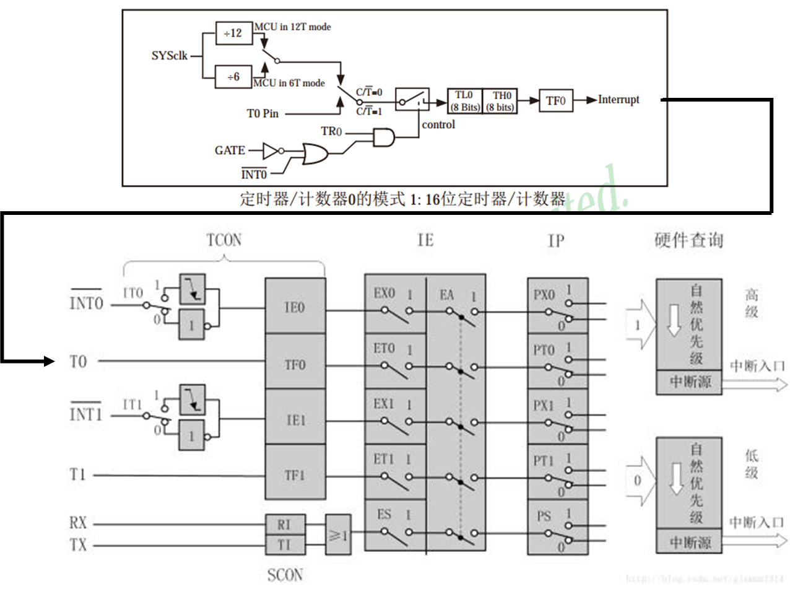
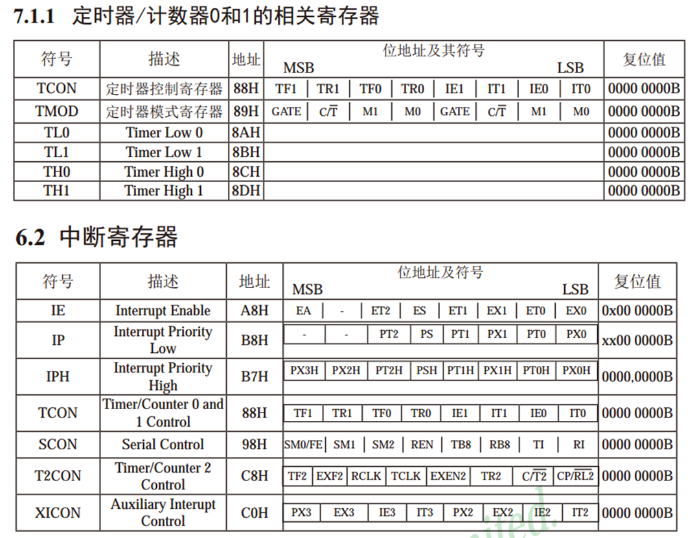

# 中断系统

## 目录

-   [中断系统+2eedb619-49bf-4e7b-8189-f69a97a53c3f](#中断系统2eedb619-49bf-4e7b-8189-f69a97a53c3f "中断系统+2eedb619-49bf-4e7b-8189-f69a97a53c3f")
-   [中断系统+2eedb619-49bf-4e7b-8189-f69a97a53c3f](#中断系统2eedb619-49bf-4e7b-8189-f69a97a53c3f "中断系统+2eedb619-49bf-4e7b-8189-f69a97a53c3f")
    -   [STC89C52中断资源](#STC89C52中断资源 "STC89C52中断资源")
    -   [定时器和中断系统](#定时器和中断系统 "定时器和中断系统")
    -   [定时器相关寄存器](#定时器相关寄存器 "定时器相关寄存器")
    -   [定时器显示时钟](#定时器显示时钟 "定时器显示时钟")
    -   [定时翻转LED](#定时翻转LED "定时翻转LED")



优先级高的先执行高的优先级的，然后再低优先级的





## STC89C52中断资源

-   中断源个数：8个（外部中断0、定时器0中断、外部中断1、定时器 1中断、串口中断、定时器2中断、外部中断2、外部中断3） • 中断优先级个数：4个

中断号：



-   注意：中断的资源和单片机的型号是关联在一起的，不同的型号可能会有不同的中断资源，例如中断源个数不同、中断优先级个数不同等等

## 定时器和中断系统



为了方便讲解，这里使用的中断系统图是传统51单片机的图，STC89C52的中断系统图可参考手册

## 定时器相关寄存器



-   寄存器是连接软硬件的媒介 • 在单片机中寄存器就是一段特殊的RAM存储器，一方面，寄存器可以存储和读取数据，另一方 面，**每一个寄存器背后都连接了一根导线，控制着电路的连接方式** • 寄存器相当于一个复杂机器的“操作按钮

> 单片机通过内置的寄存器来操作单片机

TCON = TIME control

TMOD =TIME mode

## 定时器显示时钟

main.c

```c
#include <REGX52.H>
#include "Delay.h"
#include "LCD1602.h"
#include "Timer0.h"

unsigned char Sec=55,Min=59,Hour=23;

void main()
{
    LCD_Init();
    Timer0Init();

    LCD_ShowString(1,1,"Clock:");   //上电显示静态字符串
    LCD_ShowString(2,1,"  :  :");

    while(1)
    {
        LCD_ShowNum(2,1,Hour,2);    //显示时分秒
        LCD_ShowNum(2,4,Min,2);
        LCD_ShowNum(2,7,Sec,2);
    }
}

void Timer0_Routine() interrupt 1
{
    static unsigned int T0Count;
    //进入中断后需要重新赋初值
    TH0 = 0xFC;     //设置定时初值
    TL0 = 0x18;     //设置定时初值

    T0Count++;
    if(T0Count>=1000)   //定时器分频，1s
    {
        T0Count=0;
        Sec++;          //1秒到，Sec自增
        if(Sec>=60)
        {
            Sec=0;      //60秒到，Sec清0，Min自增
            Min++;
            if(Min>=60)
            {
                Min=0;  //60分钟到，Min清0，Hour自增
                Hour++;
                if(Hour>=24)
                {
                    Hour=0; //24小时到，Hour清0
                }
            }
        }
    }
}
```

time.c

```c

#include <REGX52.H>

/**
  * @brief  定时器0初始化，1毫秒@12.000MHz晶振
  * @param  无
  * @retval 无
  */
void Timer0Init(void)
{
    TMOD &= 0xF0;       //设置定时器模式
    TMOD |= 0x01;       //设置定时器模式
    TL0 = 0x18;     //设置定时初值
    TH0 = 0xFC;     //设置定时初值
    TF0 = 0;        //清除TF0标志
    TR0 = 1;        //定时器0开始计时
    ET0=1;
    EA=1;
    PT0=0;

}

/*定时器中断函数模板
void Timer0_Routine() interrupt 1
{
    static unsigned int T0Count;
    TL0 = 0x18;     //设置定时初值
    TH0 = 0xFC;     //设置定时初值
    T0Count++;
    if(T0Count>=1000)
    {
        T0Count=0;

    }
}
*/
```

time.h

```纯文本
#ifndef __TIMER0_H__
#define __TIMER0_H__

void Timer0Init(void);

#endif
```

## 定时翻转LED

65535 每隔1us计数加1 总共定时时间65535us

让他一毫秒产生一次中断

```c
#include <REGX52.H>

//sbit LED = P2_1;
//sbit LED = 0xFE;

#define LED P2_0
#define BUTTON P1_2

void TimerO_Init()
{
    TMOD=0x01;
    TF0 = 0;    //清除TF0标志
    TR0=1;
    TH0=64535/256;  //高8位  取出高位
    TL0=64535%256;   //低8位   取出低位
    TR0 = 1;        //定时器0开始计时
    ET0=1;  //中断通道0
    EA=1;       //总中断等于1
    PT0=0;  ///需要通过三个开关
    //  65535
    //每隔1us计数加1
    //总共定时时间65535us
}
void Timer0_Routine() interrupt 1 //每一次计时完毕都会跳到的这里来
{
    TH0=64535/256;  //高8位  取出高位
    TL0=64535%256;   //低8位   取出低位
	LED=~LED;
}
void main()
{
    TimerO_Init();

   while(1)
    {

    };

}
```
