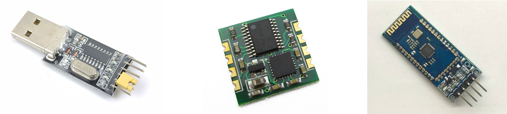
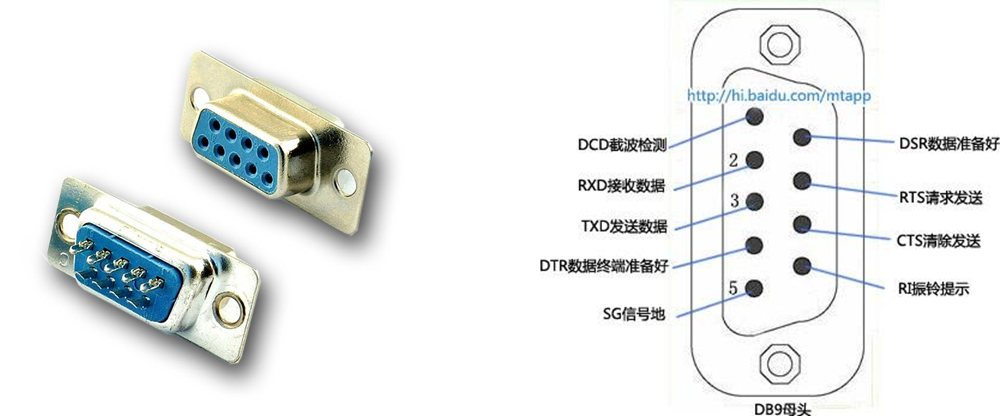
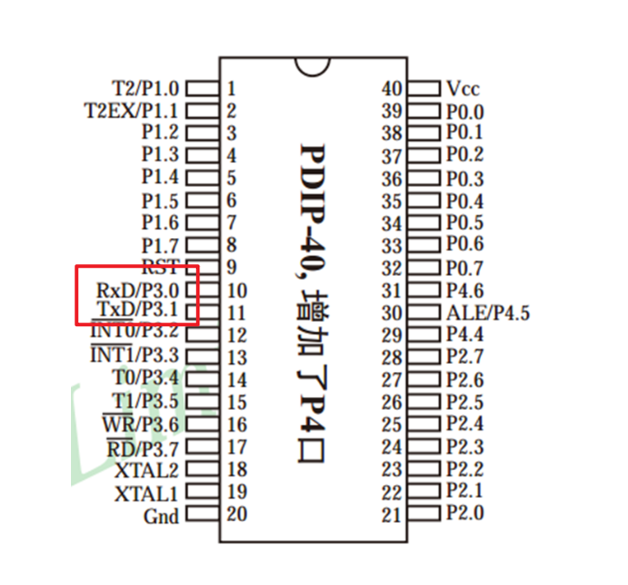
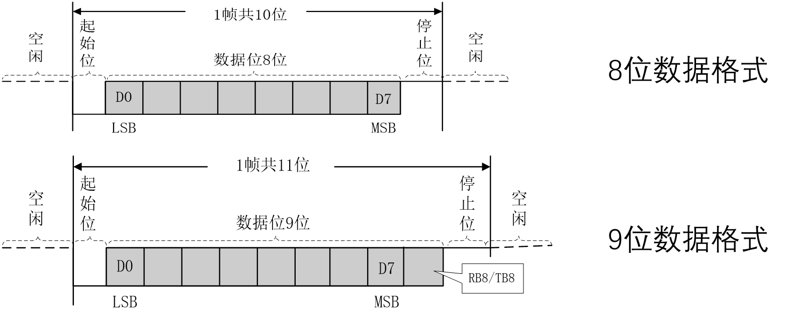
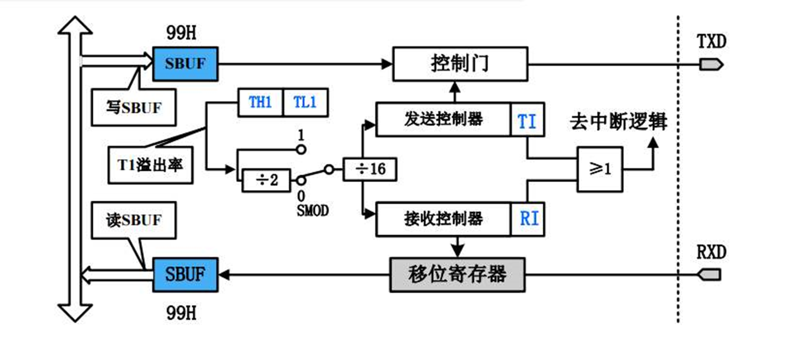
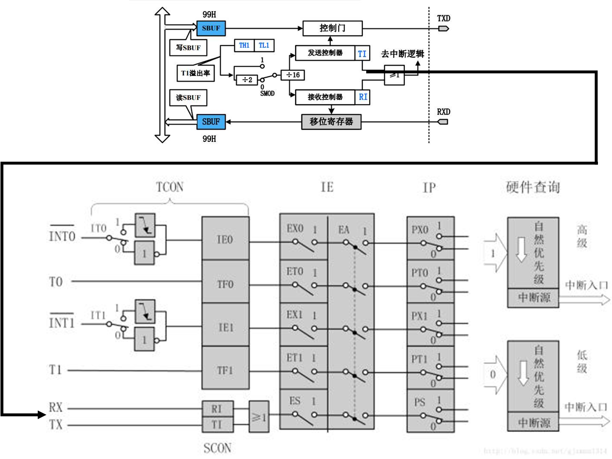
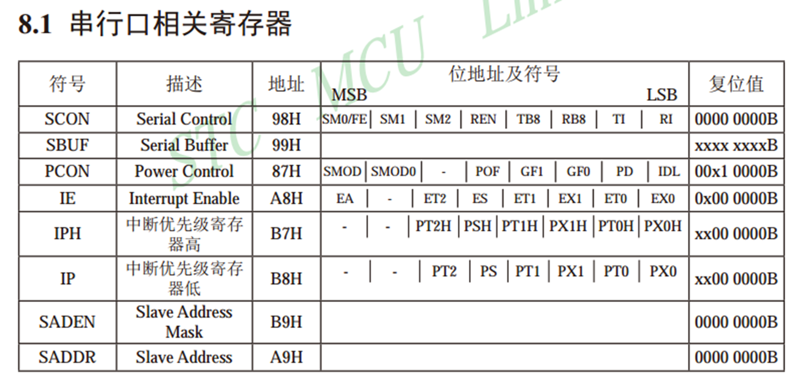
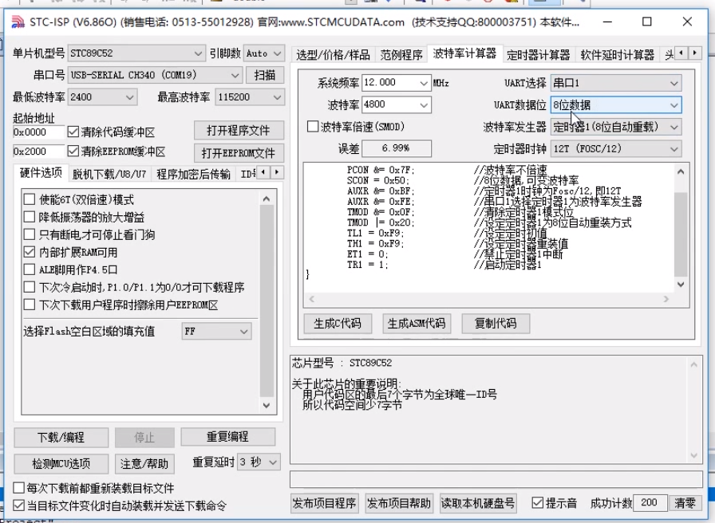
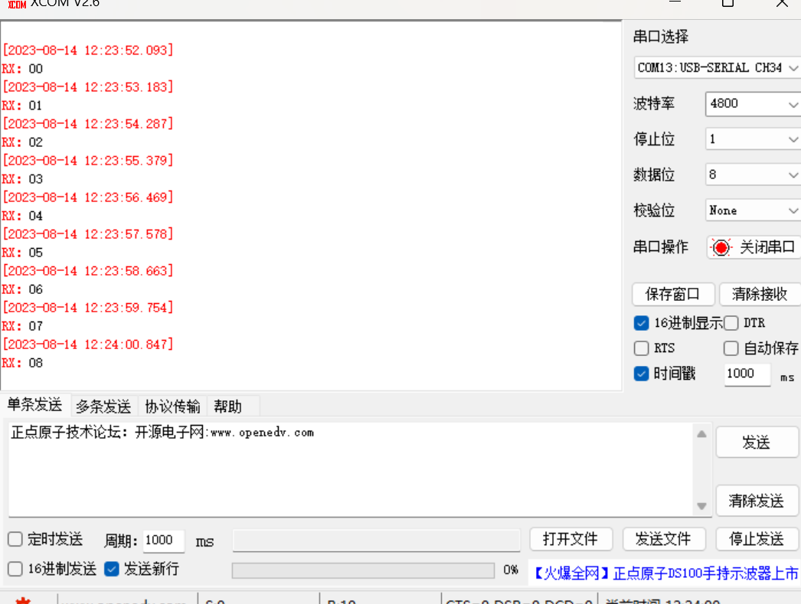
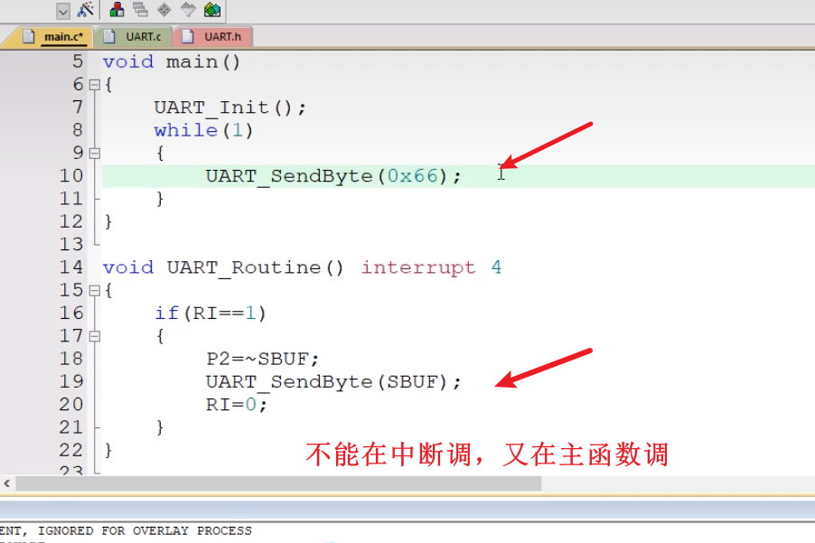

# 串口介绍+d2d72d91-8149-4c65-a1c1-92adb17e9a76 d3cf5dad

## 目录

-   [串口介绍+d2d72d91-8149-4c65-a1c1-92adb17e9a76](#串口介绍d2d72d91-8149-4c65-a1c1-92adb17e9a76 "串口介绍+d2d72d91-8149-4c65-a1c1-92adb17e9a76")
-   [串口介绍+d2d72d91-8149-4c65-a1c1-92adb17e9a76](#串口介绍d2d72d91-8149-4c65-a1c1-92adb17e9a76 "串口介绍+d2d72d91-8149-4c65-a1c1-92adb17e9a76")
-   [USB转TTL(rxd\&txd)](#USB转TTLrxdtxd "USB转TTL(rxd\&txd)")
-   [模块](#模块 "模块")
    -   [51单片机的UART](#51单片机的UART "51单片机的UART")
    -   [串口参数及时序图](#串口参数及时序图 "串口参数及时序图")
    -   [串口模式图](#串口模式图 "串口模式图")
    -   [串口和中断系统](#串口和中断系统 "串口和中断系统")
    -   [串口相关寄存器](#串口相关寄存器 "串口相关寄存器")
-   [代码](#代码 "代码")

# 串口介绍+d2d72d91-8149-4c65-a1c1-92adb17e9a76

# 串口介绍+d2d72d91-8149-4c65-a1c1-92adb17e9a76

<https://www.bilibili.com/video/BV1Mb411e7re/?p=19&spm_id_from=333.880.my_history.page.click&vd_source=5e12cc40b4cf9bc1265b996e2d71fa81>

# USB转TTL(rxd\&txd)

现在电脑是一般没有串口接口，通常是USB接口，所以要模块USB转TTL(rxd\&txd)

其他模块（MPU6050，蓝牙）可以通过串口去连接设备

简单双向串口通信有两根通信线（发送端TXD和接收端RXD） TXD与RXD要交又连接 当只需单向的数据传输时，可以直接一根通信线 当电平标准不一致时，需要加电平转换芯片


# 模块

-   串口是一种应用十分广泛的通讯接口，串口成本低、容易使用、通信线路简单，可实现两个设备的互相通信。 • 单片机的串口可以使单片机与单片机、单片机与电脑、单片机与各式各样的模块互相通信，极大的扩展了单片机的应用范围，增强了单片机系统的硬件实力。 • **51单片机内部自带UART（Universal?Asynchronous?Receiver?Transmitter，通用异步收发器），可实现单片机的串口通信。**



简单双向串口通信有两根通信线（发送端TXD和接收端RXD）

TXD与RXD要交叉连接

当只需单向的数据传输时，可以直接一根通信线

当电平标准不一致时，需要加电平转换芯片

电平标准

电平标准是数据1和数据0的表达方式，是传输线缆中人为规定的电压与数据的对应关系，串口常用的电平标准有如下三种：

TTL电平：+5V表示1，0V表示0

RS232电平：-3-15V表示1，+3+15V表示0

RS485电平：两线压差+2+6V表示1，-2-6V表示0（差分信号）接口及引脚定义

**这种接口一般是5v接口（这种接口要看内部设计，****RS485电平****或者**RS232电平 **）**



流控对数据发送进行限制，现在送不了，等会再发送数据

通信速率要保持一样

常见通信接口比较

| 名称     | 引脚定义              | 通信方式   | 特点      |
| ------ | ----------------- | ------ | ------- |
| UART   | TXD、RXD           | 全双工、异步 | 点对点通信   |
| I²C    | SCL、SDA           | 半双工、同步 | 可挂载多个设备 |
| SPI    | SCLK、MOSI、MISO、CS | 全双工、同步 | 可挂载多个设备 |
| 1-Wire | DQ                | 半双工、异步 | 可挂载多个设备 |

此外还有：CAN、USB等

相关术语 • 全双工：通信双方可以在同一时刻互相传输数据 半双工：通信双方可以互相传输数据，但必须分时复用一根数据线 单工：通信只能有一方发送到另一方，不能反向传输 • 异步：通信双方各自约定通信速率 同步：通信双方靠一根时钟线来约定通信速率 • 总线：连接各个设备的数据传输线路（类似于一条马路，把路边各住户连接起来，使住户可以相互交流）

## 51单片机的UART

-   STC89C52有**1**个UART •STC89C52的UART有四种工作模式： 模式0：同步移位寄存器 模式1：8位UART，波特率可变（常用） 模式2：9位UART，波特率固定 模式3：9位UART，波特率可变

有个奇偶校验后面可能跟一个1 0000 1111 1 来进行校验发送的位数是否正确



## 串口参数及时序图

-   波特率：串口通信的速率（发送和接收各数据位的间隔时间） • 检验位：用于数据验证 • 停止位：用于数据帧间隔



**先发低位再发高位**

## 串口模式图



-   SBUF（串口的缓存器）：串口数据缓存寄存器，物理上是两个独立的寄存器，但占用相同的地址。写操作时，写入的是发送寄存器，读操作时，读出的是接收寄存器

T1溢出率是通过配置定时器的来控制波特率的定时采样

发送和接收会有中断输出出来

接收和发送是同一个通道需要在中断里面去判断

## 串口和中断系统



## 串口相关寄存器



SCON是串口控制寄存器，是配置串口的状态的

PCON是电源控制寄存器，是与电源有关的，可能早期寄存器紧张，可以把串口控制放到电源控制里面啊

IE是开总中断

# 代码

<https://www.bilibili.com/video/BV1Mb411e7re/?p=20&spm_id_from=pageDriver&vd_source=5e12cc40b4cf9bc1265b996e2d71fa81>



11.0592晶振对波特率是没有误差的



```纯文本
#include <REGX52.H>

/**
  * @brief  串口初始化，//4800bps@11.0592MHz
  * @param  无
  * @retval 无
  */
void UART_Init()
{
    SCON=0x50;
    PCON |= 0x80;
    TMOD &= 0x0F;       //设置定时器模式
    TMOD |= 0x20;       //设置定时器模式
    TL1 = 0xF3;         //设置定时初始值
    TH1 = 0xF3;         //设置定时初始值
    ET1 = 0;        //禁止定时器1中断
    TR1 = 1;        //启动定时器1
}

/**
  * @brief  串口发送一个字节数据
  * @param  Byte 要发送的一个字节数据
  * @retval 无
  */
void UART_SendByte(unsigned char Byte)
{
    SBUF=Byte;
    while(TI==0);
    TI=0;
}

void Delay(unsigned int xms)
{
    unsigned char i, j;
    while(xms--)
    {
        i = 2;
        j = 239;
        do
        {
            while (--j);
        } while (--i);
    }
}
unsigned char Sec;
void main()
{

    unsigned char Sec = "Helloworld";
    UART_Init();            //串口初始化
    while(1)
    {
        UART_SendByte(Sec); //串口发送一个字节
        Delay(1000);        //延时1秒
    }
}

```



```纯文本
/**
  * @brief  串口初始化，//4800bps@11.0592MHz
  * @param  无
  * @retval 无
  */
void UART_Init()
{
    SCON=0x50;
    PCON |= 0x80;
    TMOD &= 0x0F;       //设置定时器模式
    TMOD |= 0x20;       //设置定时器模式
    TL1 = 0xF3;         //设置定时初始值
    TH1 = 0xF3;         //设置定时初始值
    ET1 = 0;        //禁止定时器1中断
    TR1 = 1;        //启动定时器1
}
```

0xF3等于243 ==> 256-243=13==>3us是TI的溢出率>1/13us=0.7692==>0.7692/16=0.004807xxxxxx==>乘以1000x1000=4807
