# 存储器介绍+01fae8c7-1b31-4173-854b-590b8ed47794 c951284

## 目录

-   [存储器介绍+01fae8c7-1b31-4173-854b-590b8ed47794](#存储器介绍01fae8c7-1b31-4173-854b-590b8ed47794 "存储器介绍+01fae8c7-1b31-4173-854b-590b8ed47794")
-   [存储器介绍+01fae8c7-1b31-4173-854b-590b8ed47794](#存储器介绍01fae8c7-1b31-4173-854b-590b8ed47794 "存储器介绍+01fae8c7-1b31-4173-854b-590b8ed47794")
    -   [AT24C02介绍](#AT24C02介绍 "AT24C02介绍")
    -   [内部结构框图](#内部结构框图 "内部结构框图")
    -   [I2C总线介绍](#I2C总线介绍 "I2C总线介绍")
    -   [I2C电路规范](#I2C电路规范 "I2C电路规范")
    -   [I2C时序结构](#I2C时序结构 "I2C时序结构")
    -   [I2C时序结构](#I2C时序结构 "I2C时序结构")
    -   [I2C数据帧](#I2C数据帧 "I2C数据帧")
    -   [AT24C02数据帧](#AT24C02数据帧 "AT24C02数据帧")

# 存储器介绍+01fae8c7-1b31-4173-854b-590b8ed47794

# 存储器介绍+01fae8c7-1b31-4173-854b-590b8ed47794

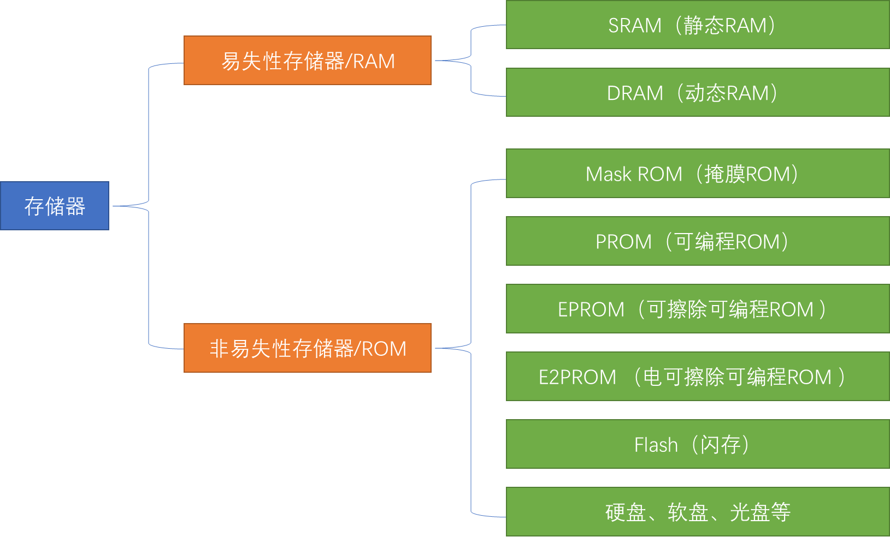

存储器简化模型

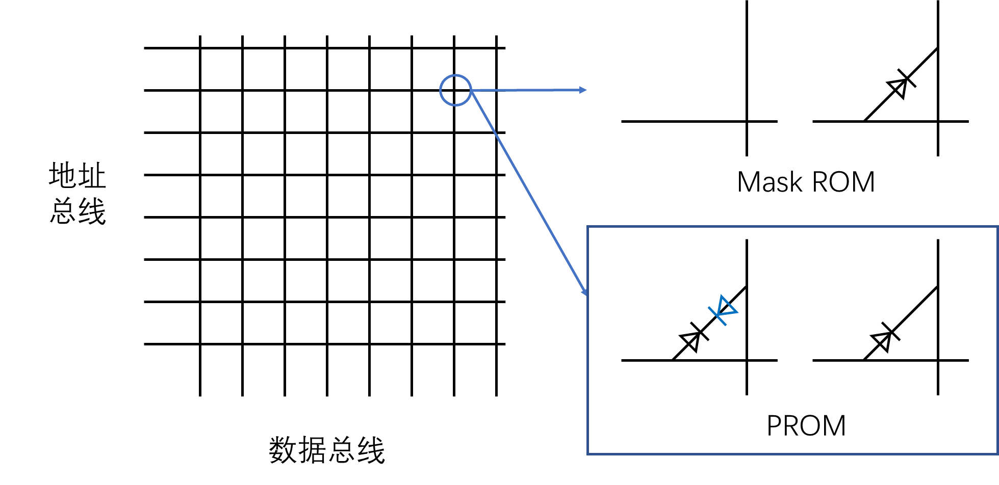

## AT24C02介绍

-   AT24C02是一种可以实现掉电不丢失的存储器，可用于保存单片机 运行时想要永久保存的数据信息 • 存储介质：E2PROM • 通讯接口：I2C总线 • 容量：256字节

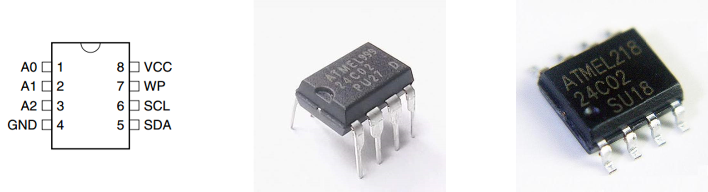

引脚及应用电路

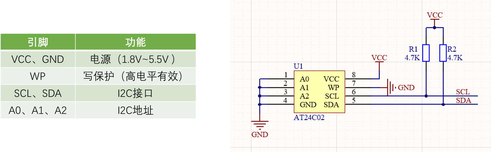

## 内部结构框图

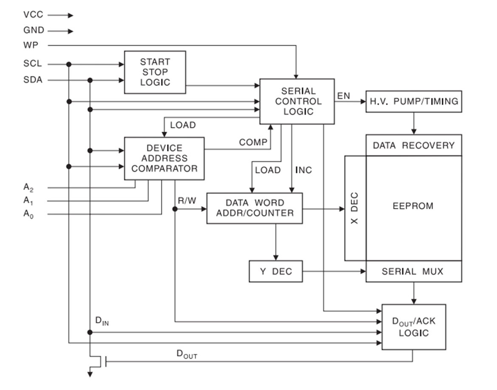

## I2C总线介绍

-   I2C总线（Inter?IC?BUS）是由Philips公司开发的一种通用数据总线 • 两根通信线：SCL（Serial?Clock）、SDA（Serial?Data） • 同步、半双工，带数据应答 • 通用的I2C总线，可以使各种设备的通信标准统一，对于厂家来说， 使用成熟的方案可以缩短芯片设计周期、提高稳定性，对于应用者 来说，使用通用的通信协议可以避免学习各种各样的自定义协议， 降低了学习和应用的难度

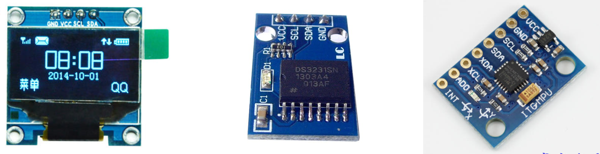

## I2C电路规范

-   所有I2C设备的SCL连在一起，SDA连在一起 • 设备的SCL和SDA均要配置成开漏输出模式 • SCL和SDA各添加一个上拉电阻

`阻值一般为4.7KΩ左右`

-   开漏输出和上拉电阻的共同作用实现了“线与”的功能，此设计主要 是为了解决多机通信互相干扰的问题

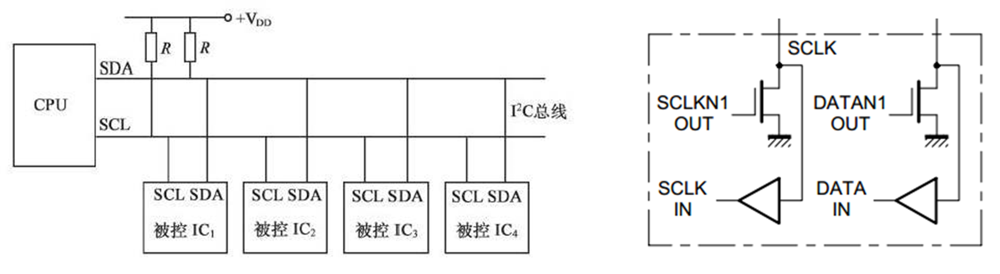

## I2C时序结构

-   起始条件：SCL高电平期间，SDA从高电平切换到低电平 • 终止条件：SCL高电平期间，SDA从低电平切换到高电平

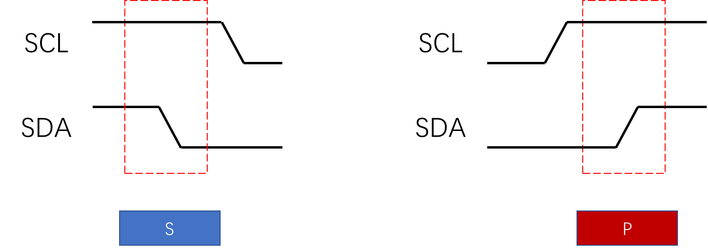

## I2C时序结构

-   发送一个字节：SCL低电平期间，主机将数据位依次放到SDA线上 （高位在前），然后拉高SCL，从机将在SCL高电平期间读取数据位， 所以SCL高电平期间SDA不允许有数据变化，依次循环上述过程8次， 即可发送一个字节

-   接收一个字节：SCL低电平期间，从机将数据位依次放到SDA线上 （高位在前），然后拉高SCL，主机将在SCL高电平期间读取数据位， 所以SCL高电平期间SDA不允许有数据变化，依次循环上述过程8次， 即可接收一个字节（主机在接收之前，需要释放SDA

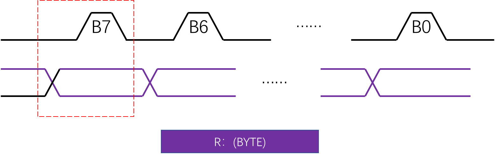

-   发送应答：在接收完一个字节之后，主机在下一个时钟发送一位数 据，数据0表示应答，数据1表示非应答 • 接收应答：在发送完一个字节之后，主机在下一个时钟接收一位数 据，判断从机是否应答，数据0表示应答，数据1表示非应答（主机 在接收之前，需要释放SDA

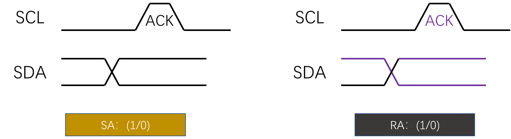

## I2C数据帧

-   发送一帧数据

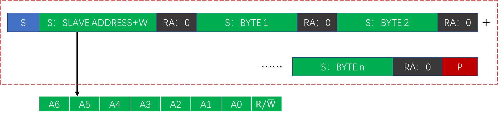

-   完成任务：向谁发什么
-   接收一帧数据

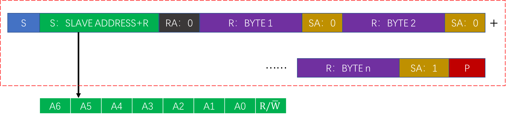

-   完成任务：向谁收什么
-   先发送再接收数据帧（复合格式）

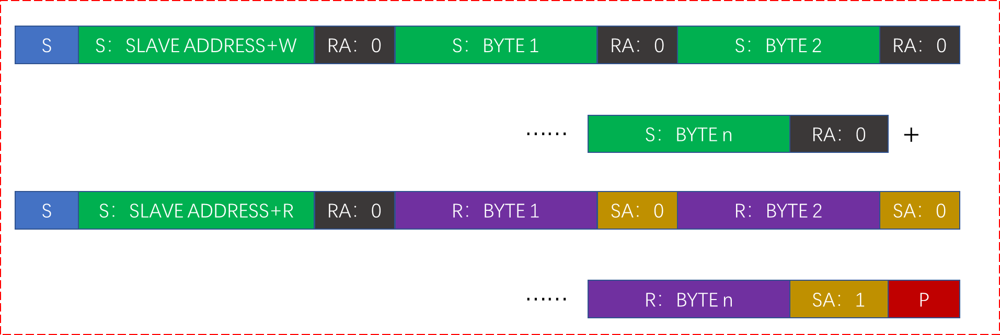

-   完成任务：向谁收指定的什么

## AT24C02数据帧

-   字节写：在WORD?ADDRESS处写入数据DATA

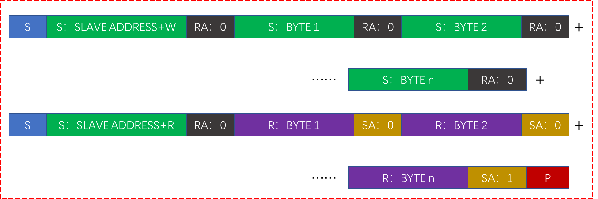

-   AT24C02的固定地址为1010，可配置地址本开发板上为000 所以SLAVE?ADDRESS+W为0xA0，SLAVE?ADDRESS+R为0xA1
-   字节写：在“字地址”处写入“数据”

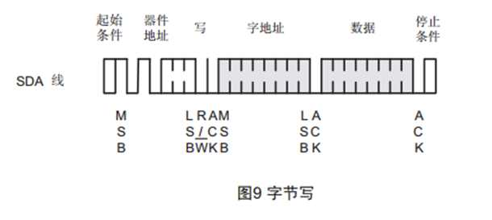

随机读：读出在“字地址”处的“数据”

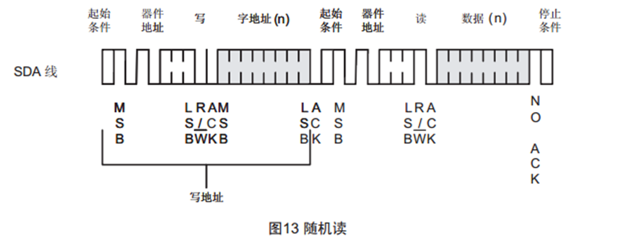
