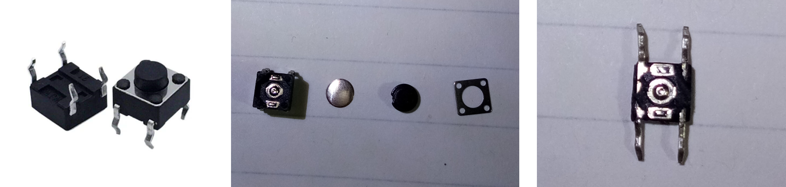
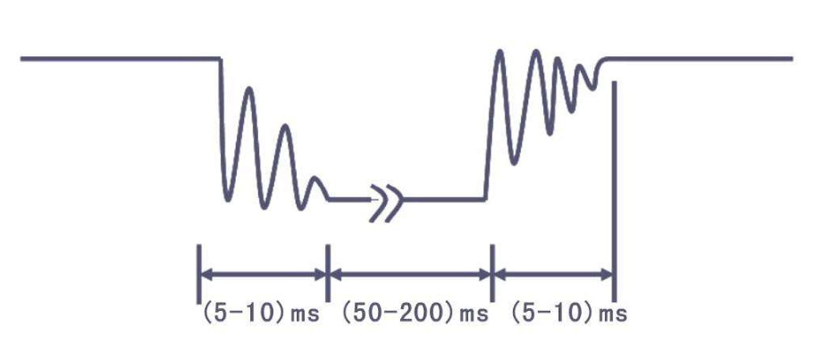

# 按键介绍 cad3159cf60d4f8f9940350156dd8a06

## 目录

-   [按键介绍](#按键介绍 "按键介绍")
-   [密码锁](#密码锁 "密码锁")

# 按键介绍

轻触按键：相当于是一种电子开关，按下时开关接通，松开时开关断开，实现原理是通过轻触按键内部的金属弹片受力弹动来实现接通和断开



对于机械开关，当机械触点断开、闭合时，由于机械触点的弹性作用，一个开关在闭合时不会马上稳定地接通，在断开时也不会一下子断开，所以在开关闭合及断开的瞬间会伴随一连串的抖动



```c
/*************************************************************************************

*
实验现象：下载程序后按下K1按键可以对D1小灯状态取反
接线说明： (具体接线图可见开发攻略对应实验的“实验现象”章节)

注意事项：

**************************************************************************************

*/

#include "reg52.h"             //此文件中定义了单片机的一些特殊功能寄存器

typedef unsigned int u16;      //对数据类型进行声明定义
typedef unsigned char u8;

sbit k1=P3^1;     //定义P31口是k1
sbit led=P2^0;     //定义P20口是led

/*******************************************************************************
* 函 数 名         : delay
* 函数功能           : 延时函数，i=1时，大约延时10us
*******************************************************************************/
void delay(u16 i)
{
    while(i--);
}

/*******************************************************************************
* 函 数 名         : keypros
* 函数功能           : 按键处理函数，判断按键K1是否按下
*******************************************************************************/
void keypros()
{
    if(k1==0)         //检测按键K1是否按下
    {
        delay(1000);   //消除抖动 一般大约10ms
        if(k1==0)    //再次判断按键是否按下
        {
            led=~led;     //led状态取反
        }
        while(!k1);  //检测按键是否松开
    }
}

/*******************************************************************************
* 函 数 名       : main
* 函数功能         : 主函数
* 输    入       : 无
* 输    出         : 无
*******************************************************************************/
void main()
{
    led=1;
    while(1)
    {
        keypros();  //按键处理函数
    }
}

```

```纯文本
#include <REGX52.H>

#include "LCD1602.h"    //包含LCD1602头文件
void Delay(unsigned int xms)
{
    unsigned char i, j;
    while(xms--)
    {
        i = 2;
        j = 239;
        do
        {
            while (--j);
        } while (--i);
    }
}

/**
  * @brief  矩阵键盘读取按键键码
  * @param  无
  * @retval KeyNumber 按下按键的键码值
            如果按键按下不放，程序会停留在此函数，松手的一瞬间，返回按键键码，没有按键按下时，返回0
  */
unsigned char MatrixKey()
{
    unsigned char KeyNumber=0;

    P1=0xFF;
    P1_3=0;
    if(P1_7==0){Delay(20);while(P1_7==0);Delay(20);KeyNumber=1;}
    if(P1_6==0){Delay(20);while(P1_6==0);Delay(20);KeyNumber=5;}
    if(P1_5==0){Delay(20);while(P1_5==0);Delay(20);KeyNumber=9;}
    if(P1_4==0){Delay(20);while(P1_4==0);Delay(20);KeyNumber=13;}

    P1=0xFF;
    P1_2=0;
    if(P1_7==0){Delay(20);while(P1_7==0);Delay(20);KeyNumber=2;}
    if(P1_6==0){Delay(20);while(P1_6==0);Delay(20);KeyNumber=6;}
    if(P1_5==0){Delay(20);while(P1_5==0);Delay(20);KeyNumber=10;}
    if(P1_4==0){Delay(20);while(P1_4==0);Delay(20);KeyNumber=14;}

    P1=0xFF;
    P1_1=0;
    if(P1_7==0){Delay(20);while(P1_7==0);Delay(20);KeyNumber=3;}
    if(P1_6==0){Delay(20);while(P1_6==0);Delay(20);KeyNumber=7;}
    if(P1_5==0){Delay(20);while(P1_5==0);Delay(20);KeyNumber=11;}
    if(P1_4==0){Delay(20);while(P1_4==0);Delay(20);KeyNumber=15;}

    P1=0xFF;
    P1_0=0;
    if(P1_7==0){Delay(20);while(P1_7==0);Delay(20);KeyNumber=4;}
    if(P1_6==0){Delay(20);while(P1_6==0);Delay(20);KeyNumber=8;}
    if(P1_5==0){Delay(20);while(P1_5==0);Delay(20);KeyNumber=12;}
    if(P1_4==0){Delay(20);while(P1_4==0);Delay(20);KeyNumber=16;}

    return KeyNumber;
}

unsigned char KeyNum;

void main()
{
    LCD_Init();                         //LCD初始化
    LCD_ShowString(1,1,"MatrixKey:");   //LCD显示字符串
    while(1)
    {
        KeyNum=MatrixKey();             //获取矩阵键盘键码
        if(KeyNum)  //非零就是true                  //如果有按键按下
        {
            LCD_ShowNum(2,1,KeyNum,2);  //LCD显示键码
        }
    }
}

```

# 密码锁

```纯文本
#include <REGX52.H>
#include "LCD1602.h"

void Delay(unsigned int xms)
{
    unsigned char i, j;
    while(xms--)
    {
        i = 2;
        j = 239;
        do
        {
            while (--j);
        } while (--i);
    }
}

/**
  * @brief  矩阵键盘读取按键键码
  * @param  无
  * @retval KeyNumber 按下按键的键码值
            如果按键按下不放，程序会停留在此函数，松手的一瞬间，返回按键键码，没有按键按下时，返回0
  */
unsigned char MatrixKey()
{
    unsigned char KeyNumber=0;

    P1=0xFF;
    P1_3=0;
    if(P1_7==0){Delay(20);while(P1_7==0);Delay(20);KeyNumber=1;}
    if(P1_6==0){Delay(20);while(P1_6==0);Delay(20);KeyNumber=5;}
    if(P1_5==0){Delay(20);while(P1_5==0);Delay(20);KeyNumber=9;}
    if(P1_4==0){Delay(20);while(P1_4==0);Delay(20);KeyNumber=13;}

    P1=0xFF;
    P1_2=0;
    if(P1_7==0){Delay(20);while(P1_7==0);Delay(20);KeyNumber=2;}
    if(P1_6==0){Delay(20);while(P1_6==0);Delay(20);KeyNumber=6;}
    if(P1_5==0){Delay(20);while(P1_5==0);Delay(20);KeyNumber=10;}
    if(P1_4==0){Delay(20);while(P1_4==0);Delay(20);KeyNumber=14;}

    P1=0xFF;
    P1_1=0;
    if(P1_7==0){Delay(20);while(P1_7==0);Delay(20);KeyNumber=3;}
    if(P1_6==0){Delay(20);while(P1_6==0);Delay(20);KeyNumber=7;}
    if(P1_5==0){Delay(20);while(P1_5==0);Delay(20);KeyNumber=11;}
    if(P1_4==0){Delay(20);while(P1_4==0);Delay(20);KeyNumber=15;}

    P1=0xFF;
    P1_0=0;
    if(P1_7==0){Delay(20);while(P1_7==0);Delay(20);KeyNumber=4;}
    if(P1_6==0){Delay(20);while(P1_6==0);Delay(20);KeyNumber=8;}
    if(P1_5==0){Delay(20);while(P1_5==0);Delay(20);KeyNumber=12;}
    if(P1_4==0){Delay(20);while(P1_4==0);Delay(20);KeyNumber=16;}

    return KeyNumber;
}

unsigned char KeyNum;
unsigned int Password,Count;

void main()
{
    LCD_Init();
    LCD_ShowString(1,1,"Password:");
    while(1)
    {
        KeyNum=MatrixKey();
        if(KeyNum)
        {
            if(KeyNum<=10)  //如果S1~S10按键按下，输入密码
            {
                if(Count<4) //如果输入次数小于4
                {
                    Password*=10;               //密码左移一位
                    Password+=KeyNum%10;        //获取一位密码
                    Count++;    //计次加一
                }
                LCD_ShowNum(2,1,Password,4);    //更新显示
            }
            if(KeyNum==11)  //如果S11按键按下，确认
            {
                if(Password==2345)  //如果密码等于正确密码
                {
                    LCD_ShowString(1,14,"OK "); //显示OK
                    Password=0;     //密码清零
                    Count=0;        //计次清零
                    LCD_ShowNum(2,1,Password,4);    //更新显示
                }
                else                //否则
                {
                    LCD_ShowString(1,14,"ERR"); //显示ERR
                    Password=0;     //密码清零
                    Count=0;        //计次清零
                    LCD_ShowNum(2,1,Password,4);    //更新显示
                }
            }
            if(KeyNum==12)  //如果S12按键按下，取消
            {
                Password=0;     //密码清零
                Count=0;        //计次清零
                LCD_ShowNum(2,1,Password,4);    //更新显示
            }
        }
    }
}

```
