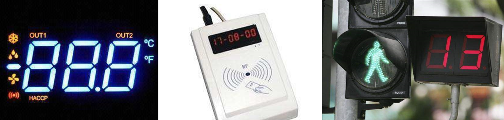
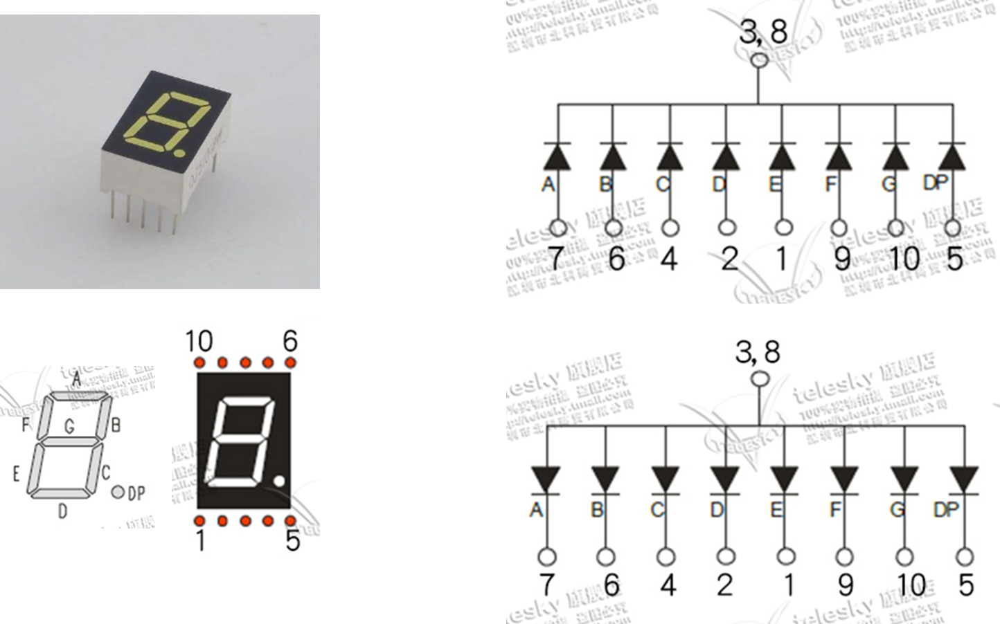
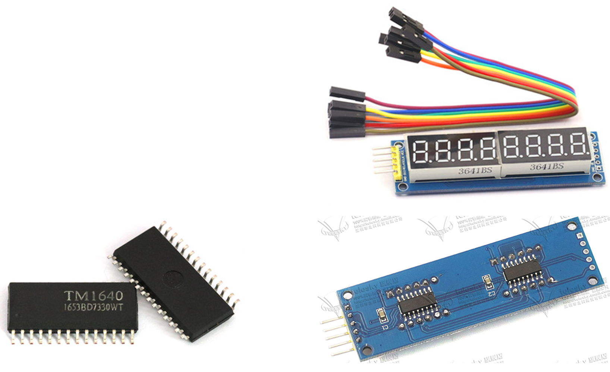

# 数码管介绍 52a7b15e360842f79445b49334615b99

## 目录

-   [数码管介绍](#数码管介绍 "数码管介绍")
-   [数码管驱动方式](#数码管驱动方式 "数码管驱动方式")
    -   [静态数码管](#静态数码管 "静态数码管")
    -   [动态数码管](#动态数码管 "动态数码管")

# 数码管介绍

LED数码管：数码管是一种简单、廉价的显示器，是由多个发光二极管封装在一起组成“8”字型的器件



数码管引脚定义




| 0    | 1    | 2    | 3    | 4    | 5    |
| ---- | ---- | ---- | ---- | ---- | ---- |
| 0x3F | 0x06 | 0x5B | 0x4F | 0x66 | 0x6D |

| 6    | 7    | 8    | 9    |   | 空    |
| ---- | ---- | ---- | ---- | - | ---- |
| 0x7D | 0x07 | 0x7F | 0x6F |   | 0x00 |

# 数码管驱动方式

-   单片机直接扫描：硬件设备简单，但会耗费大量的单片机CPU时间
    •专用驱动芯片：内部自带显存、扫描电路，单片机只需告诉它显示什么即可



## 静态数码管

```纯文本
#include <REGX52.H>

//数码管段码表
unsigned char NixieTable[]={0x3F,0x06,0x5B,0x4F,0x66,0x6D,0x7D,0x07,0x7F,0x6F};

//数码管显示子函数
void Nixie(unsigned char Location,Number)
{
    switch(Location)        //位码输出
    {
        case 1:P2_4=1;P2_3=1;P2_2=1;break;
        case 2:P2_4=1;P2_3=1;P2_2=0;break;
        case 3:P2_4=1;P2_3=0;P2_2=1;break;
        case 4:P2_4=1;P2_3=0;P2_2=0;break;
        case 5:P2_4=0;P2_3=1;P2_2=1;break;
        case 6:P2_4=0;P2_3=1;P2_2=0;break;
        case 7:P2_4=0;P2_3=0;P2_2=1;break;
        case 8:P2_4=0;P2_3=0;P2_2=0;break;
    }
    P0=NixieTable[Number];  //段码输出
}

void main()
{
    Nixie(1,1); //在数码管的第1位置显示1
    Nixie(2,3); //在数码管的第2位置显示3
    Nixie(3,1); //在数码管的第3位置显示1

    while(1)
    {
//        Nixie(1,1);    //在数码管的第1位置显示1
//        Nixie(2,3);    //在数码管的第2位置显示3
//        Nixie(3,1);    //在数码管的第3位置显示1
//        Nixie(4,4);    //在数码管的第4位置显示4

    }
}

```

## 动态数码管

```纯文本
#include <REGX52.H>

//数码管段码表
unsigned char NixieTable[]={0x3F,0x06,0x5B,0x4F,0x66,0x6D,0x7D,0x07,0x7F,0x6F};

//延时子函数
void Delay(unsigned int xms)
{
    unsigned char i, j;
    while(xms--)
    {
        i = 2;
        j = 239;
        do
        {
            while (--j);
        } while (--i);
    }
}

//数码管显示子函数
void Nixie(unsigned char Location,Number)
{
    switch(Location)        //位码输出
    {
        case 1:P2_4=1;P2_3=1;P2_2=1;break;
        case 2:P2_4=1;P2_3=1;P2_2=0;break;
        case 3:P2_4=1;P2_3=0;P2_2=1;break;
        case 4:P2_4=1;P2_3=0;P2_2=0;break;
        case 5:P2_4=0;P2_3=1;P2_2=1;break;
        case 6:P2_4=0;P2_3=1;P2_2=0;break;
        case 7:P2_4=0;P2_3=0;P2_2=1;break;
        case 8:P2_4=0;P2_3=0;P2_2=0;break;
    }
    P0=NixieTable[Number];  //段码输出
    Delay(1);               //显示一段时间
    P0=0x00;                //段码清0，消影
}

void main()
{
    while(1)
    {
        Nixie(1,1);     //在数码管的第1位置显示1
//        Delay(20);
        Nixie(2,2);     //在数码管的第2位置显示2
//        Delay(20);
        Nixie(3,3);     //在数码管的第3位置显示3
//        Delay(20);
        Nixie(4,4);        //在数码管的第3位置显示3
    }
}

```
