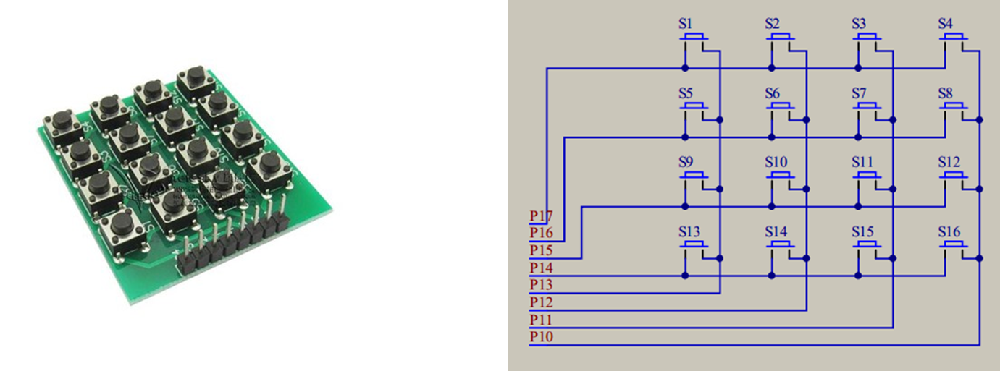

# 矩阵键盘+29da7be7-9490-453a-bdd5-5007c1ecafd3 cf0fd101

## 目录

-   [矩阵键盘+29da7be7-9490-453a-bdd5-5007c1ecafd3](#矩阵键盘29da7be7-9490-453a-bdd5-5007c1ecafd3 "矩阵键盘+29da7be7-9490-453a-bdd5-5007c1ecafd3")
-   [矩阵键盘+29da7be7-9490-453a-bdd5-5007c1ecafd3](#矩阵键盘29da7be7-9490-453a-bdd5-5007c1ecafd3 "矩阵键盘+29da7be7-9490-453a-bdd5-5007c1ecafd3")
    -   [矩阵键盘介绍](#矩阵键盘介绍 "矩阵键盘介绍")
    -   [扫描的概念](#扫描的概念 "扫描的概念")
-   [消抖](#消抖 "消抖")
-   [独立按键控制LED显示二进制](#独立按键控制LED显示二进制 "独立按键控制LED显示二进制")
-   [独立按键控制LED移位](#独立按键控制LED移位 "独立按键控制LED移位")
-   [另一种读取键盘的方式74HC165](#另一种读取键盘的方式74HC165 "另一种读取键盘的方式74HC165")

# 矩阵键盘+29da7be7-9490-453a-bdd5-5007c1ecafd3

# 矩阵键盘+29da7be7-9490-453a-bdd5-5007c1ecafd3

## 矩阵键盘介绍

-   在键盘中按键数量较多时，为了减少I/O口的占用，通常将按键排 列成矩阵形式 • 采用逐行或逐列的“扫描”，就可以读出任何位置按键的状态



## 扫描的概念

-   数码管扫描（输出扫描） 原理：显示第1位→显示第2位→显示第3位→……，然后快速循环这个过程，最终实现所有数码管同时显示的效果
-   矩阵键盘扫描（输入扫描） 原理：读取第1行(列)→读取第2行(列)?→读取第3行(列)?→?……，然后快速循环这个过程，最终实现所有按键同时检测的效果
-   以上两种扫描方式的共性：节省I/O口

```纯文本
#include <REGX52.H>

void main()
{
    while(1)
    {
        if(P3_1==0 || P3_0==0)  //如果K1按键或K2按键按下
        {
            P2_0=0;     //LED1输出0，点亮
        }
        else
        {
            P2_0=1;     //LED1输出1，熄灭
        }
    }
}
```

# 消抖

```纯文本
#include <REGX52.H>

void Delay(unsigned int xms)
{
    unsigned char i, j;
    while(xms)
    {
        i = 2;
        j = 239;
        do
        {
            while (--j);
        } while (--i);
        xms--;
    }
}

void main()
{
    while(1)
    {
        if(P3_1==0)         //如果K1按键按下
        {
            Delay(20);      //延时消抖
            while(P3_1==0); //松手检测
            Delay(20);      //延时消抖

            P2_0=~P2_0;     //LED1取反
        }
    }
}
```

# 独立按键控制LED显示二进制

```纯文本
#include <REGX52.H>

void Delay(unsigned int xms)
{
    unsigned char i, j;
    while(xms--)
    {
        i = 2;
        j = 239;
        do
        {
            while (--j);
        } while (--i);
    }
}

void main()
{
    unsigned char LEDNum=0;
    while(1)
    {
        if(P3_1==0)         //如果K1按键按下
        {
            Delay(20);      //延时消抖
            while(P3_1==0); //松手检测
            Delay(20);      //延时消抖

            LEDNum++;       //变量自增
            P2=~LEDNum;     //变量取反输出给LED
        }
    }
}
```

# 独立按键控制LED移位

```纯文本
#include <REGX52.H>
void Delay(unsigned int xms);

unsigned char LEDNum;

void main()
{
    P2=~0x01;               //上电默认LED1点亮
    while(1)
    {
        if(P3_1==0)         //如果K1按键按下
        {
            Delay(20);
            while(P3_1==0);
            Delay(20);

            LEDNum++;       //LEDNum自增
            if(LEDNum>=8)   //限制LEDNum自增范围
                LEDNum=0;
            P2=~(0x01<<LEDNum); //LED的第LEDNum位点亮
        }
        if(P3_0==0)         //如果K2按键按下
        {
            Delay(20);
            while(P3_0==0);
            Delay(20);

            if(LEDNum==0)   //LEDNum减到0后变为7
                LEDNum=7;
            else            //LEDNum未减到0，自减
                LEDNum--;
            P2=~(0x01<<LEDNum); //LED的第LEDNum位点亮
        }
    }
}

void Delay(unsigned int xms)
{
    unsigned char i, j;
    while(xms--)
    {
        i = 2;
        j = 239;
        do
        {
            while (--j);
        } while (--i);
    }
}

```

# 另一种读取键盘的方式74HC165
