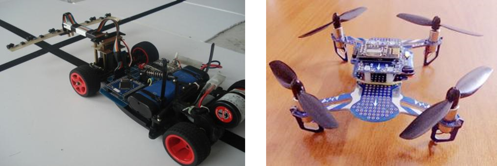

# 简介-主控芯片STC89C52 83dd82a173a745b8a826b62112576a83

## 目录

-   [简介-主控芯片STC89C52](#简介-主控芯片STC89C52 "简介-主控芯片STC89C52")
-   [Keil5-C51和Keil5-MDK的区别:](#Keil5-C51和Keil5-MDK的区别 "Keil5-C51和Keil5-MDK的区别:")
-   [单片机介绍](#单片机介绍 "单片机介绍")
-   [单片机的应用领域](#单片机的应用领域 "单片机的应用领域")
-   [STC89C52单片机](#STC89C52单片机 "STC89C52单片机")
-   [单片机内部拆解](#单片机内部拆解 "单片机内部拆解")
-   [STC89C52芯片工作原理及芯片参数介绍](#STC89C52芯片工作原理及芯片参数介绍 "STC89C52芯片工作原理及芯片参数介绍")

# 简介-主控芯片STC89C52

# Keil5-C51和Keil5-MDK的区别:

两者都是Keil系列软件，但前者是用来开发51单片机的，后者是用来开发ARM系列，比如STM32的

# 单片机介绍

-   单片机，英文Micro?Controller?Unit，简称MCU
    •
    内部集成了CPU、RAM、ROM、定时器、中断系统、通讯接口等一系列电脑的常用硬件功能
    •
    单片机的任务是信息采集（依靠传感器）、处理（依靠CPU）和硬件设备（例如电机，LED等）的控制
    •
    单片机跟计算机相比，单片机算是一个袖珍版计算机，一个芯片就能构成完整的计算机系统。但在性能上，与计算机相差甚远，但单片机成本低、体积小、结构简单，在生活和工业控制领域大有所用
    •
    同时，学习使用单片机是了解计算机原理与结构的最佳选择

# 单片机的应用领域

# STC89C52单片机

-   所属系列：51单片机系列
    •
    公司：STC公司
    •
    位数：8位
    •
    RAM：512字节
    •
    ROM：8K（Flash）
    •
    工作频率：12MHz（本开发板使用）

# **单片机内部拆解**

# STC89C52芯片工作原理及芯片参数介绍

STC89C52是一款8051系列的单片机芯片，由STC公司生产。它与其他8051系列芯片一样，具有广泛的应用领域，如家电、工业自动化、通信、电力等领域。下面简单介绍一下它的工作原理和芯片参数。STC89C52的工作原理：STC89C52采用8051内核，具有8位宽的数据总线、16位宽的地址总线和128字节的RAM。**`它的主频为12MHz`**，内置32KB的Flash程序存储器，可以存储用户程序。它还内置了多种外设模块，如定时器、串口、中断控制器和ADC等，可以方便地实现各种功能。STC89C52的芯片参数：1. 工作电压：2.4V-5.5V；2. 主频：12MHz；3. 存储器：32KB的Flash程序存储器、128字节的RAM；4. 外设模块：3个定时器、1个串口、1个中断控制器、10个ADC输入通道；5. I/O口：32个；6. 温度范围：-40℃-85℃。以上是STC89C52的简单介绍，它是一款性价比较高的单片机芯片，具有广泛的应用领域。
