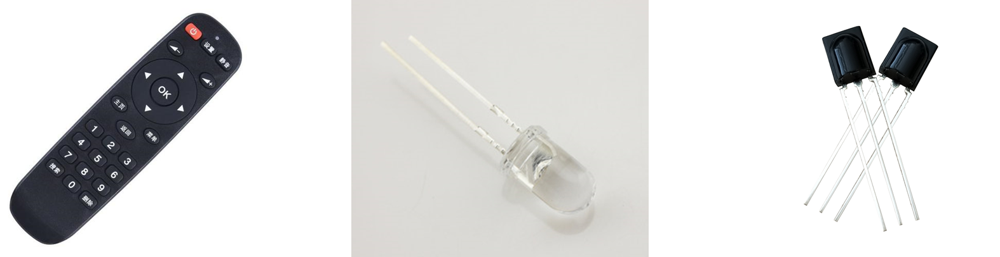
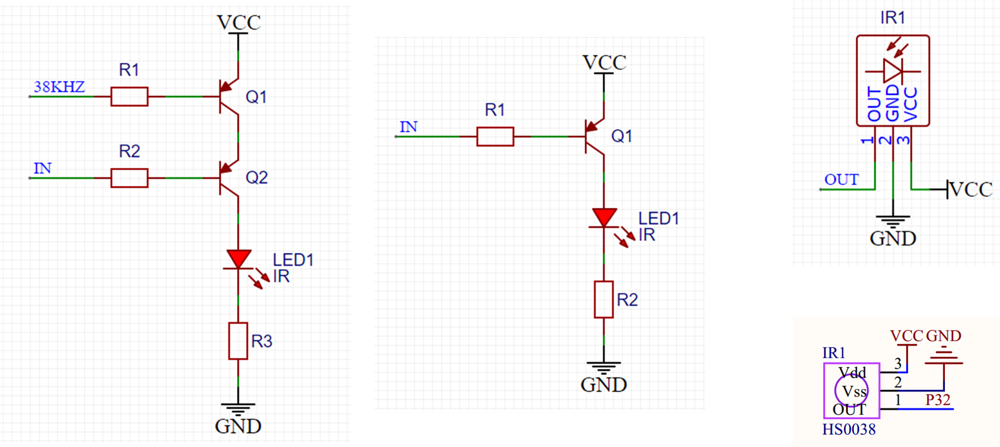
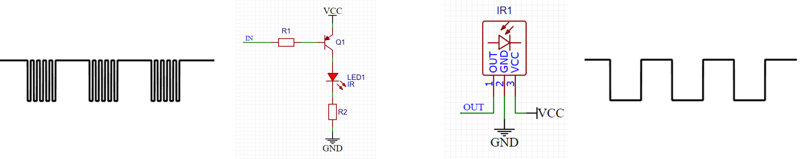
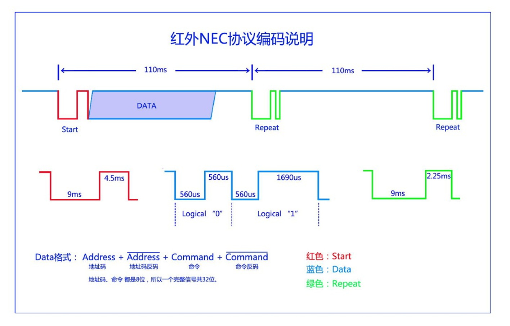
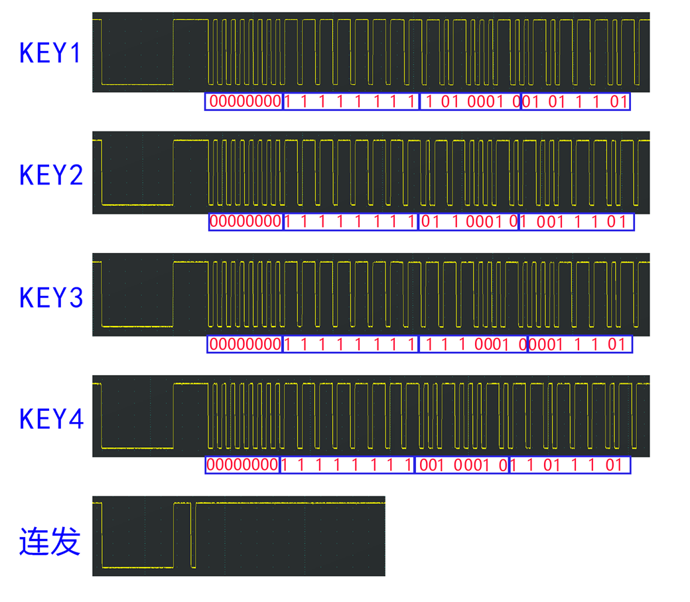
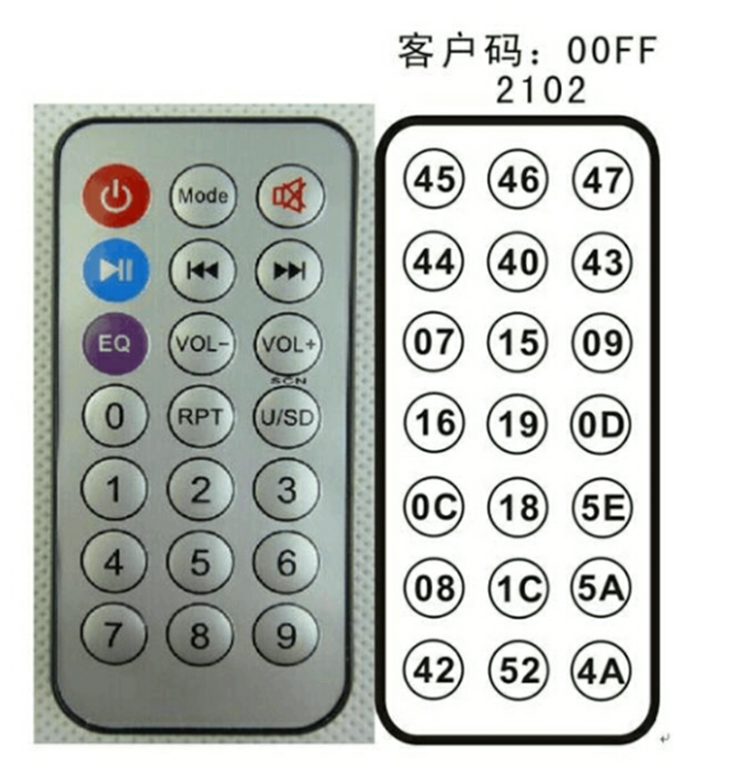
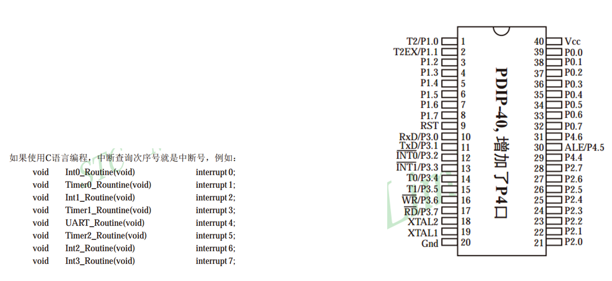
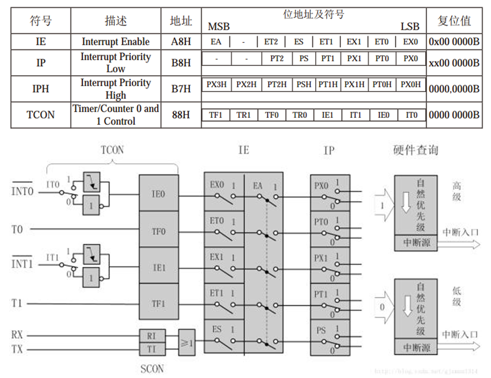
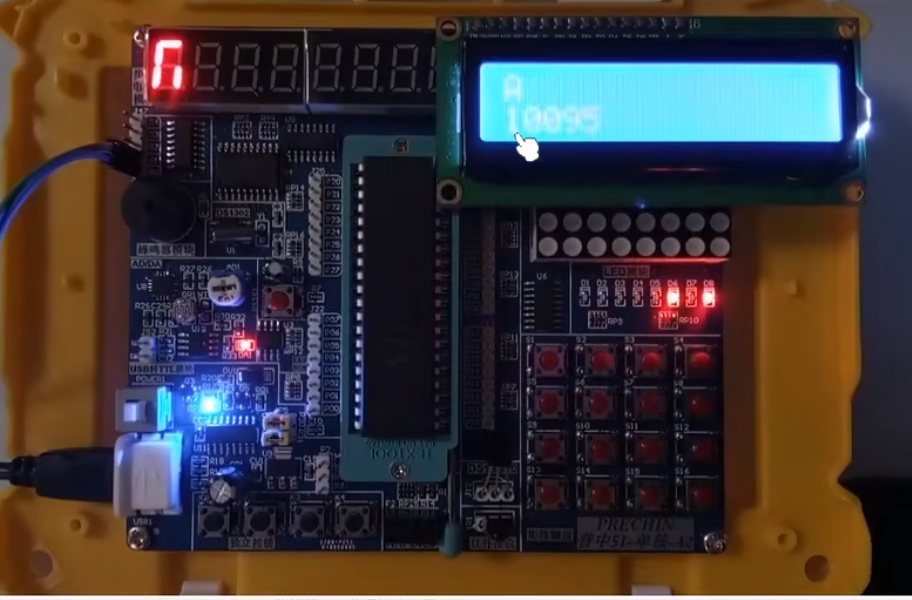
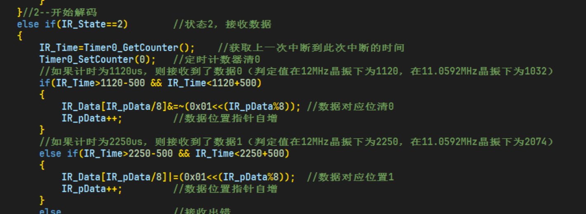

# 红外遥控简介 ae1da5a10a75426e897ecb0581ad9677

## 目录

-   [红外遥控简介](#红外遥控简介 "红外遥控简介")
-   [硬件电路](#硬件电路 "硬件电路")
-   [代码 \*（这个偏难）](#代码-这个偏难 "代码 *（这个偏难）")

# 红外遥控简介

-   红外遥控是利用红外光进行通信的设备，由红外LED将调制后的信 号发出，由专用的红外接收头进行解调输出 • 通信方式：单工，异步 • 红外LED波长：940nm • 通信协议标准：NEC标准



# 硬件电路



基本发送与接收

-   空闲状态：红外LED不亮，接收头输出高电平 • 发送低电平：红外LED以38KHz频率闪烁发光，接收头输出低电平 • 发送高电平：红外LED不亮，接收头输出高电平



NEC编码

低电平560us，高电平560us，表示“0”

低电平560us，高电平1690us，表示“1”



> 遥控器采样出来的



遥控器键码



51单片机的外部中断

-   STC89C52有4个外部中断 • STC89C52的外部中断有两种触发方式：下降沿触发和低电平触发 • 中断号：



外部中断寄存器



采集红外信号，最好用中断去采集信号，因为红外信号的速度很快

# 代码 \*（这个偏难）

<https://www.bilibili.com/video/BV1Mb411e7re/?p=38&spm_id_from=pageDriver&vd_source=5e12cc40b4cf9bc1265b996e2d71fa81>



unsigned long 的数据右移或者左移太多位数，可能会出错



```纯文本
IR_Data[IR_pData/8]&=~(0x01<<(IR_pData%8)); //数据对应位清0
```

是的，可以将该行代码拆分成多行代码来实现相同的功能。以下是拆分后的代码示例：

```纯文本

index = IR_pData // 8
bit_position = IR_pData % 8
mask = ~(0x01 << bit_position)
IR_Data[index] &= mask
```

这段代码首先计算了索引值`index`，即`IR_pData`除以8的整数部分。然后计算了位偏移量`bit_position`，即`IR_pData`除以8的余数。接下来，使用位移操作符将0x01左移`bit_position`位，并取反，生成了屏蔽掩码`mask`。最后，将`IR_Data`中索引为`index`的元素与`mask`进行按位与操作，以实现与原代码相同的功能。
