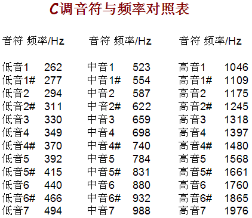

# 蜂鸣器介绍 d4ac46d159114354b152e4ad8e75375f

## 目录

-   [蜂鸣器介绍](#蜂鸣器介绍 "蜂鸣器介绍")
-   [1.蜂鸣器介绍](#1蜂鸣器介绍 "1.蜂鸣器介绍")
    -   [压电式蜂鸣器](#压电式蜂鸣器 "压电式蜂鸣器")
    -   [电磁式蜂鸣器](#电磁式蜂鸣器 "电磁式蜂鸣器")
    -   [硬件设计-驱动电路](#硬件设计-驱动电路 "硬件设计-驱动电路")
        -   [三极管驱动](#三极管驱动 "三极管驱动")
        -   [集成电路驱动](#集成电路驱动 "集成电路驱动")
    -   [一般不会使用IO口来驱动蜂鸣器，电流太小，只有20ma](#一般不会使用IO口来驱动蜂鸣器电流太小只有20ma "一般不会使用IO口来驱动蜂鸣器，电流太小，只有20ma")
-   [播放音乐](#播放音乐 "播放音乐")
-   [频率的计算](#频率的计算 "频率的计算")
-   [代码](#代码 "代码")
-   [频率蜂鸣器发声-软件设计](#频率蜂鸣器发声-软件设计 "频率蜂鸣器发声-软件设计")

# 蜂鸣器介绍

# 1.蜂鸣器介绍

蜂鸣器是一种一体化结构的电子讯响器，采用直流电压供电广泛应用于电子产品中作为发声器件。
蜂鸣器主要分为**压电式蜂鸣器**和**电磁式蜂鸣器**两种类型

## **压电式蜂鸣器**

压电式的是需要一定频率信号

## **电磁式蜂鸣器**

只需要电源

有源蜂鸣器的驱动相对来说简单一点，跟点亮LED一样，驱动IO一样


`左边无源（可以改变音调和音频）（体积比较大），右边有源（比较小）`

-   蜂鸣器是一种将电信号转换为声音信号的器件，常用来产生设备的 按键音、报警音等提示信号 • 蜂鸣器按驱动方式可分为有源蜂鸣器和无源蜂鸣器 •
-   有源蜂鸣器：内部自带振荡源，将正负极接上直流电压即可持续发 声，频率固定 •
-   无源蜂鸣器：内部不带振荡源，需要控制器提供振荡脉冲才可发声， 调整提供振荡脉冲的频率，可发出不同频率的声音


## 硬件设计-驱动电路

### 三极管驱动


### 集成电路驱动


## 一般不会使用IO口来驱动蜂鸣器，电流太小，只有20ma


内部是复合管


无源蜂鸣器不能长期通电，但开发板上设计得不合理，P15上电就为1，经过ULN2003D芯片后输出0到蜂鸣器，因为都是给0驱动给1不驱动的，而蜂鸣器另一端接VCC，相当于一上电就直接驱动了，处于工作状态，只不过没给频率没有响

一般用这种结构来驱动蜂鸣器

# 播放音乐

4分音节为1拍，每小节的4拍


附点：延长前一个音的1/2





# 频率的计算


用定时器中断来产生相对应的周期


# 代码

<https://www.bilibili.com/video/BV1Mb411e7re/?p=26&spm_id_from=333.1007.top_right_bar_window_history.content.click&vd_source=5e12cc40b4cf9bc1265b996e2d71fa81>

```纯文本
#include <REGX52.H>
#include "Delay.h"
#include "Key.h"
#include "Nixie.h"
#include "Buzzer.h"

#include <INTRINS.H>

//蜂鸣器端口：
sbit Buzzer=P1^5;

/**
  * @brief  蜂鸣器私有延时函数，延时500us
  * @param  无
  * @retval 无
  */
void Buzzer_Delay500us()        //@12.000MHz
{
    unsigned char i;

    _nop_();
    i = 247;
    while (--i);
}

/**
  * @brief  蜂鸣器发声
  * @param  ms 发声的时长，范围：0~32767
  * @retval 无
  */
void Buzzer_Time(unsigned int ms)
{    //翻转两次才是一个周期
    unsigned int i;
    for(i=0;i<ms*2;i++)  //100*2*500 =  1ms=T        周期2ms频率为周期的倒数，为500hz
    {
        Buzzer=!Buzzer;
        Buzzer_Delay500us();
    }
}

unsigned char KeyNum;

void main()
{
    Nixie(1,0);
    while(1)
    {
        KeyNum=Key();
        if(KeyNum)
        {
            Buzzer_Time(100);
            Nixie(1,KeyNum);
        }
    }
}
```

51单片机的性能有限，音乐播发做完，难做其他的事

**对音的选择可以推到导成对定时器重载值的选择**


# 频率蜂鸣器发声-软件设计

```纯文本
/*************************************************************************************

*
实验现象：下载程序后"蜂鸣器模块"的蜂鸣器发声
接线说明：
注意事项：

**************************************************************************************

*/

#include "reg52.h"             //此文件中定义了单片机的一些特殊功能寄存器
#include <intrins.h>        //因为要用到左右移函数，所以加入这个头文件

typedef unsigned int u16;      //对数据类型进行声明定义
typedef unsigned char u8;

sbit beep=P1^5;

/*******************************************************************************
* 函 数 名         : delay
* 函数功能           : 延时函数，i=1时，大约延时10us
*******************************************************************************/
void delay(u16 i)
{
    while(i--);
}
/*******************************************************************************
* 函 数 名         : 调节占空比
* 函数功能           :
*******************************************************************************/
void PWN_adjust_20_180()
{
   beep=0;
   delay(20); //延时大约1ms   通过修改此延时时间达到不同的发声效果
   beep=1;
   delay(180); //延时大约1ms   通过修改此延时时间达到不同的发声效

}
/*******************************************************************************
* 函 数 名         : 调节占空比
* 函数功能           :
*******************************************************************************/
void PWN_adjust_50_150()
{
   beep=0;
   delay(50); //延时大约1ms   通过修改此延时时间达到不同的发声效果
   beep=1;
   delay(150); //延时大约1ms   通过修改此延时时间达到不同的发声效

}
/*******************************************************************************
* 函 数 名       : main
* 函数功能         : 主函数
* 输    入       : 无
* 输    出         : 无
*******************************************************************************/
void main()
{
    while(1)
    {
        u16 j = 2000;
        while(j--)
       {
//            beep=~beep;
//            delay(); //延时大约1ms   通过修改此延时时间达到不同的发声效果
           PWN_adjust_20_180();   //

        }
       j=0;
       beep = 0;

    }
}

```

本章所要实现的功能是：让峰鸣器发出声音，一段时间后再关闭，即让管脚输出一定频率的脉冲信号（高低电平）控制无源蜂鸣器。
