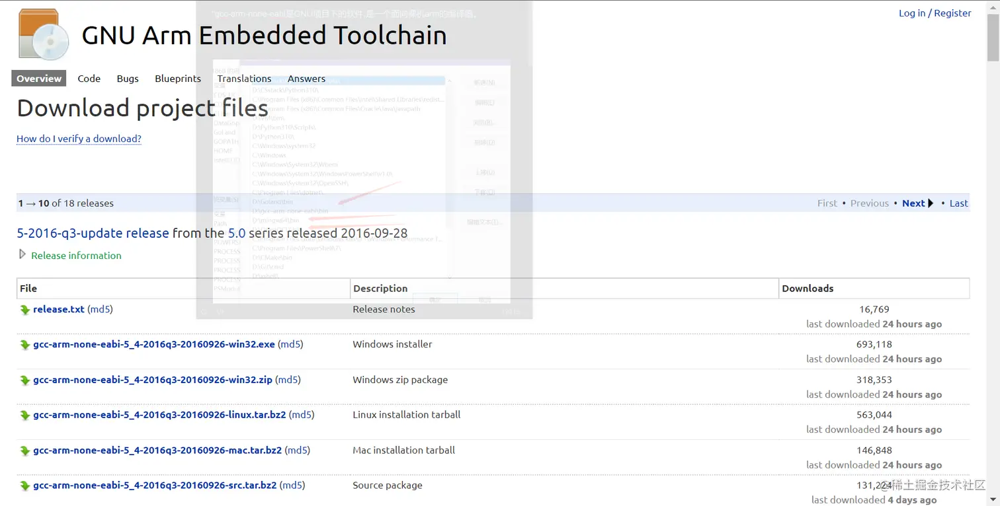
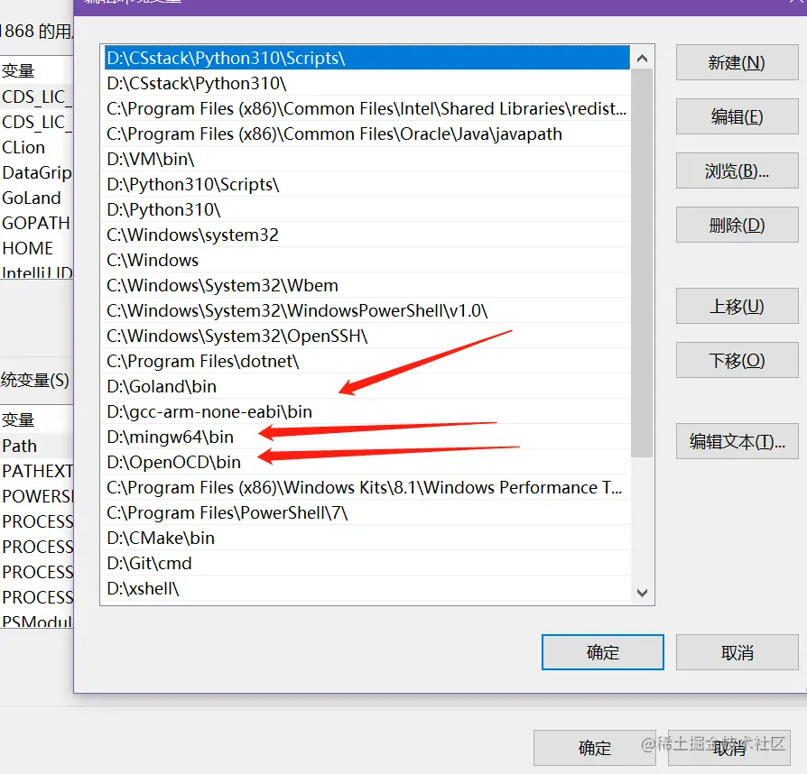
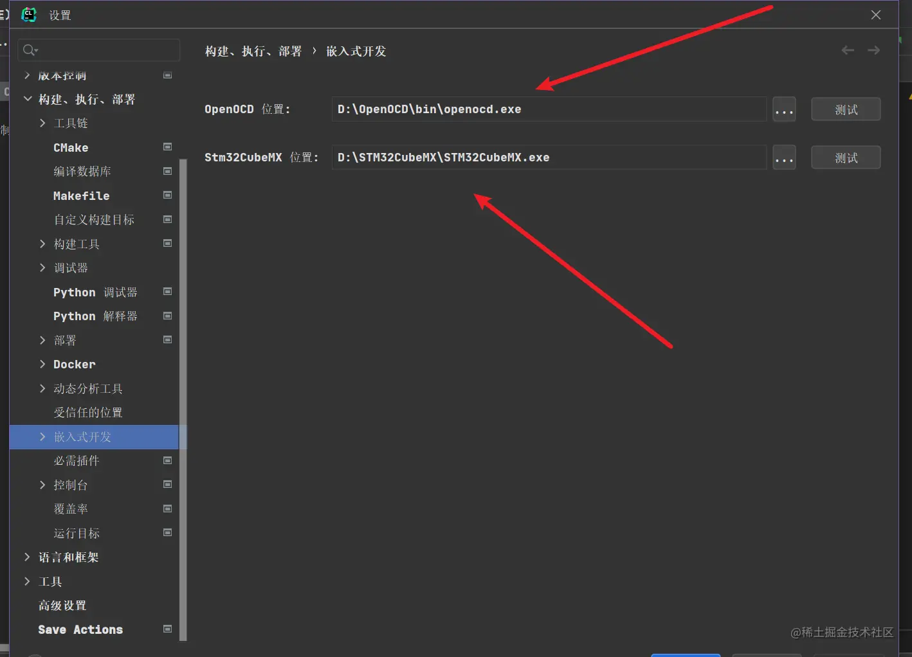
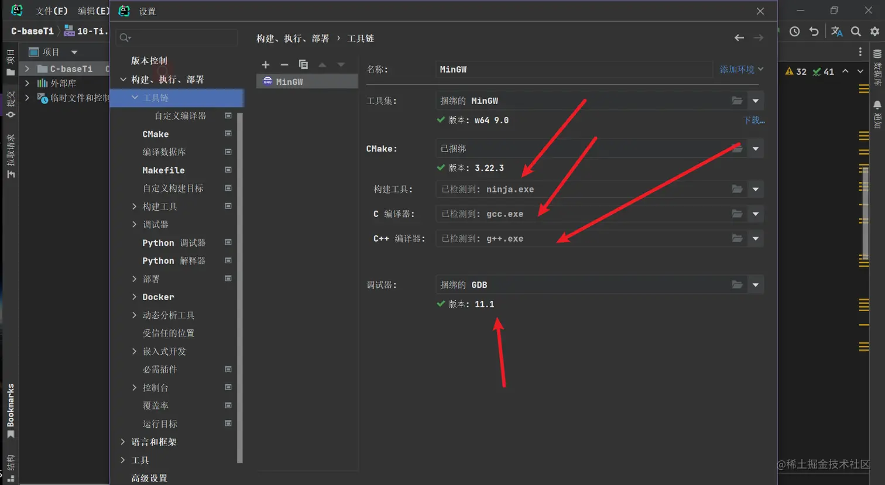
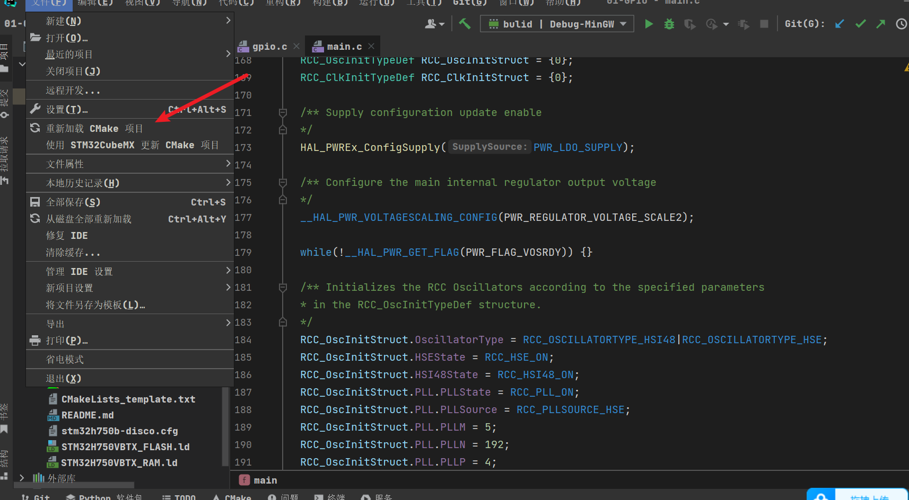

# Clion开发STM32 b764e70485114b5fbdd5a5ac3f509193\_副本

# Clion开发STM32

# CLion开发STM32

需要把opencd和gcc-arm-none-eabi,mingw的工具链添加到环境变量，然后配置到clion里

<https://link.juejin.cn/?target=https%3A%2F%2Fgnutoolchains.com%2Farm-eabi%2Fopenocd%2F>

[launchpad.net/gcc-arm-emb…](https://link.juejin.cn/?target=https%3A%2F%2Flaunchpad.net%2Fgcc-arm-embedded%2F%2Bdownload "launchpad.net/gcc-arm-emb…")\\

1.  “gcc-arm-none-eabi是GNU项目下的软件,是一个面向裸机arm的编译器。

如果还是不成功重新加载CMake(reload Cmake)

