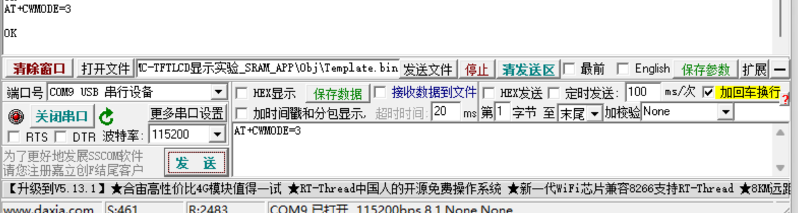
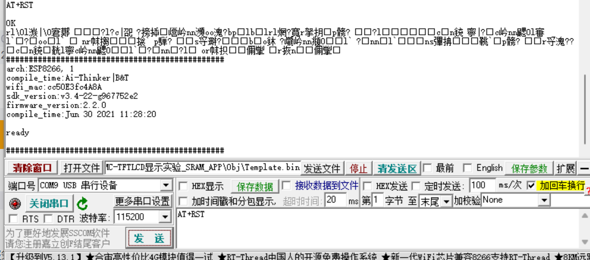
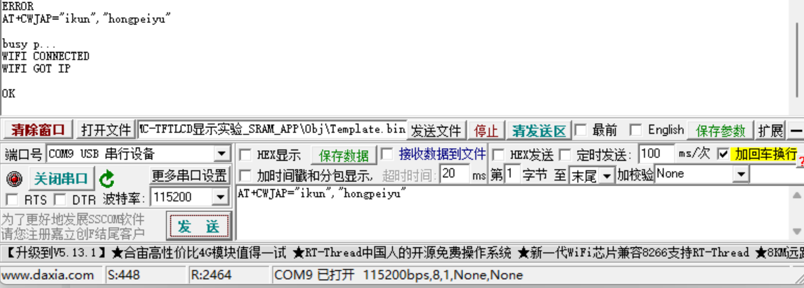
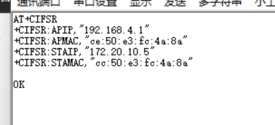

# AT指令

# wifi模块入网设置

## 重启wifi模块命



`Closure Stylesheets (GSS) AT+RST`

# AT指令

## 目录

-   [wifi模块入网设置](#wifi模块入网设置 "wifi模块入网设置")
    -   [重启wifi模块命令](#重启wifi模块命令 "重启wifi模块命令")
    -   [设置工作模式](#设置工作模式 "设置工作模式")
    -   [以设备模式接入家中路由器配置](#以设备模式接入家中路由器配置 "以设备模式接入家中路由器配置")
    -   [查询 IP 地址](#查询-IP-地址 "查询 IP 地址")

[https://blog.csdn.net/LuLuke\_lucky/article/details/129227039](https://blog.csdn.net/LuLuke_lucky/article/details/129227039 "https://blog.csdn.net/LuLuke_lucky/article/details/129227039")

# wifi模块入网设置

## 重启wifi模块命令



## 设置工作模式

`Plain Text AT+CWMODE=3`

1.  是 station （设备）模式 2. 是 AP （路由）模式 3. 是双模


## 以设备模式接入家中路由器配置

```text
AT+CWJAP="ikun","hongpeiyu"

```



## 查询 IP 地址

`Closure Stylesheets (GSS) AT+CIFSR`

查询结果

```c
AT+CIFSR
```


