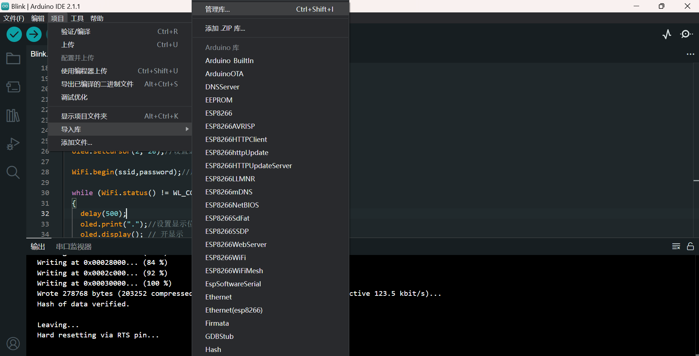
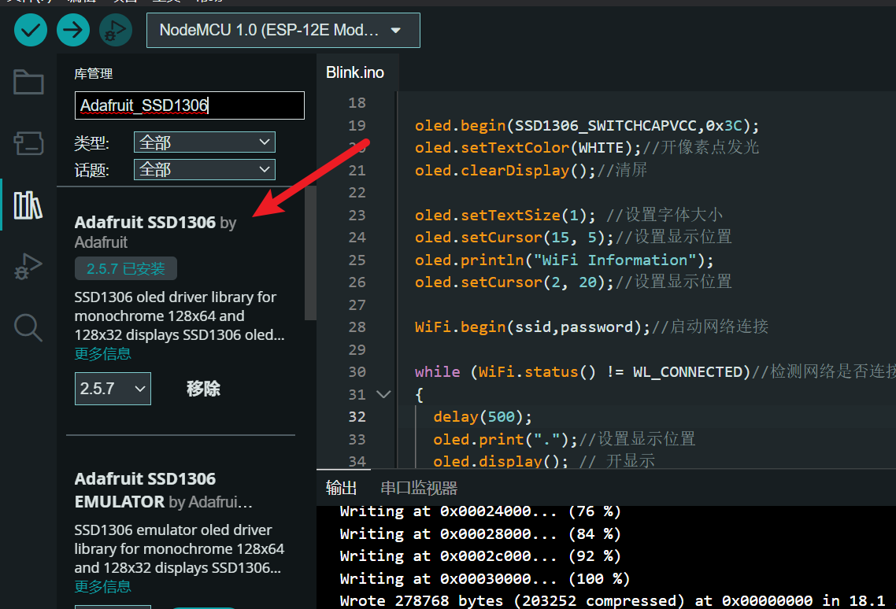
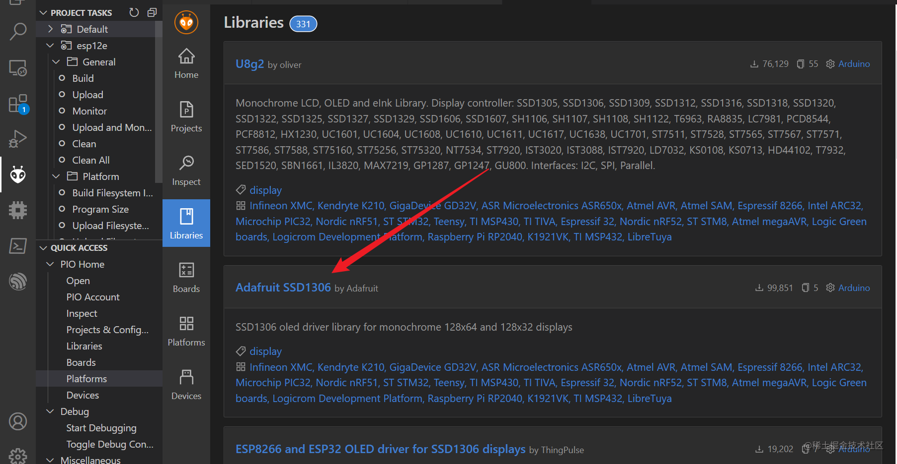
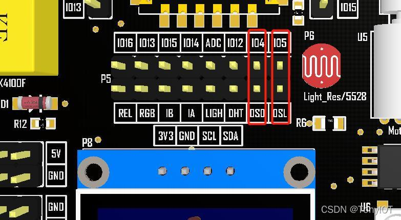
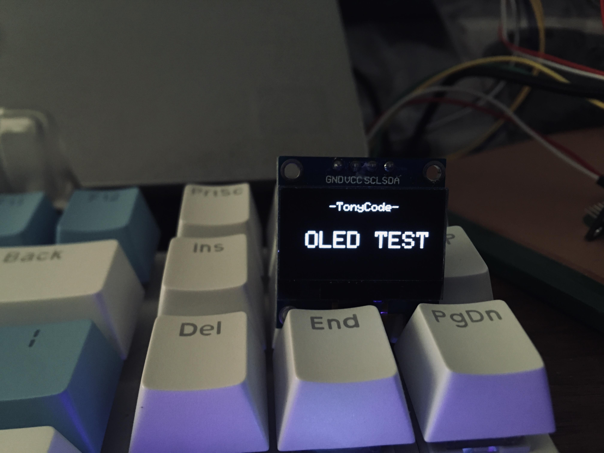

# ESP8266-OLED显示

## 安装驱动库

在之前的Arduino系列教程中，也有对OLED进行驱动的示例。这里我们依然使用「**Adafruit\_SSD1306**」驱动库。

在Arduino IDE中点击「项目」—「加载库」—「管理库」，查找选择最新版本，点击安装，然后在弹出的对话框中选择Install all，安装全部的关联库。

### arduinoIDE显示驱动的安装





## PlatformIO库的下载的



## 硬件连接

这里使用IIC驱动屏，在IOT Kit开发板上，ESP8266的GPIO4（D2）和GPIO5（D1）分别通过跳线帽连接到OLED屏的SDA和SCL引脚。



## 编程下载

在Arduino IDE中新建sketch，拷贝如下代码并保存。

```text
/*
 * oled
 * ESP8266驱动OLED屏
 */
#include <ESP8266WiFi.h>
#include <Wire.h>
#include <Adafruit_GFX.h>
#include <Adafruit_SSD1306.h>
Adafruit_SSD1306 oled(128, 64, &Wire, -1);

void setup()
{
  oled.begin(SSD1306_SWITCHCAPVCC,0x3C);
  oled.setTextColor(WHITE);//开像素点发光
  oled.clearDisplay();//清屏

  oled.setTextSize(1); //设置字体大小
  oled.setCursor(35, 5);//设置显示位置
  oled.println("-TonyCode-");

  oled.setTextSize(2);//设置字体大小
  oled.setCursor(15, 30);//设置显示位置
  oled.println("OLED TEST");

  oled.display(); // 开显示
}

void loop() {

}
```

电脑连接开发板，在「工具」—「开发板」—「端口」中选择正确的端口号，点击上传，程序编译并上传。

上传完成后，可以看到OLED可以显示了。


## 显示WiFi信息

在完成对OLED屏的驱动后，结合前篇连接网络的例程，我们就可以在OLED屏上查看连网信息了。

拷贝如下程序编译上传，之前在串口显示的连网信息就可以在OLED屏上显示了。

```text
/*
 * oled_infor
 * OLED显示连网信息
 */

#include <ESP8266WiFi.h>
#include <Wire.h>
#include <Adafruit_GFX.h>
#include <Adafruit_SSD1306.h>

const char* ssid     = "your-ssid";//连接WIFI名(SSID)
const char* password = "your-password";//WIFI密码

Adafruit_SSD1306 oled(128, 64, &Wire, -1);

void setup()
{
  oled.begin(SSD1306_SWITCHCAPVCC,0x3C);
  oled.setTextColor(WHITE);//开像素点发光
  oled.clearDisplay();//清屏

  oled.setTextSize(1); //设置字体大小
  oled.setCursor(15, 5);//设置显示位置
  oled.println("WiFi Information");
  oled.setCursor(2, 20);//设置显示位置

  WiFi.begin(ssid,password);//启动网络连接

  while (WiFi.status() != WL_CONNECTED)//检测网络是否连接成功
  {
    delay(500);
    oled.print(".");//设置显示位置
    oled.display(); // 开显示
  }

  oled.setTextSize(1);//设置字体大小
  oled.setCursor(2, 35);//设置显示位置
  oled.println("Connected,IP address:");
  oled.println();
  oled.println(WiFi.localIP());
  oled.display(); // 开显示
}

void loop() {}
```

)

## 字模显示原理及取模软件的使用

我们使用的OLED屏是由方形的发光点阵列组成的，分辨率为128x64。英文和数字最小可用8x8像素，汉字最小显示像素为16x16，通常为了显示效果，英文和数字通常使用8x16像素表示。要显示需要的字符只需对应点亮像素区域中对应的发光点即可。



字模一般都是通过取模软件生成的，接下来介绍「PCtoLCD」取模软件的使用：

### Windows系统下双击启动软件，点击「模式」，选择「字符模式」，通常默认就是字符模式。

字符模式

### 点击「选项」进行字模配置。通常字模配置要根据程序驱动方式来选择，本篇中我们选择阴码、逐行式、顺向，其他选项如下图所示。

选项配置

### 输入汉字。点击生成字模或者保存字模，就会得到对应的点阵数据。

\\\[外链图片转存中…(img-3OhcE2ug-1689498876694)]

生成字模

## 实验材料

-   Uno R3开发板
-   配套USB数据线
-   面包板及配套连接线
-   OLED显示屏

## 实验步骤

### 根据原理图搭建电路图。

IIC接口只需要两根线。OLED屏的VCC和GND分别连接开发板的3.3V和GND，OLED屏的SDA和SCL分别连接开发板A4和A5。

实验原理图如下图所示：

电路连接图

实物连接图如下图所示：

实物连接图

### 新建sketch，拷贝如下代码替换自动生成的代码并进行保存。

```text
/*
  OLED显示汉字
*/
#include <Wire.h>
#include <Adafruit_GFX.h>
#include <Adafruit_SSD1306.h>

#define OLED_RESET     4
Adafruit_SSD1306 display(128, 64, &Wire, OLED_RESET);

//取16X16汉字字模 逐行式 顺向高位在前
static const unsigned char PROGMEM str1[] =
{
  0x01, 0x00, 0x01, 0x00, 0x01, 0x00, 0x01, 0x00, 0x3F, 0xF8, 0x21, 0x08, 0x21, 0x08, 0x21, 0x08,
  0x21, 0x08, 0x21, 0x08, 0x3F, 0xF8, 0x21, 0x08, 0x01, 0x00, 0x01, 0x00, 0x01, 0x00, 0x01, 0x00
};/*"中",0*/

static const unsigned char PROGMEM str2[] =
{
  0x02, 0x00, 0x01, 0x00, 0x01, 0x00, 0xFF, 0xFE, 0x10, 0x10, 0x10, 0x10, 0x08, 0x20, 0x08, 0x20,
  0x04, 0x40, 0x02, 0x80, 0x01, 0x00, 0x02, 0x80, 0x04, 0x40, 0x08, 0x20, 0x30, 0x18, 0xC0, 0x06
};/*"文",1*/
static const unsigned char PROGMEM str3[] =
{
  0x00, 0x00, 0x1F, 0xF0, 0x10, 0x10, 0x10, 0x10, 0x1F, 0xF0, 0x10, 0x10, 0x10, 0x10, 0x1F, 0xF0,
  0x04, 0x40, 0x44, 0x44, 0x24, 0x44, 0x14, 0x48, 0x14, 0x50, 0x04, 0x40, 0xFF, 0xFE, 0x00, 0x00
};/*"显",2*/

static const unsigned char PROGMEM str4[] =
{
  0x00, 0x00, 0x3F, 0xF8, 0x00, 0x00, 0x00, 0x00, 0x00, 0x00, 0x00, 0x00, 0xFF, 0xFE, 0x01, 0x00,
  0x01, 0x00, 0x11, 0x10, 0x11, 0x08, 0x21, 0x04, 0x41, 0x02, 0x81, 0x02, 0x05, 0x00, 0x02, 0x00
};/*"示",3*/

void setup() {
  display.begin(SSD1306_SWITCHCAPVCC, 0x3C);
  display.setTextColor(WHITE);//开像素点发光
  display.clearDisplay();//清屏

  display.setTextSize(1); //设置字体大小
  display.setCursor(35, 5);//设置显示位置
  display.println("-TonyCode-");//输出字符

  display.drawBitmap(32, 32, str1, 16, 16, 1); //画出字符对应点阵数据
  display.drawBitmap(48, 32, str2, 16, 16, 1); //画出字符对应点阵数据
  display.drawBitmap(64, 32, str3, 16, 16, 1); //画出字符对应点阵数据
  display.drawBitmap(80, 32, str4, 16, 16, 1); //画出字符对应点阵数据
  display.display();//开显示

}

void loop() {

}
```

### 连接开发板，设置好对应端口号和开发板类型，进行程序下载。

\\\[外链图片转存中…(img-SCIl5amr-1689498876696)]

程序下载

## 实验现象

OLED显示出对应中文。

## 实验分析

程序中我们使用了图像库「Adafruit\\\_GFX」中的drawBitmap()函数，函数参数分别输入了要显示的坐标，字符数据源，字符的宽高，最后参数由于我们的OLED是单色的，默认为1。

我们可以选择不同的字体，也可以使用不同像素获取不同大小的字符，如下图显示的是32x32像素的汉字，注意drawBitmap()函数中对应字符宽高需要对应。
