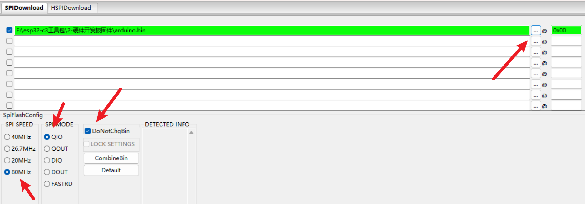

# 合宙ESP32-C3刷写arduino固件





# arduino-IDE的配置

我用的版本：2.1.1（版本不对也多大没关系）

## 下载安


选择 `ESP32C3 Dev Module`


## 安装环境


## 配置环境：

```text
https://raw.githubusercontent.com/espressif/arduino-esp32/gh-pages/package_esp32_dev_index.json
```

填入下面箭头的指向


# 测试代码

```c
//***************************************************************/
//
//           -------------------------------------------
//           board: ESP32C3 Dev Module
//           Flash Mode: "DIO"
//           -------------------------------------------
//
//***************************************************************/

#define     LED_D4     12
#define     LED_D5     13

void setup() {

  Serial.begin(115200);
  pinMode(LED_D4, OUTPUT);
  pinMode(LED_D5, OUTPUT);

}

void loop() {

  Serial.println("Hello world!");

  digitalWrite(LED_D4, LOW);
  digitalWrite(LED_D5, HIGH);
  delay(500);
  digitalWrite(LED_D4, HIGH);
  digitalWrite(LED_D5, LOW);
  delay(500);

}
```
