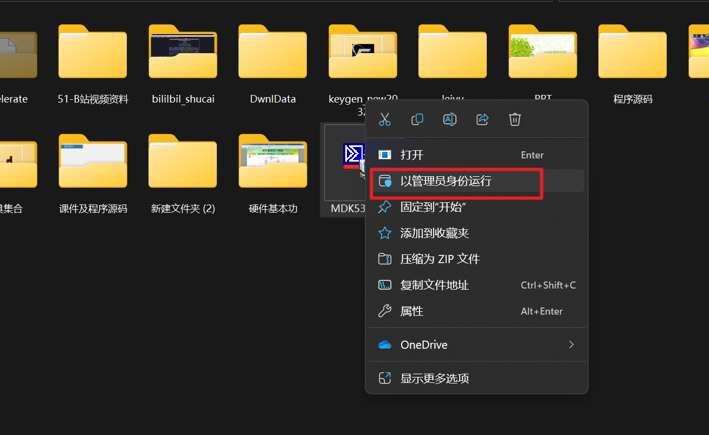
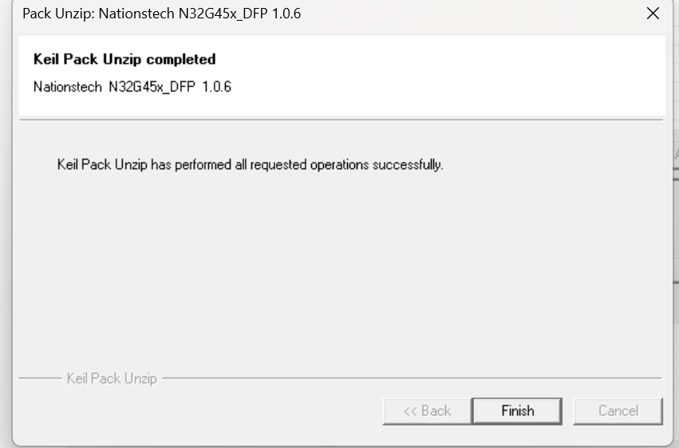

# DFP安装失败，可能是keil安装包太低导致

## 目录

-   \[]\(#)
    -   [MDK下载地址](#MDK下载地址 "MDK下载地址")
    -   [破解](#破解 "破解")
    -   [重装了keil的最新版本问题解决](#重装了keil的最新版本问题解决 "重装了keil的最新版本问题解决")

[https://blog.csdn.net/weixin\_54221349/article/details/131712592](https://blog.csdn.net/weixin_54221349/article/details/131712592 "https://blog.csdn.net/weixin_54221349/article/details/131712592")

## MDK下载地址

[https://www.keil.com/demo/eval/arm.htm](https://www.keil.com/demo/eval/arm.htm "https://www.keil.com/demo/eval/arm.htm")

下载了很多东西，需要等一下

**安装后，后面两个打勾要勾上**

## 破解

## 重装了keil的最新版本问题解决

