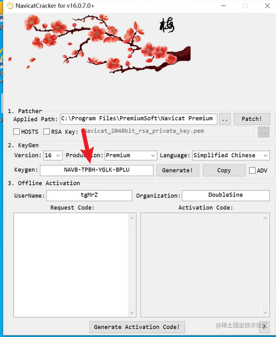

# Navicat破解

# Navicat破解

<https://www.bilibili.com/video/BV1CR4y1m7Hy/?spm_id_from=333.788&vd_source=5e12cc40b4cf9bc1265b996e2d71fa81>

<https://www.navicat.com.cn/>

<https://wwhs.lanzoup.com/iMxHz0yjdx0f>

密码:cf1g

安装过程

**`1.断掉wifi（！！！重要）`**

**`2.点开，点注册，点进去，让系统识别到已经存在的页面`**

**`3.点击软件（注意要把要管理员身份打开！！！重要）`**

**`4.把破解路径放到安装路径下去`**

