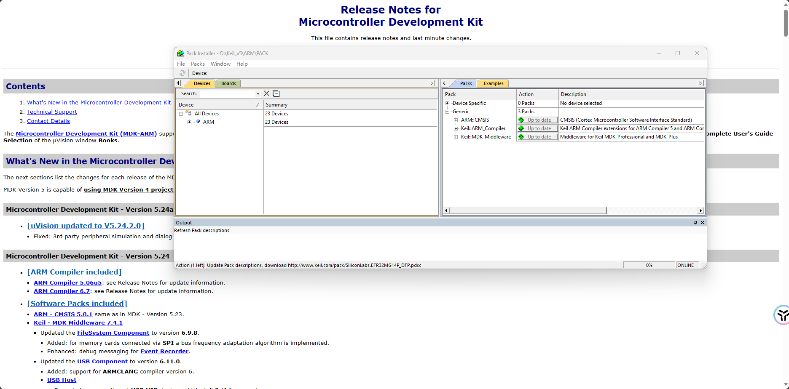
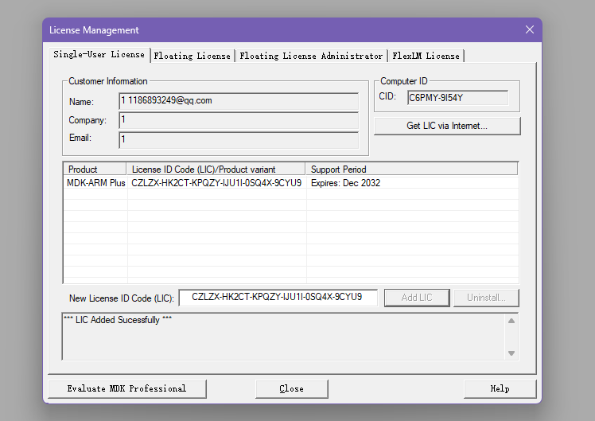

# STM32-Keil软件的破解

# STM32-Keil软件的破解

# 找到安装包

我是去江科大下面去找的，里面放最新的安装包和破解,

<https://jiangxiekeji.com/download.html>

# 安装软件

安装完成后，会出现这些东西，可以先退出出去。

# 进行破解

先点击，管理员身份去运行keil，再用管理员身份去打开破解软件

`**破解成功**`

如果之前先是安装stm32的mdk，再次安装C51的时候

按了skip，一直按，就可以了
