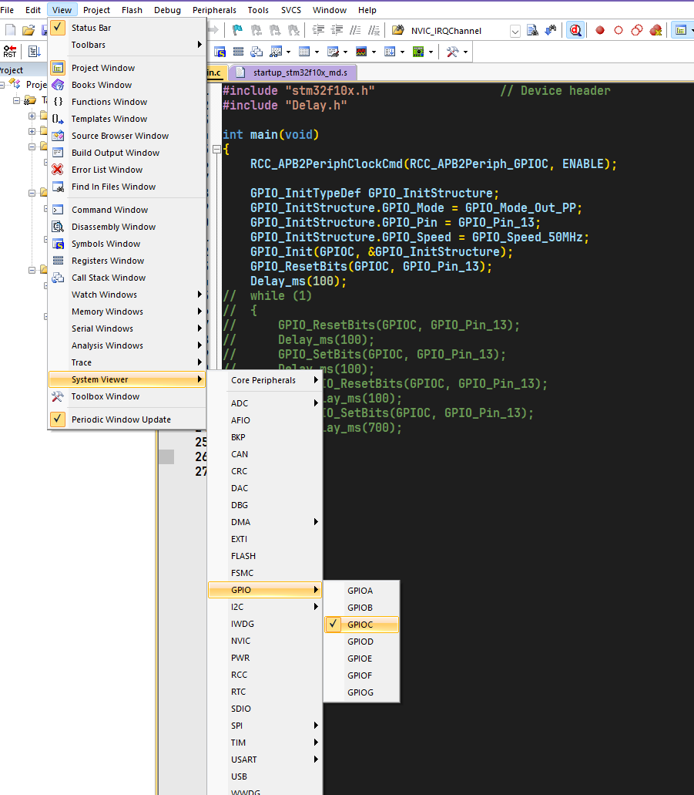

# Keil怎么调试代码-点灯例子

## 目录

-   [具体方法](#具体方法 "具体方法")

```c
#include "stm32f10x.h"                  // Device header
#include "Delay.h"

int main(void)
{
  RCC_APB2PeriphClockCmd(RCC_APB2Periph_GPIOC, ENABLE);
  
  GPIO_InitTypeDef GPIO_InitStructure;
  GPIO_InitStructure.GPIO_Mode = GPIO_Mode_Out_PP;
  GPIO_InitStructure.GPIO_Pin = GPIO_Pin_13;
  GPIO_InitStructure.GPIO_Speed = GPIO_Speed_50MHz;
  GPIO_Init(GPIOC, &GPIO_InitStructure);
  
  while (1)
  {
    GPIO_ResetBits(GPIOC, GPIO_Pin_13);
    Delay_ms(100);
    GPIO_SetBits(GPIOC, GPIO_Pin_13);
    Delay_ms(100);
//    GPIO_ResetBits(GPIOC, GPIO_Pin_13);
//    Delay_ms(100);
//    GPIO_SetBits(GPIOC, GPIO_Pin_13);
//    Delay_ms(700);
  }
}

```

# 具体方法

正确连接硬件，编译程序后，按下工具栏的调试按钮进入调试模式。 \&#x20;


然后在View->System Viwer下，可以按照分类来查看某个寄存器的值。例如GPIOC相关的寄存器：




