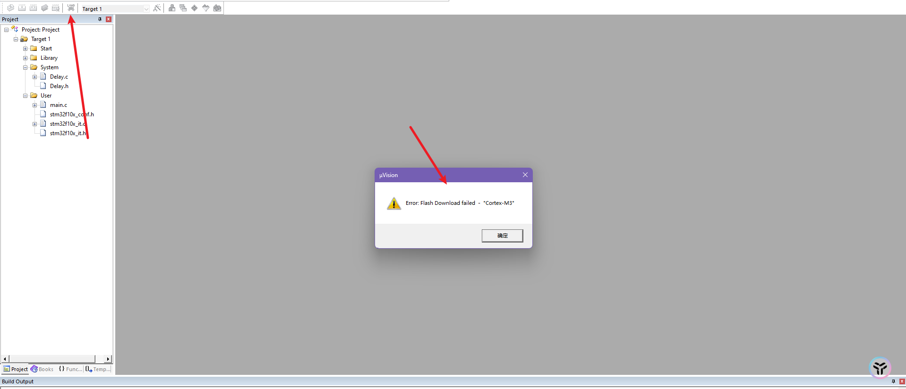

# STM32的各种问题

# STM32的烧录不成功 089371d57faf458bb28a0f869e9e4698

## 目录

-   [STM32的烧录不成功](#STM32的烧录不成功 "STM32的烧录不成功")
-   [问题一：Error: Flash Download failed - "Cortex-M3](#问题一Error-Flash-Download-failed---Cortex-M3 "问题一：Error: Flash Download failed - \"Cortex-M3")
-   [最后的解决是问题是芯片问题，买了2块都用不了，店家说是拆机的，这种东西一般有写保护](#最后的解决是问题是芯片问题买了2块都用不了店家说是拆机的这种东西一般有写保护 "最后的解决是问题是芯片问题，买了2块都用不了，店家说是拆机的，这种东西一般有写保护")

# STM32的烧录不成功

#

## 目录

-   [STM32的烧录不成功](#STM32的烧录不成功 "STM32的烧录不成功")
-   [问题一：Error: Flash Download failed - "Cortex-M3](#问题一Error-Flash-Download-failed---Cortex-M3 "问题一：Error: Flash Download failed - \"Cortex-M3")
-   [最后的解决是问题是芯片问题，买了2块都用不了，店家说是拆机的，这种东西一般有写保护](#最后的解决是问题是芯片问题买了2块都用不了店家说是拆机的这种东西一般有写保护 "最后的解决是问题是芯片问题，买了2块都用不了，店家说是拆机的，这种东西一般有写保护")

# STM32的烧录不成功

# 问题一：Error: Flash Download failed - "Cortex-M3

[Error: Flash Download failed - “Cortex-M3“\_error: flash download failed - "cortex-m3\_s.猴仔的博客-CSDN博客](<https://blog.csdn.net/qq_44619221/article/details/124051529?ops_request_misc={"request_id":"169773402116800197099380","scm":"20140713.130102334.."}\&request_id=169773402116800197099380\&biz_id=0\&utm_medium=distribute.pc_search_result.none-task-blog-2~all~top_positive~default-1-124051529-null-null.142^v96^pc_search_result_base1\&utm_term=Error: Flash Download failed - Cortex-M3\&spm=1018.2226.3001.4187> "Error: Flash Download failed - “Cortex-M3“_error: flash download failed - \"cortex-m3_s.猴仔的博客-CSDN博客")

解决不了

[Error: Flash Download failed - “Cortex-M3“报错终极解决方法总结-CSDN博客](<https://blog.csdn.net/LegendZenith/article/details/130672705?ops_request_misc={"request_id":"169773402116800197099380","scm":"20140713.130102334.."}\&request_id=169773402116800197099380\&biz_id=0\&utm_medium=distribute.pc_search_result.none-task-blog-2~all~top_click~default-2-130672705-null-null.142^v96^pc_search_result_base1\&utm_term=Error: Flash Download failed - Cortex-M3\&spm=1018.2226.3001.4187> "Error: Flash Download failed - “Cortex-M3“报错终极解决方法总结-CSDN博客")

解决不了

# 最后的解决是问题是芯片问题，买了2块都用不了，店家说是拆机的，这种东西一般有写保护
