# 数据库技术（SQL）结课作业-医疗方向的

#

请你设计医院门诊就医系统的数据库表格，并对其中的关键操作编写SQL语句。

## 第一部分 设计数据库表格

创建一个名为“db\_capital”的数据库，存储医院门诊就医系统的各个表格。

表格包括但不限于：

患者信息表“tab\_patient”、

医生信息表“tab\_doctor”、

护士信息表“tab\_nurse”、

科室信息表“tab\_department”、

诊室信息表“tab\_consultation\_room”、

药品信息表“medicine”、

病历信息表“tab\_record”、

检查项信息“tab\_inspection\_item”、

检查单信息“tab\_inspection”、

处方表“tab\_prescription”、

挂号信息表“tab\_register”、

排班信息表“tab\_scheduling”、

缴费信息表“tab\_pay”、

检查结果表“tab\_inspection\_result”。

### 要求：

（1）使用SQL语句建立各表格，自行设计表格中的字段名称及数据类型、主外键关系、非空属性及默认属性；

（2）要求表格名及字段名命名符合规则及常识，能够通过名称判断其表达含义及作用；

（3）每个表格要求有字段集合、数据表设计及SQL语句三部分。

【举例】以患者信息表“tab\_patient”为例

①患者信息表“tab\_patient”

**患者**（就医卡号，姓名，性别，籍贯，身份证号，年龄）；

**患者信息表设计**“tab\_patient”

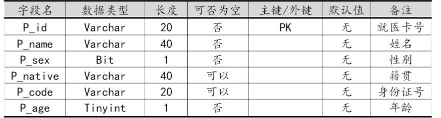

“tab\_patient”SQL语句

```sql
CREATE TABLE tab_patient
(
    P_id    Varchar(20)  NOT NULL,     --就医卡号
    P_name    Varchar  (40)  NOT NULL,  --姓名
    P_sex    Bit        NOT NULL,  --性别
    P_native   Varchar  (40),        --籍贯
    P_code    Varchar  (20),        --身份证号
    P_age    Tinyint      NOT NULL,  --年龄
    primary key (P_id)

);
```

## 第二部分 基本信息添加

在患者信息表“tab\_patient”、医生信息表“tab\_doctor”、护士信息表“tab\_nurse”、科室信息表“tab\_department”、诊室信息表“tab\_consultation\_room”、药品信息表“medicine”、检查项信息“tab\_inspection\_item”、排班信息表“tab\_scheduling”、缴费信息表“tab\_pay”等表格中各添加不少于10条基本信息，供后续操作使用。

## 要求：

### （1）界面化操作添加即可；

### （2）添加信息要专业、拟真；

【举例】以科室信息表为例

①科室信息表“tab\_department”

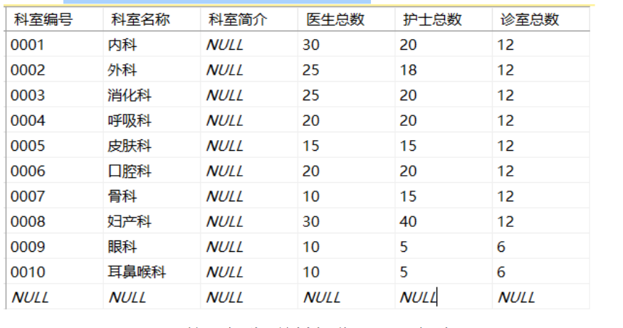

## 第三部分 关键操作SQL

本部分主要包括以下系统关键操作的SQL语句编写

设计系统实现上述功能的基本数据库调用数据的SQL语句，语句中判断信息自行选择表格中数据为例即可（比如患者张三、检查彩超、药品头孢等）；

### （1）办卡过程：

将一个就医卡的卡号和系统输入或采集的病人信息添加到患者信息表中，成为医院有记录的患者；

```sql

INSERT INTO tab_patient (patient_id, card_number, patient_name, gender, native_place, id_card, age) VALUES ('P001', 'C1001', '张三', '男', '山东省青岛市', '370102199001011234', 30);
```

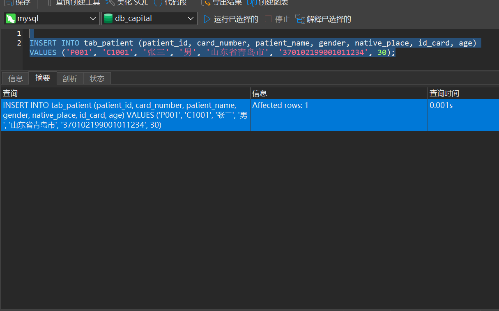

### （2）挂号过程：查询排班信息、已经挂号信息、科室信息等，如果想要挂的医生有号可挂，则挂号成功，否则挂号不成功；

#### 查询排班信息

```纯文本
SELECT * FROM tab_scheduling;
```

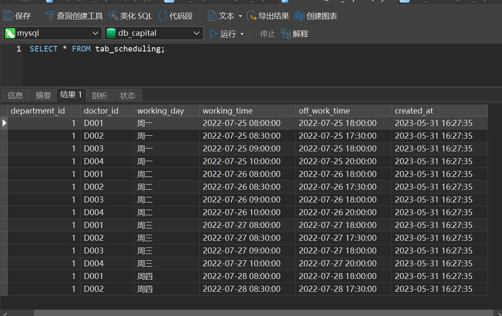

#### 已经挂号信息

```纯文本
SELECT * FROM tab_register;
```

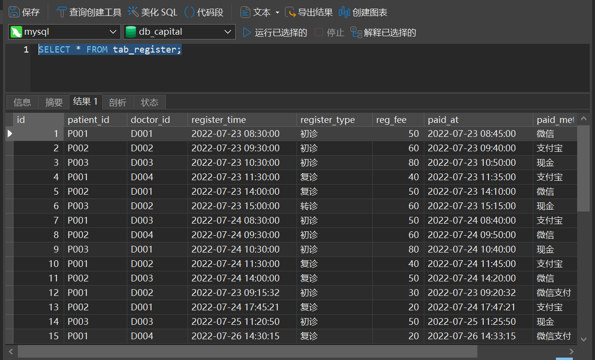

#### 科室信息

```纯文本
 SELECT * FROM tab_department;
```

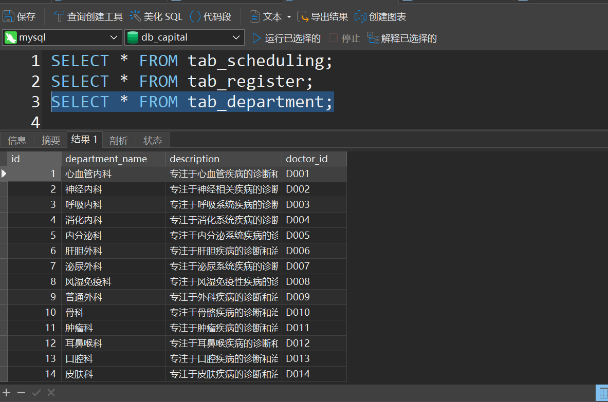

### 如果想要挂的医生有号可挂，则挂号成功，否则挂号不成功；

想找出骨科大夫的上班时间

```sql
SELECT DISTINCT * FROM tab_department INNER JOIN tab_scheduling ON tab_department.doctor_id = tab_scheduling.doctor_id WHERE  department_name = '骨科';
```

连接两张表

### （3）就诊过程：

#### 开出检查单：

（开出P001号病人的检查单）根据患者信息及病情，开具检查单；

```纯文本
SELECT * FROM tab_inspection  where  patient_id = 'P001';
```

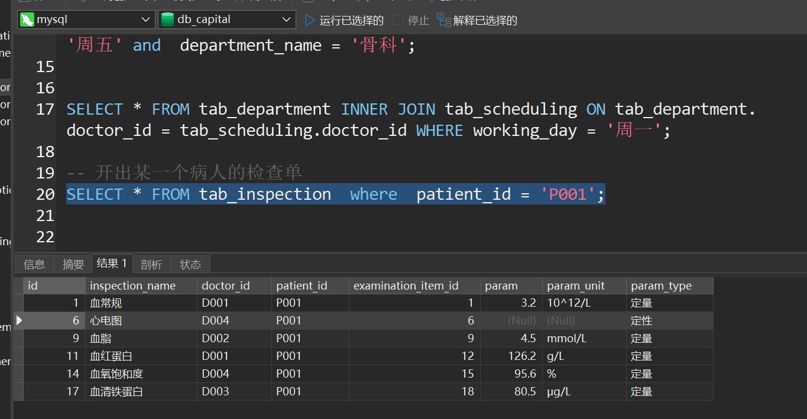

#### 按照检查单缴费：

根据检查单和检查项表给出缴纳费用，支付时将相关信息添加到缴费信息表；

```sql
SELECT * FROM tab_inspection  INNER JOIN tab_pay ON tab_inspection.id = tab_pay.id GROUP BY tab_inspection.id;
```

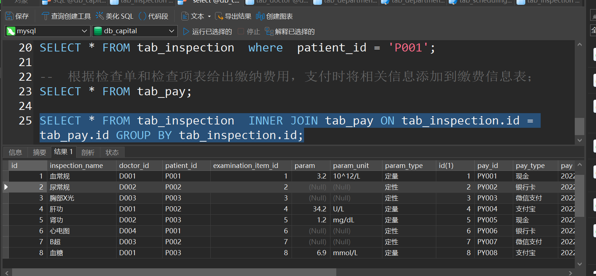

#### 检查将结果录入系统：

体检科医生检查完后将电子检查信息权限放给主治医生，将基本检查信息录入系统，便于医生查看和患者打印；

```sql
INSERT INTO tab_inspection_result(disease_name, patient_name, doctor_name, result)
VALUES('心脏病', '张三', '张医生', '冠心病');

```

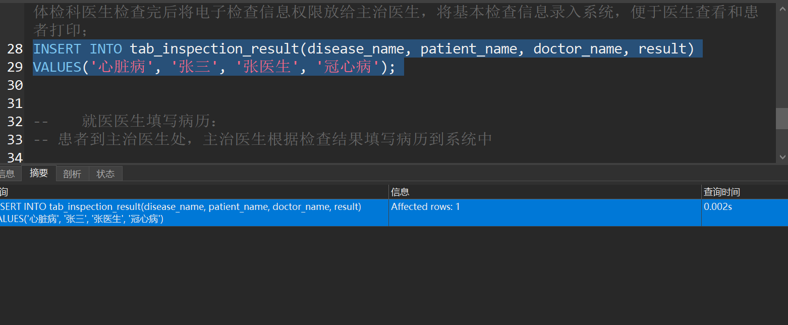

#### 就医医生填写病历：

患者到主治医生处，主治医生根据检查结果填写病历到系统中；

```sql
INSERT INTO tab_record(id, patient_id, doctor_id, record_time,diagnosis,treatment,medication,examination)
VALUES('15', 'P001', 'D001', NOW(),'冠心病','卧床休息','美托洛尔、硝酸异山梨酯、维拉帕米','心电图');
```

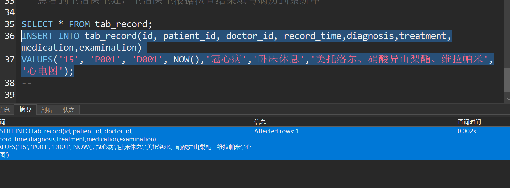

#### 医生开处方：

医生根据自己经验和患者病情，从系统中挑选在库药品形成处方；

```纯文本
SELECT * FROM medicine WHERE medicine_name = '维拉帕米' OR   medicine_name = '硝酸异山梨酯' OR  medicine_name = '美托洛尔' ;
```

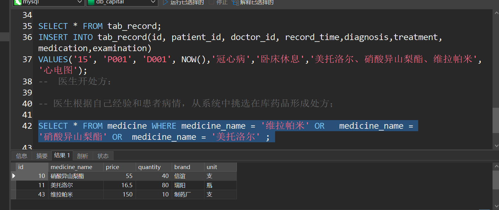

#### 缴纳药费：

根据处方和药品信息表中药品价格信息，生成总费用，患者支付时生成缴费记录；

```sql
SELECT * FROM medicine  WHERE medicine_name = '维拉帕米' OR   medicine_name = '硝酸异山梨酯' OR  medicine_name = '美托洛尔' ;


SELECT *, SUM(price) FROM medicine  WHERE medicine_name = '维拉帕米' OR   medicine_name = '硝酸异山梨酯' OR  medicine_name = '美托洛尔' ;
```

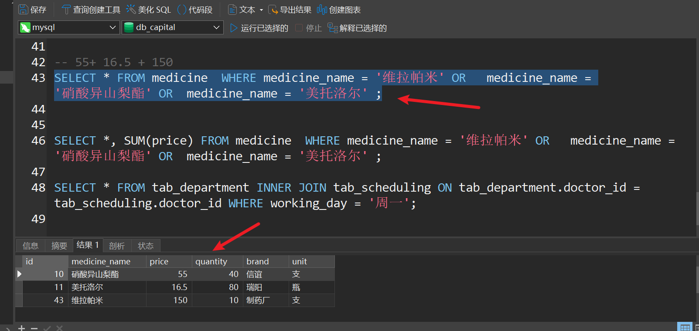

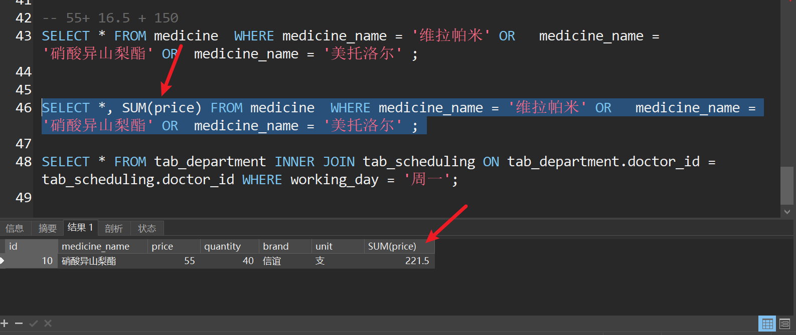

#### 领取药品：

患者领取药品，药品信息表中药品数量随之核减。

P001 的张三领取药品后的

```sql
  
  SELECT * FROM medicine WHERE medicine_name = '维拉帕米';
UPDATE medicine SET quantity = quantity + 1 WHERE medicine_name = '维拉帕米';
 
 
 
 
 UPDATE medicine SET quantity = quantity - 1 WHERE medicine_name = '维拉帕米';
  
  UPDATE medicine SET quantity = quantity - 1 WHERE medicine_name = '维拉帕米';
```

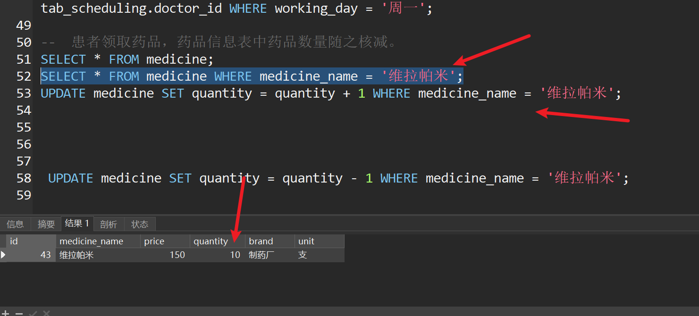

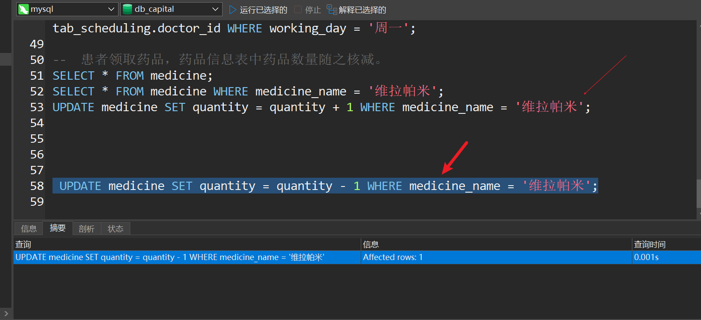

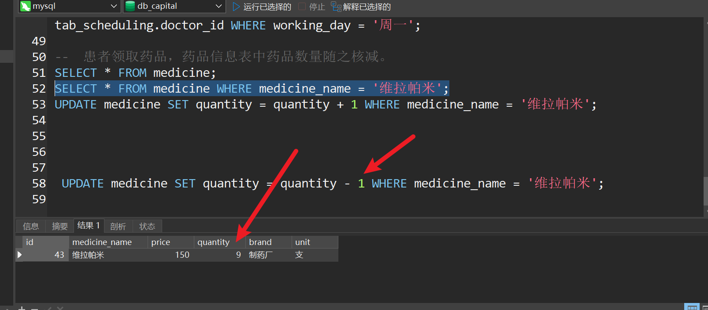
