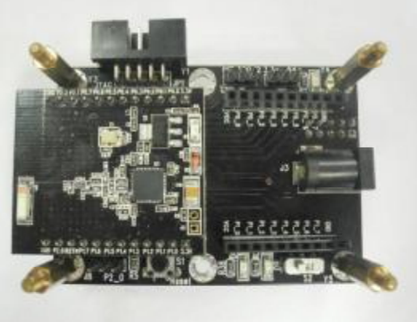

# 题目 （基于cc2530）的羽毛球加速度检测系统-课程设计任务书(1)

**无线单片机课程设计**

# 任务：

基于CC2530实验平台，选择一种**新颖应用背景**作为题目，以小组（2人一组）形式合作设计并制作多路数据采集的无线传感网络。

**禁止选用的背景（功能简单）**：倒车雷达、计步器、电子称。

要求：

1.  至少采用以下传感器其中1种: a.超声波、b.加速度、c.压力。
2.  点对点传输，采用LCD或数码管显示传感数据，或者通过串口传输到PC端，由串口调试助手完成。定时采样并刷新显示。
3.  设计报告中要清楚描述所用传感器的工作原理以及软硬件设计的具体方案。必须设计清晰、合理的程序流程图。解释关键代码段。
4.  全部程序代码作为附录，并要有必要的注释。
5.  **优良等级的要求**：实现*多点的无线网络传输*，要有自定义数据帧格式(含加密和纠错)。

# 时间进度安排（以发布任务的周次为起点）：

1.  第1周，随机分组并发布课程设计任务与要求；
2.  第2周，检查课题应用背景与解决思路，并提交设计方案；
3.  第3周，检查程序设计框架与流程图，功能模块；
4.  第4周，检查软硬件调试进展具体情况；
5.  第5周，正式验收作品并提交设计报告。

**若发现抄袭程序(代码相似度超过70%)，将不及格**。

# 评分项目：&#x20;

开题报告25分+作品验收15分+结题报告50分+答辩分享10分。

课程设计结束后，教师将根据以下几方面来评定成绩：

1.  设计方案的正确性和合理性。
2.  实验动手能力（安装工艺水平、调试中分析解决问题的能力，以及创新精神等）。
3.  答辩情况（课题的论述和回答问题的情况）。
4.  设计报告（内容与格式）。
5.  设计过程中的学习态度、工作作风和科学精神。

\*\*   	图1 超声波传感器HC-SR04	\*\*​

\*\*	图2加速度传感器ADXL345 \*\*

\*\*	\*\*​**图3 压力传感器（人体秤）**

**图4  CC2530主板**

