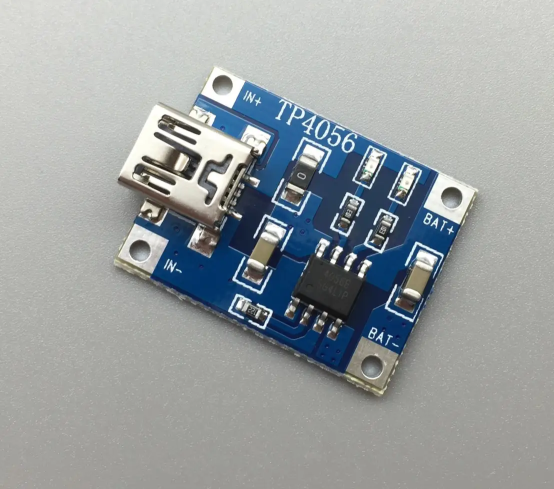
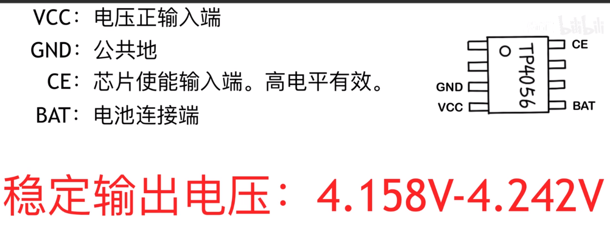
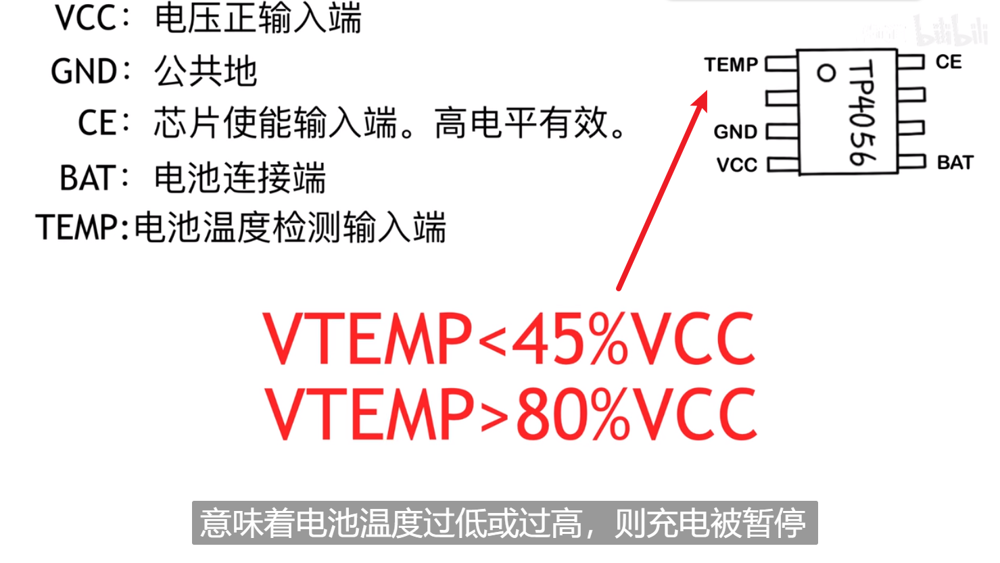
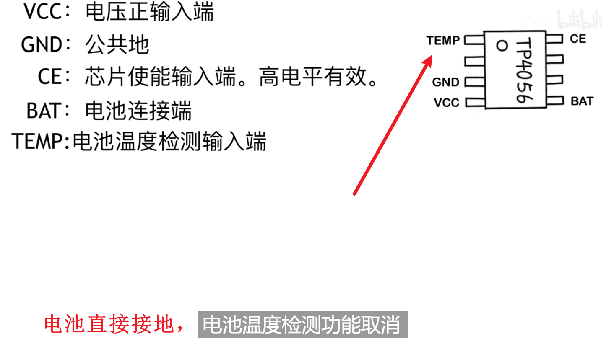
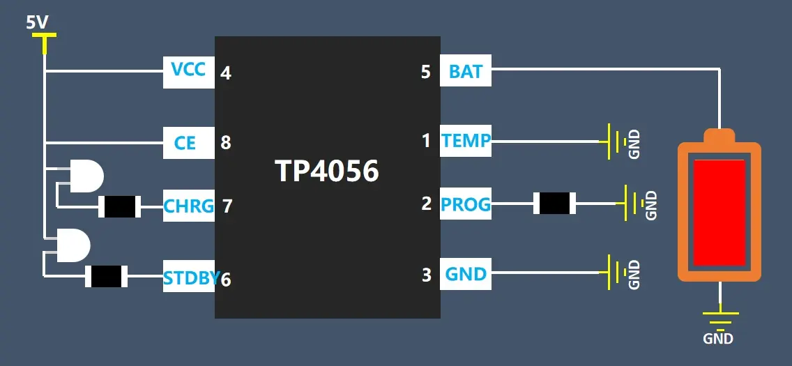
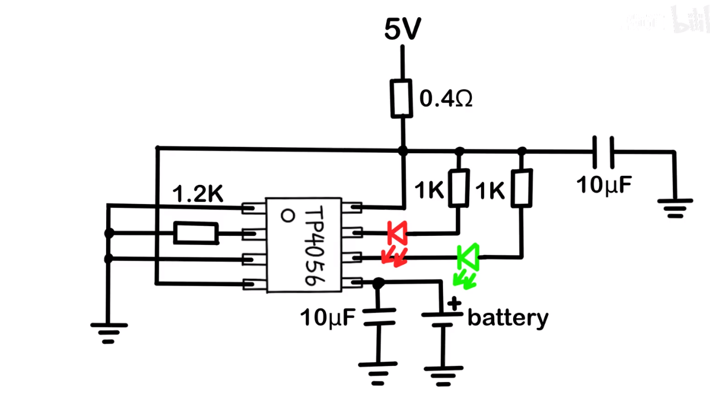

# TP4056锂电池充电电路&#x20;

是设计为一节锂电池充电用的

<https://www.bilibili.com/video/BV1ho4y1f7u2/?spm_id_from=333.337.search-card.all.click&vd_source=5e12cc40b4cf9bc1265b996e2d71fa81>

**充电电流可以用外部电阻编程设定,** 最大持续充电电流可达一安培,TP4056具有电池温度监测功能,精度达到1%的4.2V预设充电电压,高达1000mA的可编程充电电流

**TEMP**

[TP4056充电模块，把限流电阻换成电位器，变成可调电流充电模块\_哔哩哔哩\_bilibili](https://www.bilibili.com/video/BV1QN411n7ZQ/?spm_id_from=333.337.search-card.all.click "TP4056充电模块，把限流电阻换成电位器，变成可调电流充电模块_哔哩哔哩_bilibili")

Prog引脚接1.2k =   充电电流大概1A左右

[TP4056.pdf](file/TP4056_IB6qXIgWUl.pdf "TP4056.pdf")
