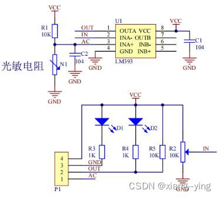
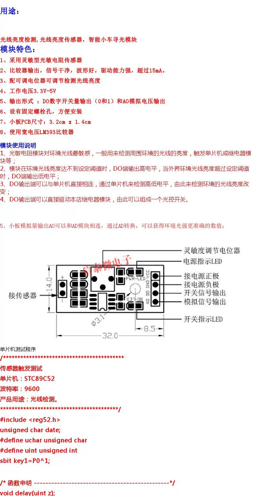
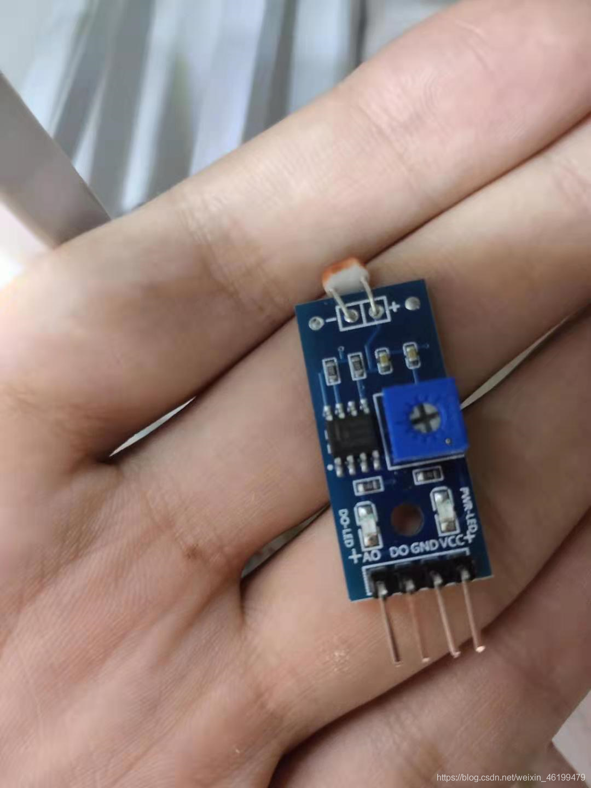

# 光敏传感器

[STM32+光敏模块\_光敏电阻模块-CSDN博客](https://blog.csdn.net/weixin_58632615/article/details/124729997 "STM32+光敏模块_光敏电阻模块-CSDN博客")

光敏模块引脚说明
VCC：电源引脚，接单片机+5V或者3.3V。
GND：地线，接单片机GND。
DO：开关量输出（0或1），模块在无光条件下或光强达不到设定阈值时，DO口输出高电平；当外界环境光强超过设定阈值时，DO输出低电平。
AO：模拟量输出（电压），与单片机AD模块相连，通过AD转换，获得准确数值。（后续中使用PA1引脚作为ADC转换，因此此处接单片机的\*\*`PA1`\*\*引脚）
————————————————
版权声明：本文为CSDN博主「xiang--ying」的原创文章，遵循CC 4.0 BY-SA版权协议，转载请附上原文出处链接及本声明。
原文链接：[https://blog.csdn.net/weixin\_58632615/article/details/124729997](https://blog.csdn.net/weixin_58632615/article/details/124729997 "https://blog.csdn.net/weixin_58632615/article/details/124729997")

[光敏电阻传感器模块资料\_光敏传感器模块-CSDN博客](https://blog.csdn.net/qq_38393591/article/details/130321276 "光敏电阻传感器模块资料_光敏传感器模块-CSDN博客")

光敏模块的DO和AO是什么意思

数字量输出，AO是模拟量输出

***

DO是**数字量输出，AO是模拟量输出**。 这个模块里面有个LM393比较器 ，通过电位器可以调节光敏电阻的采光值（即一个临界值），超过了这个临界值，就通过D0输出一个高电平的信号。 AO则是根据光敏电阻的采光值的不同，输出0-5V的电压。
