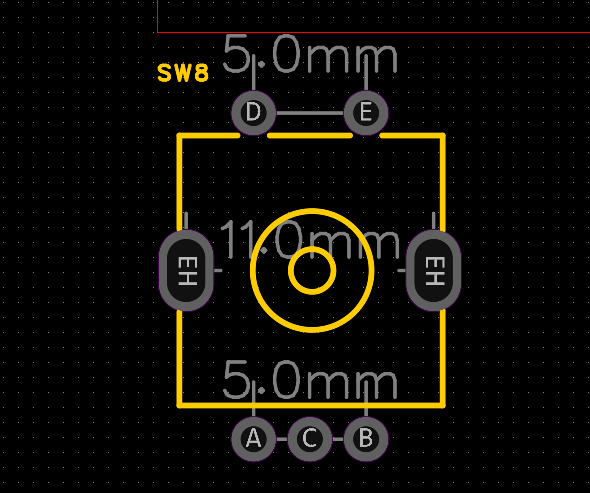
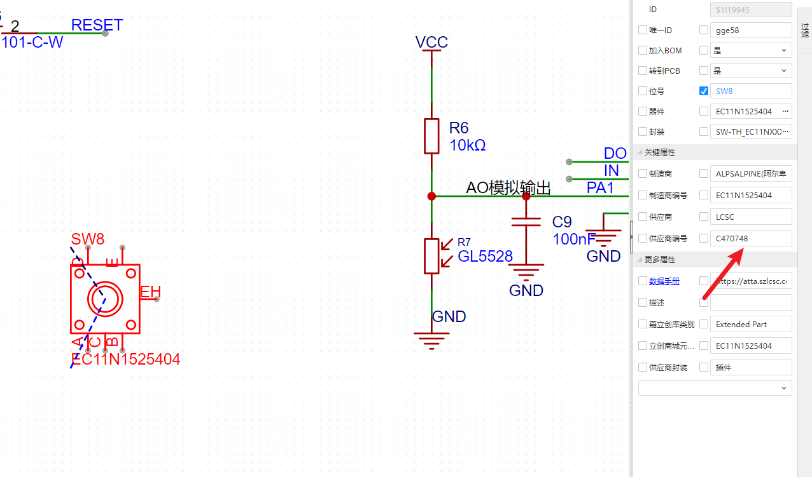
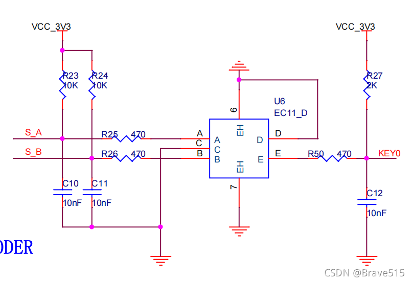

# 旋转编码器-EC11

[EC11旋转编码器 数字电位器 编码5脚带开关 20mm 梅花轴柄 耐高温-淘宝网 (taobao.com)](https://item.taobao.com/item.htm?spm=a1z0d.6639537/tb.1997196601.4.38d07484P8cv9U\&id=693325195287 "EC11旋转编码器 数字电位器 编码5脚带开关 20mm 梅花轴柄 耐高温-淘宝网 (taobao.com)")

[详解EC11编码器示波器波形图\_ec11旋转编码器引脚图\_Brave515的博客-CSDN博客](https://blog.csdn.net/weixin_45362275/article/details/120162259 "详解EC11编码器示波器波形图_ec11旋转编码器引脚图_Brave515的博客-CSDN博客")

[STM32 EC11 旋转编码器-CSDN博客](https://blog.csdn.net/m0_51016767/article/details/129179707 "STM32 EC11 旋转编码器-CSDN博客")
