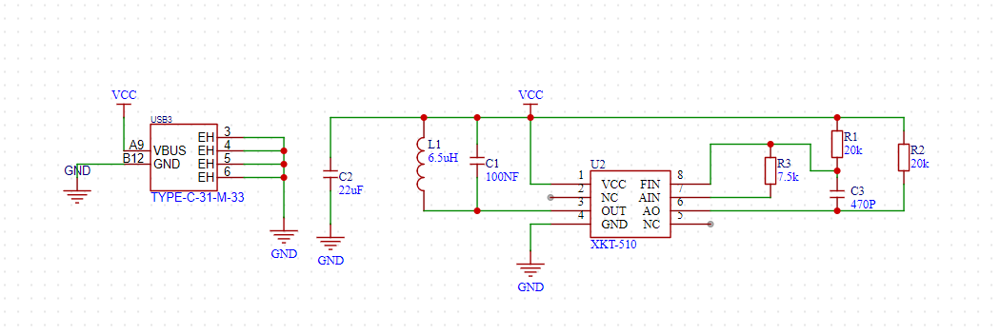
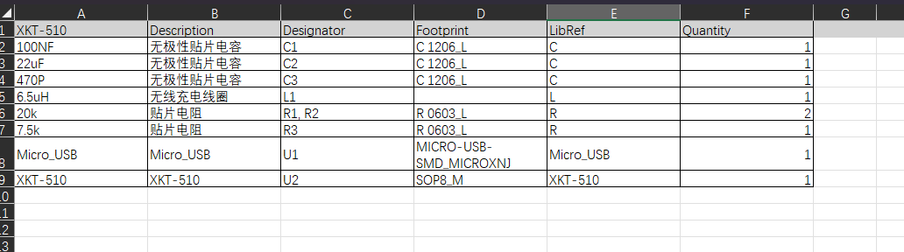

# 无线充

[浅谈无线充电技术，三分钟带你自制无线充电模块!\_哔哩哔哩\_bilibili](https://www.bilibili.com/video/BV1be4y1X725/?spm_id_from=333.999.0.0\&vd_source=5e12cc40b4cf9bc1265b996e2d71fa81 "浅谈无线充电技术，三分钟带你自制无线充电模块!_哔哩哔哩_bilibili")

[无线充电IC 主控芯片XKT-510+副芯片T3168 无线供电IC 有电路图-淘宝网 (taobao.com)](https://item.taobao.com/item.htm?spm=a1z0d.7625083.1998302264.6.5c5f4e69nCUF9t\&id=600000188343 "无线充电IC 主控芯片XKT-510+副芯片T3168 无线供电IC 有电路图-淘宝网 (taobao.com)")

