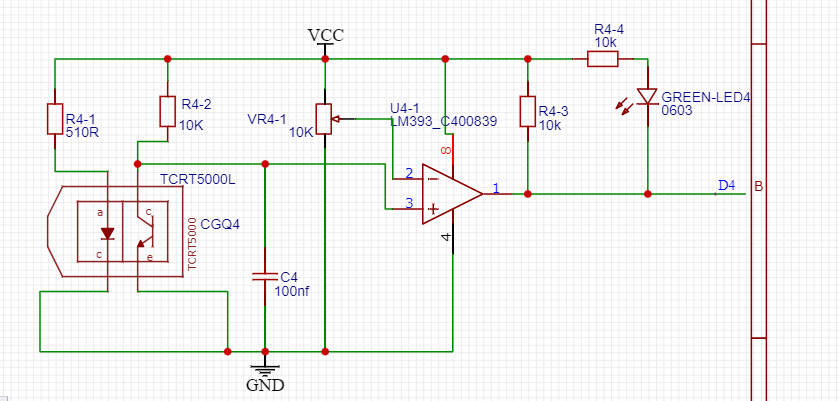
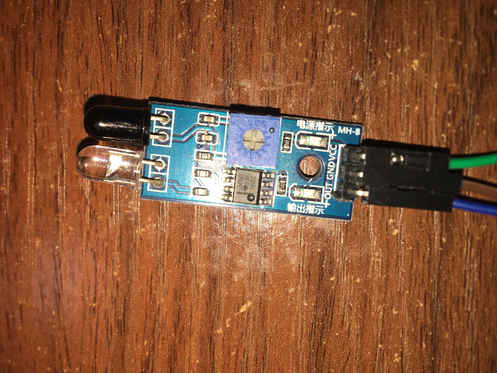

# 红外对管

<https://detail.tmall.com/item.htm?_u=m2teeq1c4aca&id=40844279989&spm=a1z09.2.0.0.79c22e8dqU3D25>

红外传感器模块寻迹循迹避障模块光电反射对管光电开关板智能小车

# 硬件

红外避障传感器是专为轮式机器人设计的一款距离可调式避障传感器。此传感器对环境光线
适应能力强、精度高，其具有一对红外线发射与接收管，发射管发射出一定频率的红外线，
当检测方向遇到障碍物（反射面）时，红外线反射回来被接收管接收，此时指示灯亮起，
经过电路处理后，信号输出接口输出数字信号，可通过电位器旋钮调节检测距离，有效距
离 2～40cm，工作电压为 3.3V-5V，由于工作电压范围宽泛，在电源电压波动比较大的情
况下仍能稳定工作，适合多种单片机、Arduino 控制器、BS2 控制器使用，安装到机器人上即
可感测周围环境的变化

1、当模块检测到前方障碍物信号时，电路板上绿色指示灯点亮电平，同时0UT端口持续输出低电平信号，该模块检测距离2-30cm，检测角度35°，检测距离可以通过电位器进行调节，顺时针调电位器，检测距离增加：逆时针调电位器，检测距离减少。

2、传感器主动红外线反射探测，因此目标的反射率和形状是探测距离的关键。其中黑色探测距离小，白色大；小面积物体距离小，大面积距离大。
3、传感器模块输出端口OUT可直接与单片机10口连接即可，也可以直接驱动一个5V继电器；

4、比较器**采用LM393**，工作稳定
5、可采用3-5V直流电源对模块进行供电。当电源接通时，红色电源指示灯点亮
6、具有3mm的螺丝孔，便于固定、安装
7、电路板尺寸：32*14mm（长*宽）
8、每个模块在发货已经将阀值比较电压通过电位器调节好，非特殊情况，请勿随意调节电位器。

# 硬件物料

## TCRT5000

TCRT5000传感器的工作原理与一般的红外传感器一样,一传一感.TCRT5000具有一个红外发射管和一个红外接收管.当发射管的红外信号经反射被接收管接收后,接收管的电阻会发生变化,在电路上一般以电压的变化形式体现出来,而经过ADC转换或LM324等电路整形后得到处理后的输出结果.电阻的变化起取于接收管所接收的红外信号强度,常表现在反射面的颜色和反射面接收管的距离两二方面.硬件参考原理图如下:

<https://item.taobao.com/item.htm?spm=a21n57.1.0.0.577a523cX0dXw1&id=653664205823&ns=1&abbucket=7#detail>

## LM393

# 硬件验证过（JIC开源广场）

<https://oshwhub.com/search?wd=LM393&page=1>

<https://oshwhub.com/ld_xk/si-lu-hong-wailm393>



# 硬件实物



# 软件

## arduino

```c
int Led=13;//定义 LED 接口
int buttonpin=3; //定义避障传感器接口
int val;//定义数字变量 val
void setup()
{
  pinMode(Led,OUTPUT);//定义 LED 为输出接口
  pinMode(buttonpin,INPUT);//定义避障传感器为输出接口
}
void loop()
{
  val=digitalRead(buttonpin);//将数字接口 3 的值读取赋给 val
  if(val==HIGH)//当避障传感器检测有信号时，LED 闪烁==有物体输出高电平
  {
    digitalWrite(Led,HIGH);
  }
  else
  {
    digitalWrite(Led,LOW);
  }
}
```

## STM32
