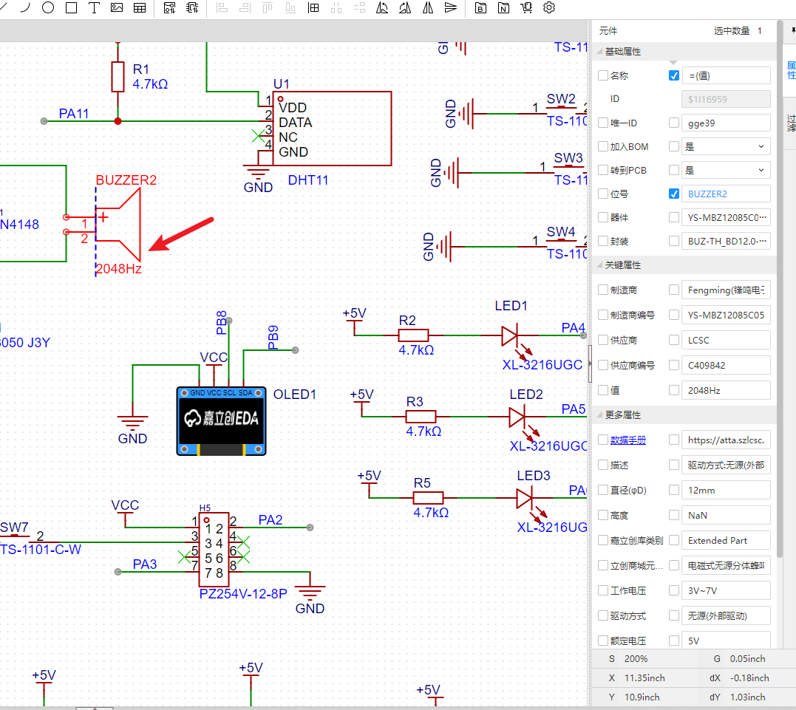
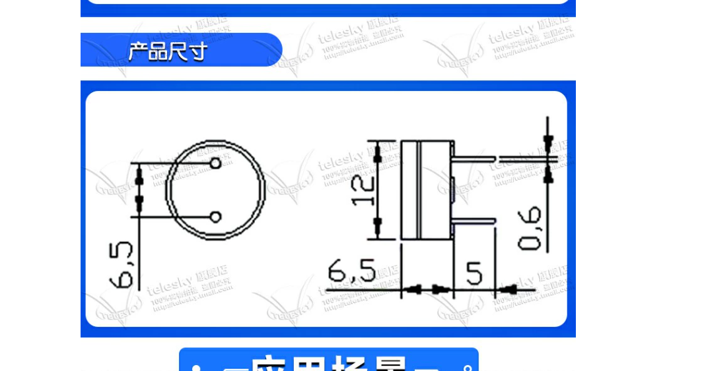

# 蜂鸣器原理图

## 有源蜂鸣器

跟LED一样的

# 无源蜂鸣器

需要PWN才能去驱动

[矮体 通用无源蜂鸣器 电磁式 阻抗16欧 直流电阻16欧 (5个)-tmall.com天猫](https://detail.tmall.com/item.htm?ali_refid=a3_430582_1006:1109983619:N:XqKkRX2wkaKRlwRoyuvkuH2trDRs9/qc:ea23c7ba29dc1e13aa04a1d0a0f4a8bd\&ali_trackid=1_ea23c7ba29dc1e13aa04a1d0a0f4a8bd\&id=41297077381\&spm=a21n57.1.0.0 "矮体 通用无源蜂鸣器 电磁式 阻抗16欧 直流电阻16欧 (5个)-tmall.com天猫")
